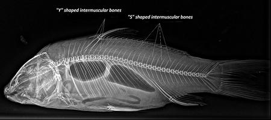
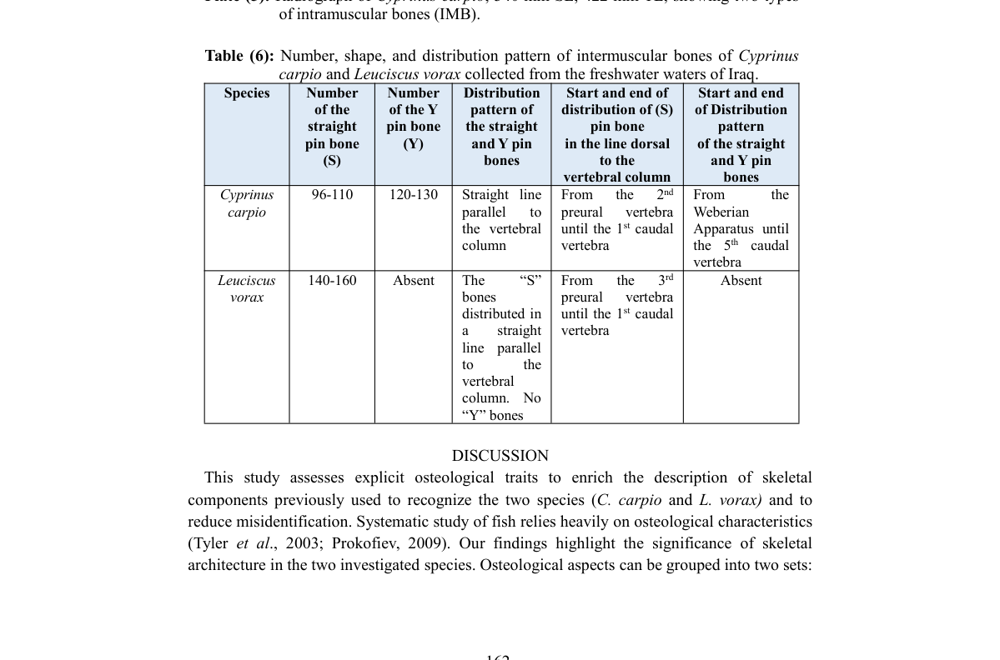

# Xương liên cơ IMB: số lượng, hình dạng và phân bố

- **Module:** 05. Xương đuôi và IMB
- **Bài:** 2/2
- **Nguồn chính:** PDF trang 23-24
- **Loại:** Lesson độc lập

## Mục tiêu học tập

- Phân biệt hai kiểu IMB trong nghiên cứu.
- So sánh số lượng IMB giữa hai loài theo Table 6.
- Mô tả mô hình phân bố dọc cột sống.

## 1. Hai dạng IMB

Nghiên cứu nhận dạng hai dạng xương liên cơ: dạng **pin thẳng (S/straight pin)** và dạng **Y**. Cả hai được quan sát như các xương mảnh trong cơ phía trên và dưới cột sống.

## 2. Khác biệt số lượng

Theo Table 6, **C. carpio** có khoảng **96-110** xương pin thẳng và **120-130** xương dạng Y. **L. vorax** có khoảng **140-160** xương pin thẳng, trong khi dạng Y được báo cáo là **không có**.

## 3. Phân bố

Ở C. carpio, hai dạng S và Y được mô tả phân bố thành hai đường thẳng phía lưng và phía bụng cột sống trong vùng đuôi. Ở L. vorax, chỉ dạng S hiện diện và cũng phân bố thành các đường song song với cột sống. Table 6 ghi thêm điểm bắt đầu/kết thúc phân bố theo các mốc preural/caudal và Weberian apparatus.

## Hình và bảng cần đọc

*Plate 5: ảnh X-quang C. carpio có chú thích IMB dạng Y và S.*

*Số lượng và mô hình phân bố IMB của hai loài.*

## Điểm cần nhớ

- L. vorax có nhiều pin-shaped IMB hơn trong phạm vi nguồn báo cáo.
- Y-shaped IMB được ghi nhận ở C. carpio nhưng không ở L. vorax.
- Tác giả thận trọng về việc dùng riêng mô hình phân bố IMB làm tiêu chí phân loại rộng cho cả genera.

## Câu hỏi tự kiểm tra

1. Hai dạng IMB được nhận dạng là gì?
2. Loài nào không có Y-shaped IMB trong tập mẫu?
3. Vì sao phân bố IMB chưa nên được coi là tiêu chí phân loại tuyệt đối ở cấp genus?

## Ghi chú nguồn

Nội dung bài học được biên soạn lại từ bài báo gốc, giữ nguyên thuật ngữ và phạm vi lập luận của nguồn.
