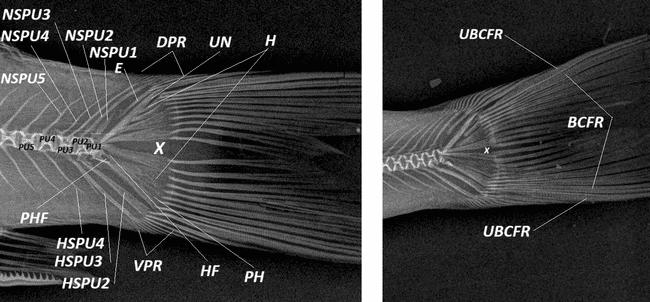

# Ý nghĩa chức năng và tiến hóa theo lập luận của bài báo

- **Module:** 06. Thảo luận
- **Bài:** 2/2
- **Nguồn chính:** PDF trang 39-40
- **Loại:** Lesson độc lập

## Mục tiêu học tập

- Trình bày cách tác giả liên hệ cột sống với độ cứng/linh hoạt và chuyển động.
- Mô tả cách pterygiophore và caudal skeleton được liên hệ với ổn định, điều hướng và lực đẩy.
- Phân biệt kết quả đo trực tiếp với diễn giải chức năng của tác giả.

## 1. Cột sống và locomotion

Ở phần cuối Discussion, tác giả diễn giải sự phân vùng cột sống như một cơ chế cân bằng độ vững và độ linh hoạt. Các vùng trước đuôi với neural/haemal spines mạnh được liên hệ với cơ trục dùng trong bơi duy trì, còn vùng caudal thu nhỏ dần được liên hệ với tạo lực đẩy qua đuôi.

## 2. Vây và điều khiển chuyển động

Tác giả liên hệ pterygiophore vây lưng với ổn định và pterygiophore vây hậu môn với hãm/điều hướng. Sự khác biệt về interdigitation giữa hai loài được diễn giải như các cấu hình chức năng khác nhau. Đây là **diễn giải của bài báo**, không phải phép đo trực tiếp lực hoặc vận tốc bơi trong thí nghiệm này.

## 3. Vùng đuôi và IMB

Hypural plates, pleurostyle/urostyle và procurrent rays được tác giả gắn với hiệu quả tạo lực đẩy và kiểm soát vây đuôi. IMB được xem như phần tử truyền lực cơ học trong cơ thể. Phần này đi xa hơn dữ liệu hình thái thuần túy và đề xuất ý nghĩa sinh cơ học/tiến hóa dựa trên so sánh cấu trúc.

## Hình và bảng cần đọc

*Diagram 1 là dữ liệu hình thái nền cho diễn giải về regionalization.*

*Plate 4 minh họa các phần tử được tác giả liên hệ với chức năng vây đuôi.*

## Điểm cần nhớ

- Phân biệt rõ: hình thái/X-quang là dữ liệu đo; vai trò bơi là phần diễn giải trong Discussion.
- Tác giả liên hệ sự phân vùng cột sống với cân bằng stiffness-flexibility.
- Caudal skeleton được xem là hệ truyền lực và nâng đỡ tia vây đuôi.

## Câu hỏi tự kiểm tra

1. Đâu là dữ liệu trực tiếp và đâu là diễn giải chức năng trong nghiên cứu?
2. Pterygiophore vây hậu môn được tác giả liên hệ với chức năng gì?
3. Tác giả lý giải vai trò của IMB trong cơ học bơi như thế nào?

## Ghi chú nguồn

Nội dung bài học được biên soạn lại từ bài báo gốc, giữ nguyên thuật ngữ và phạm vi lập luận của nguồn.
