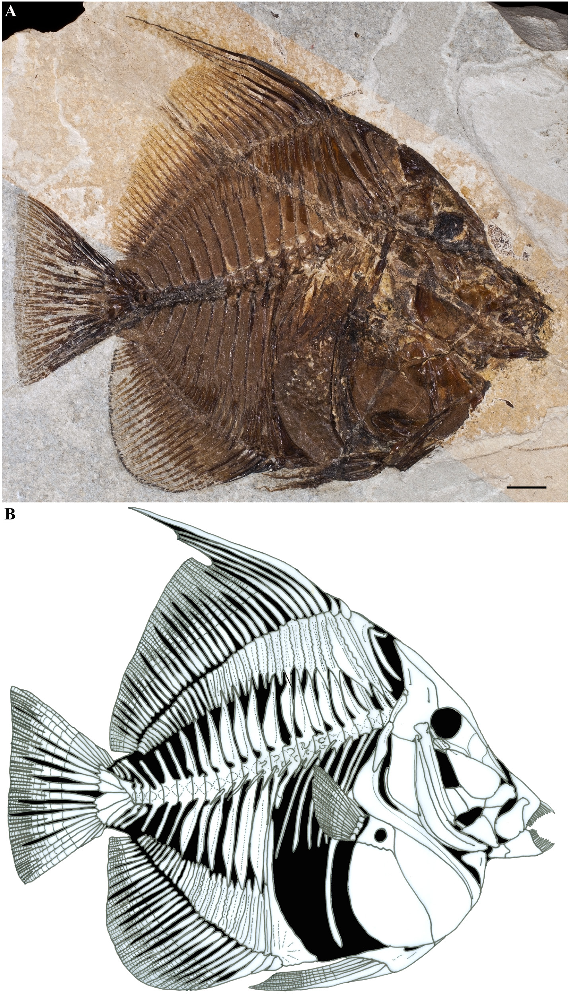
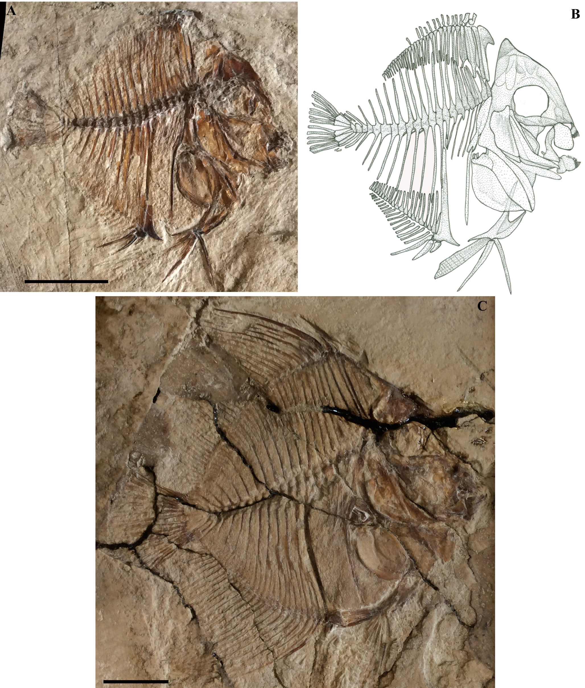

# Angiolinia mirabilis: chẩn đoán và hình thái tổng thể

## 1. Mục tiêu bài học

Bài này chuyển từ cấp họ sang taxon mới, tập trung vào những đặc điểm khiến *Angiolinia mirabilis* khác *Eozanclus* và *Zanclus*.

## 2. Mẫu điển hình và các paratype

Holotype CMC 39 là bộ xương gần hoàn chỉnh. Phần mô tả mẫu ghi 131.4 mm tổng chiều dài và 117.7 mm SL. Tuy nhiên Bảng 1 của chính bài báo thể hiện 111.7 mm cho standard length của CMC 39; đây là một điểm không nhất quán nội bộ cần giữ nguyên khi đối chiếu nguồn.

Hai paratype tiền thiếu niên gồm:

- MCSNV I.C. 2-3: 31.3 mm SL, tổng chiều dài ước tính 35.8 mm;
- MCSNV I.C. 5: 46.1 mm SL, tổng chiều dài 58.8 mm.

*Hình 1, trang PDF 4: holotype CMC 39 nhìn bên phải và phục dựng bộ xương.*

*Hình 2, trang PDF 5: các paratype MCSNV I.C. 3 và MCSNV I.C. 5, kèm phục dựng.*

## 3. Hình dáng cơ thể

Thân *Angiolinia* sâu, gần hình đĩa và dẹp bên. Body depth đạt khoảng **85–87% SL**. Đầu tương đối lớn, head length khoảng **38.3–39.2% SL**. Mõm dài, rộng và dạng ống, khoảng **22–24.7% SL**.

Miệng nằm tận cùng, khá nhỏ nhưng rõ, ở dưới trục cơ thể. Orbit lớn và tròn. Khoang bụng tương đối gọn; cuống đuôi ngắn và dẹp.

## 4. Tổ hợp chẩn đoán quan trọng

Những đặc điểm nổi bật của chi mới gồm:

- một uroneural;
- pterygiophore vây lưng đầu tiên mang một gai supernumerary;
- tất cả gai vây lưng trừ hai gai đầu có đầu xa dạng sợi;
- gai vây lưng thứ ba dài nhất, khoảng một nửa SL;
- 31 hoặc 32 tia vây lưng;
- 26 hoặc 27 tia vây hậu môn;
- vây ngực có 11 hoặc 12 tia tương đối dài;
- vây đuôi dạng truncate;
- hai postcleithra;
- pectoral disc nở rộng, bề rộng đo được khoảng 20.1–23.3% SL trong các mẫu có dữ liệu;
- tỷ lệ depth/length của basipterygium khoảng 25–28.1%.

## 5. Hình thái các vây nhìn từ ngoài

Vây lưng có gốc dài và liên tục. Chiều cao gai tăng mạnh từ gai thứ hai sang gai thứ ba, sau đó giảm dần về phía sau. Phần tia mềm cũng giảm dần chiều cao về sau.

Vây hậu môn có gốc dài. Gai thứ ba phát triển nhất trong ba gai hậu môn; các tia hậu môn tăng dần chiều cao tới khoảng tia thứ bảy rồi giảm, làm phần bờ sau gần thẳng đứng.

Vây chậu xuất phát ngay dưới vùng bám vây ngực. Vây đuôi bị cắt ngang ở bờ sau và kéo dài ra sau hơn bờ sau của cả vây lưng và vây hậu môn.

## 6. Ý nghĩa của “hình thái trung gian”

Bài báo gọi *Angiolinia* là trung gian về hình thái giữa *Eozanclus* và *Zanclus*. Điều này không có nghĩa nó là “dạng lai” hay một chuỗi tiến hóa tuyến tính. Ở đây “intermediate” mô tả việc nhiều tỷ lệ cơ thể của *Angiolinia* nằm giữa hai chi kia, trong khi một số đặc điểm xương lại cho thấy nó chia sẻ trạng thái dẫn xuất với *Zanclus*.

## 7. Điểm cần nhớ

Nhận diện *Angiolinia* cần nhìn đồng thời tỷ lệ cơ thể, số tia vây và những chi tiết xương rất cụ thể. Hình dáng gần đĩa chỉ là lớp ngoài; các đặc điểm như một uroneural và một gai supernumerary mới là bằng chứng quan trọng khi xét quan hệ họ hàng.
