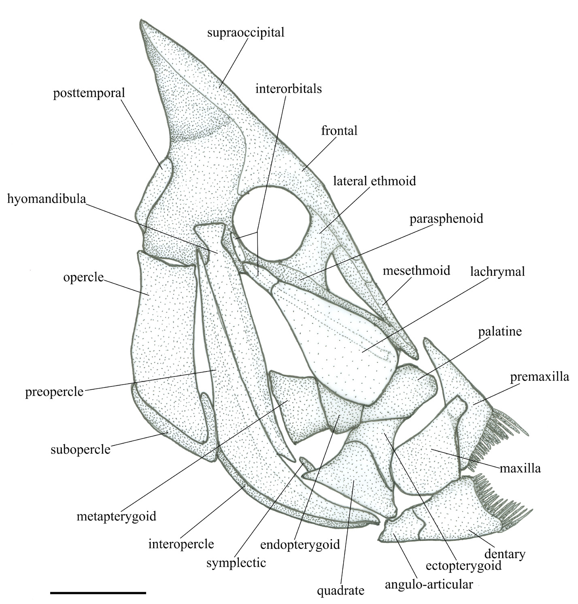
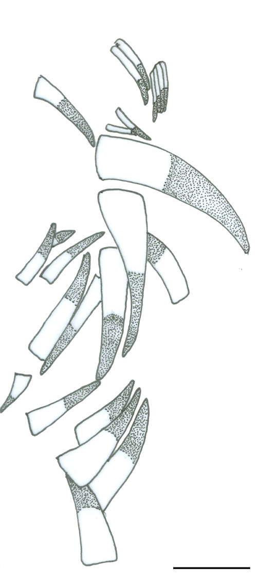

# Hộp sọ, hàm và răng của Angiolinia

## 1. Mục tiêu bài học

Bài này đọc Hình 3 và Hình 4 để xây dựng một bản đồ giải phẫu vùng đầu, đồng thời phân biệt điều tác giả quan sát được trực tiếp với phần bị giới hạn do bảo tồn.

*Hình 3, trang PDF 6: phục dựng hộp sọ nhìn bên phải và các xương được gắn nhãn.*

## 2. Neurocranium

Neurocranium sâu và có dạng tam giác khi nhìn bên. Mào supraoccipital rất cao, giống một đỉnh nhọn và có bờ trước dày. Frontals lớn, mở rộng sang bên và tạo phần đáng kể của thành lưng và thành trước orbit.

Ở holotype, vùng ethmoid tương đối dài hơn so với hai mẫu tiền thiếu niên. Tác giả xem khác biệt này là dấu hiệu gợi ý **positive ontogenetic allometry** của vùng ethmoid.

Một số vùng otic và occipital không bảo tồn tốt, vì vậy bài báo không mô tả được toàn bộ đặc điểm của chúng. Đây là giới hạn dữ liệu, không phải bằng chứng rằng các cấu trúc đó vắng mặt.

## 3. Các xương vùng mũi và quanh mắt

Lateral ethmoid chắc, dạng cột và tạo thành thành trước của orbit. Mesethmoid dài, đầu xa nhọn. Parasphenoid dày và lộ một phần dưới orbit và vùng ethmoid.

Lachrymal lớn, thuôn dạng giọt nước, nằm dọc mõm và ở trước bờ orbit. Infraorbital thứ hai và thứ ba chỉ nhận ra một phần ở holotype; infraorbital thứ ba có cấu trúc giống một subocular shelf thô sơ.

## 4. Hàm trên và khả năng protrusion

Premaxilla có ascending process dài, hơi dài hơn alveolar process. Maxilla nở rộng ở đầu xa và liên kết với premaxilla. Không có supramaxilla được nhận diện.

Từ cấu hình này, tác giả cho rằng hàm trên có **khả năng protrusibility rất hạn chế**. Đây là diễn giải của chính bài báo dựa trên cấu trúc xương hàm, không phải một thử nghiệm chức năng trực tiếp.

## 5. Răng

Răng rất nhiều, dạng sợi dài, mép trơn và có nền gần tròn. Răng ở phần trước alveolar process dài và dày hơn. Răng ở dentary tương tự răng đối diện trên premaxilla.

*Hình 4, trang PDF 7: răng hàm của holotype CMC 39; scale bar 2 mm.*

## 6. Hàm dưới và suspensorium

Mandible của holotype khá dài; dentary lớn và dài hơn rõ so với anguloarticular. Hyomandibula có trục thẳng, dài và mang flange phía trước. Quadrate có dạng tam giác; symplectic thẳng, mảnh, hình trụ. Palatine khá lớn và không có răng. Các pterygoid mỏng dạng phiến.

Preopercle có dạng lưỡi liềm với bờ sau và bờ bụng trơn. Opercle gần hình chữ nhật. Interopercle dài và hẹp ở phía trước, rộng hơn ở phía sau.

## 7. Phần không bảo tồn

Hyoid apparatus và branchial skeleton hầu như không được bảo tồn, ngoại trừ urohyal. Urohyal có dạng tam giác, bờ sau hơi lõm và một gờ bụng dày.

## 8. Điểm cần nhớ

Hộp sọ *Angiolinia* cho thấy một tổ hợp đặc trưng của Zanclidae: supraoccipital crest rất cao, mõm dài, bộ răng dạng sợi và cấu trúc hàm đặc biệt. Tuy nhiên, luôn phải tách “không quan sát được vì bảo tồn kém” khỏi “không tồn tại”.
