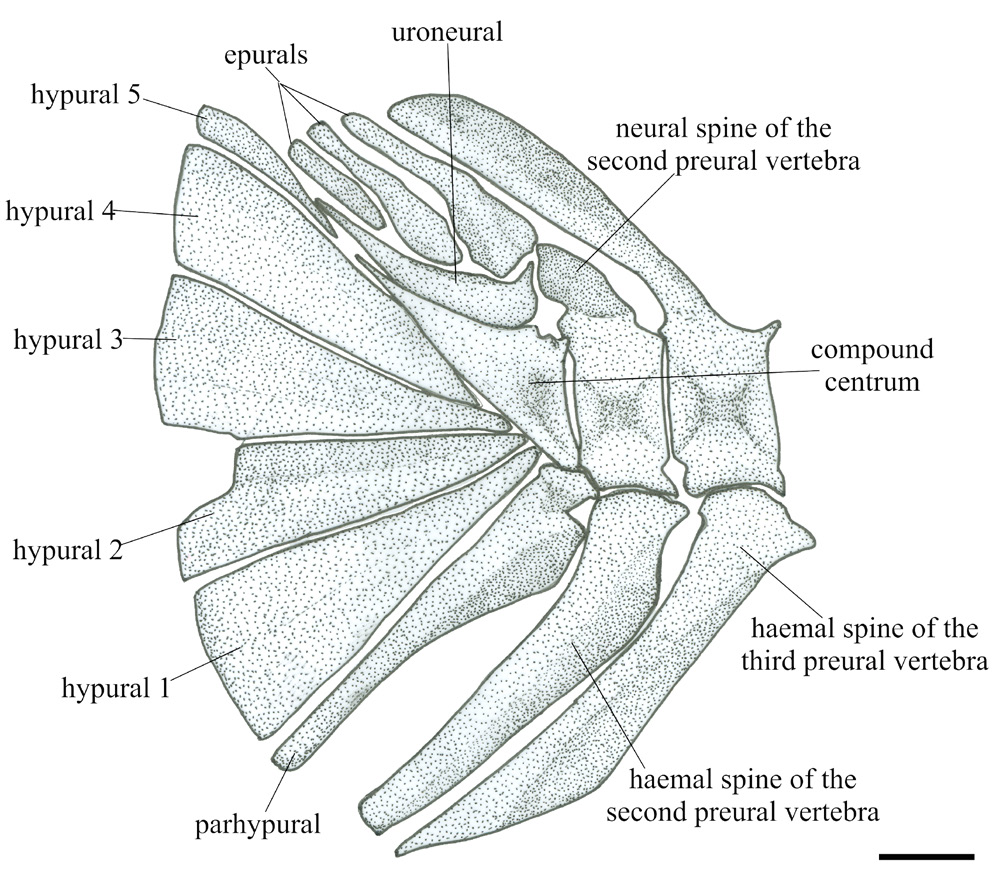
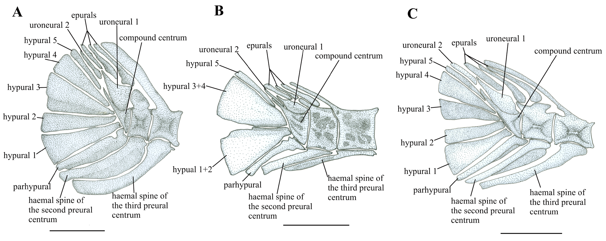

# Cột sống và bộ xương đuôi

## 1. Mục tiêu bài học

Bài này đi từ trục thân tới bộ xương đuôi, tập trung vào các đặc điểm có giá trị phân loại: số đốt sống, khoảng interneural thứ ba, uroneural và cấu trúc hypural.

## 2. Cột sống

Cột sống hơi cong chữ S và gồm **22 đốt sống**, chia thành **9 đốt bụng + 13 đốt đuôi**. Centra dày, bị nén theo chiều trước-sau, gần hình chữ nhật và cao hơn dài. Mặt bên centra có các hố và gờ không đều.

Neural spine của đốt đầu tiên tương đối mảnh, dính với centrum và xen với đầu dưới của hai pterygiophore vây lưng trước. Neural spines của đốt thứ ba và thứ tư nằm giữa pterygiophore vây lưng thứ ba và thứ tư, từ đó cho thấy **third interneural space vacant**.

Đặc điểm “khoảng interneural thứ ba trống” quan trọng vì nó còn xuất hiện trong thảo luận về quan hệ giữa Zanclidae và Acanthuridae.

## 3. Ribs, parapophyses và epineurals

Parapophyses tăng dần kích thước ở bốn đốt bụng phía sau. Parapophysis của đốt bụng sau cùng nở rộng. Các xương sườn tương đối mảnh xuất hiện từ đốt bụng thứ ba tới thứ tám. Epineurals mảnh liên quan tới năm đốt bụng sau và năm đốt đuôi trước.

Bài báo lưu ý rằng cấu trúc parapophysis mở rộng từng từng bị diễn giải nhầm trong *Eozanclus* như một cặp xương sườn biến đổi gọi là “pseudobassin”.

## 4. Bộ xương đuôi của Angiolinia

Bộ xương đuôi gồm:

- 5 hypural tự chủ;
- 1 parhypural tự chủ;
- 1 uroneural khớp với compound centrum;
- 3 epural.

Vây đuôi có **16 tia chính** theo công thức I, 7+7, I, cộng với ba tia procurrent phía trên và ba phía dưới.

*Hình 5, trang PDF 8: hypural 1–5, parhypural, epural, uroneural và compound centrum.*

## 5. Vì sao một uroneural quan trọng

Số uroneural là một character quan trọng trong lập luận phát sinh chủng loại của bài báo. *Angiolinia* và *Zanclus* có **một uroneural**, trong khi *Eozanclus* có **hai**. Tác giả coi trạng thái hai uroneural là điều kiện plesiomorphic trong bối cảnh so sánh Acanthuriformes, còn một uroneural là trạng thái dẫn xuất hỗ trợ nhánh *Angiolinia* + *Zanclus*.

## 6. So sánh hình bộ xương đuôi

*Hình 7, trang PDF 11: phục dựng bộ xương đuôi của* Eozanclus brevirostris, Gazolaichthys vestenanovae *và* Padovathurus gaudryi.

Hình so sánh giúp thấy trực quan trạng thái hai uroneural ở *Eozanclus* và các acanthurid hóa thạch được dùng làm đối chiếu.

## 7. Điểm cần nhớ

Cột sống của *Angiolinia* có 22 đốt và khoảng interneural thứ ba trống. Bộ xương đuôi có một uroneural; đây là một trong ba đặc điểm chủ chốt nối *Angiolinia* với *Zanclus* trong cladogram của bài báo.
