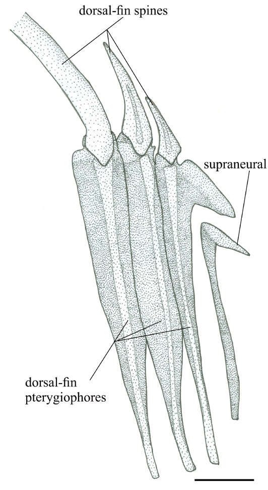
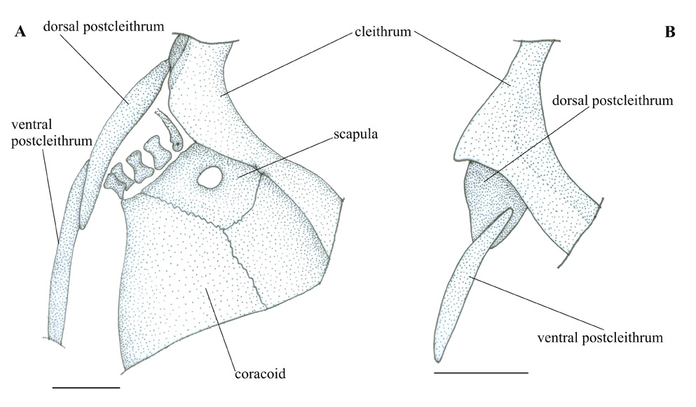

# Hệ vây, đai ngực, đai chậu và lớp vảy

## 1. Mục tiêu bài học

Bài này tập trung vào các cấu trúc quanh vây và đai xương, đặc biệt là pterygiophore, cleithrum, coracoid và pectoral disc – những phần có giá trị lớn trong chẩn đoán Zanclidae.

## 2. Supraneural và vây lưng

*Angiolinia* có một supraneural. Trục chính của xương này khá dày và nằm trong preneural space cùng pterygiophore vây lưng đầu tiên.

Vây lưng gồm **7 gai + 31 hoặc 32 tia**, được đỡ bởi 36 hoặc 37 pterygiophore. Hai gai đầu ngắn; gai thứ ba dài nhất, xấp xỉ một nửa SL. Tất cả gai trừ hai gai đầu có đầu xa dạng sợi.

Gai vây lưng đầu tiên ở trạng thái **supernumerary association** trên pterygiophore đầu tiên. Ba pterygiophore đầu có median flange dạng bán nguyệt và có gờ, được tác giả diễn giải là vùng quanh đó các gai trước có thể xoay và khóa.

*Hình 6, trang PDF 9: vùng supraneural và các pterygiophore vây lưng trước của MCSNV I.C. 5.*

## 3. Vây hậu môn

Vây hậu môn có **3 gai + 26 hoặc 27 tia**, với 25–28 pterygiophore. Hai gai đầu là supernumerary trên pterygiophore hậu môn thứ nhất đã nở lớn.

Pterygiophore đầu tiên có hai median flange có gờ, quanh đó hai gai supernumerary có thể xoay và khóa. Khoảng 15–17 pterygiophore phía trước liên kết sát nhau và đôi khi xen khớp.

## 4. Đai ngực và pectoral disc

Cleithrum nở rộng mạnh về phía bụng và có bờ trước rất lồi. Coracoid cũng nở rộng và có đường viền tròn. Cùng với scapula, phần bụng của cleithrum và coracoid tạo một cấu trúc lớn dạng đĩa – **pectoral disc**.

Bề rộng pectoral disc trong các mẫu đo được khoảng **20.1–23.3% SL**. Tác giả coi kiểu cleithrum nở rộng, lồi trước-bụng kết hợp với coracoid là một trong hai đặc điểm chẩn đoán rõ nhất của Zanclidae.

Có hai postcleithra: một dorsal postcleithrum ngắn, thuôn; một ventral postcleithrum dày hơn, gần thẳng đứng. Vây ngực hướng chéo và có ít nhất 12 tia trong mẫu được mô tả, được đỡ bởi bốn radial nhỏ.

*Hình 8, trang PDF 11: vùng trung tâm đai ngực của* Eozanclus brevirostris *và* Massalongius gazolai.

## 5. Đai chậu và vây chậu

Basipterygium lớn, có iliac process phía trước, ischiac process phía sau và pubic process hướng lên rõ. Tỷ lệ depth/length lớn nhất khoảng **25–28%**.

Vây chậu gồm **một gai dày, nhọn + năm tia**. Chiều dài tương đối của gai chậu giảm theo quá trình phát triển; ở cá trưởng thành đạt khoảng 15% SL theo mô tả của bài báo.

## 6. Vảy, spinule và đường bên

Toàn thân, kể cả đầu và gốc các vây giữa, được phủ liên tục bởi các phiến vảy đa giác hoặc kéo dài theo lưng-bụng. Các phiến mang spinule dựng đứng; phiến kéo dài có thể mang 20 spinule trở lên. Các spinule nhỏ cũng xuất hiện dọc bờ bên của tia vây.

Chuỗi vảy đường bên được nhận ra ở vùng epaxial, bắt đầu gần neural spine của đốt đuôi thứ nhất, sau đó cong xuống bên thân tới khoảng centrum của đốt đuôi thứ tám rồi không còn quan sát được.

Dấu vết sắc tố gốc duy nhất được ghi nhận là các dải sẫm ngắn, không đều ở vùng bụng của holotype, ngay dưới centra.

## 7. Điểm cần nhớ

Ở *Angiolinia*, hệ vây cung cấp cả số đếm lẫn cơ chế khóa xương đặc trưng. Đai ngực đặc biệt quan trọng: cleithrum và coracoid tạo pectoral disc, một character cốt lõi để nhận diện Zanclidae trong phân tích của bài báo.
