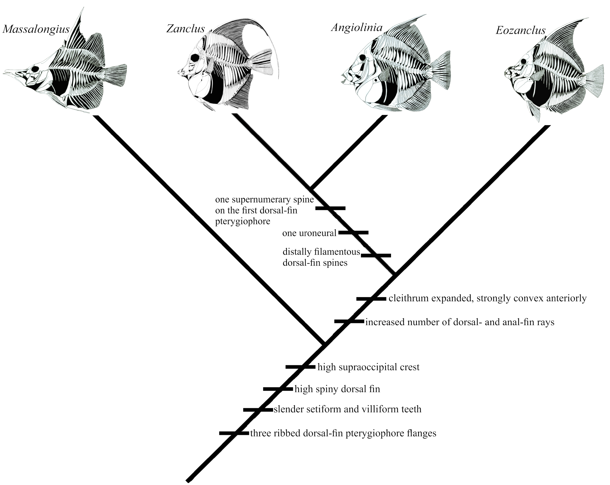

# Quan hệ phát sinh chủng loại của Zanclidae

## 1. Mục tiêu bài học

Bài này giải thích lập luận phylogeny của nghiên cứu bằng cách đọc từng nút trên Hình 9 và nối chúng với các cấu trúc đã học ở Module 03.

*Hình 9, trang PDF 13: cladogram giả thuyết vị trí của* Angiolinia *trong Zanclidae.*

## 2. Khung Acanthuriformes

Bài báo đặt Zanclidae trong Acanthuriformes cùng Acanthuridae và Luvaridae. Nhiều bằng chứng hình thái và phân tử trước đó được dẫn để hỗ trợ quan hệ gần giữa Acanthuridae và Zanclidae.

Hai character được nêu là chia sẻ giữa zanclid và acanthurid:

- khoảng interneural thứ ba trống;
- pterygiophore vây lưng/hậu môn phía trước có median flange bán nguyệt có gờ để khóa gai trước.

## 3. Massalongius là nhóm chị em của Zanclidae

*Massalongius gazolai*, một acanthuriform Eocene khác của Bolca, được đặt là sister group của Zanclidae. Những đặc điểm chung ở nhánh sâu hơn gồm:

- supraoccipital crest rất cao và tam giác;
- ba flange có gờ ở pterygiophore vây lưng trước;
- phần gai vây lưng cao, với gai vượt 40% SL;
- răng mảnh, trơn, dạng setiform/villiform.

## 4. Hai character xác định Zanclidae trong phân tích này

Tác giả nhấn mạnh hai đặc điểm không mơ hồ hỗ trợ tính đơn ngành của ba chi Zanclidae:

1. **Cleithrum nở rộng và lồi mạnh phía trước-bụng**, cùng coracoid tạo pectoral disc.
2. **Số tia vây lưng và vây hậu môn cao**, khoảng 31–43 tia lưng và 26–38 tia hậu môn trong các zanclid được xét.

Đây là nút tách Zanclidae khỏi *Massalongius* trên cladogram.

## 5. Eozanclus là nhánh cơ sở trong Zanclidae

*Eozanclus* giữ hai uroneural và hai gai supernumerary ở pterygiophore vây lưng đầu tiên. Hai trạng thái này giống điều kiện plesiomorphic ở các acanthuriform khác, nên nó được đặt bên ngoài nhánh dẫn xuất hơn gồm *Angiolinia* và *Zanclus*.

## 6. Nhánh Angiolinia + Zanclus

Ba character chung hỗ trợ cặp này:

- **một** gai supernumerary trên pterygiophore vây lưng đầu tiên;
- **một** uroneural trong bộ xương đuôi;
- tất cả gai vây lưng trừ hai gai đầu có đầu xa dạng sợi.

Vì vậy, dù nhiều tỷ lệ của *Angiolinia* “ở giữa” *Eozanclus* và *Zanclus*, topology của cladogram vẫn đặt *Angiolinia* gần *Zanclus* hơn.

## 7. Cách đọc cladogram mà không hiểu sai

Cladogram thể hiện giả thuyết quan hệ dựa trên character được lựa chọn và so sánh. Độ dài nhánh trong hình không phải thước đo thời gian hay mức độ “tiến hóa”. Các vạch character đặt trên nhánh cho biết trạng thái được dùng để hỗ trợ nút tương ứng trong lập luận của tác giả.

## 8. Tổng kết khóa học lý thuyết

Từ một mẫu vật Eocene, nghiên cứu đi qua chuỗi lập luận: địa tầng → mô tả mẫu → đo tỷ lệ → nhận diện xương → so sánh character → thiết lập taxon → xây dựng giả thuyết quan hệ. *Angiolinia mirabilis* vừa mở rộng đa dạng đã biết của Zanclidae ở Eocene vừa làm rõ các character của họ và vị trí tương đối của *Eozanclus* với *Zanclus*.
