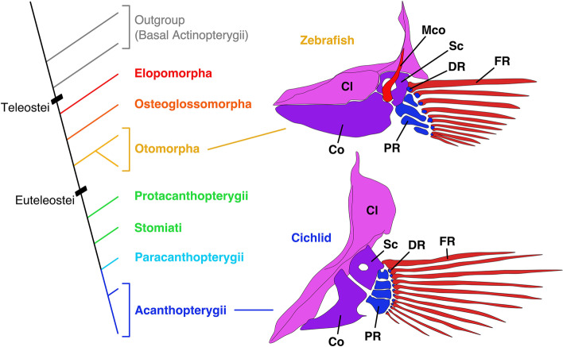

# Bài 1 — Cấu trúc vây ngực và câu hỏi tiến hóa

## Mục tiêu

- Nhận diện hai vùng chính của bộ xương vây ngực teleost.
- Hiểu vì sao số lượng xương không đủ để mô tả hình thái.
- Chuẩn bị một schema giải phẫu dùng được cho reference 3D.

## Nội dung cốt lõi

Vây ngực gồm **đai vây** và **phần tận cùng của vây**. Đai vây thường được mô tả bằng cleithrum, scapula, coracoid và mesocoracoid. Phần tận cùng gồm proximal radials, distal radials và fin rays. Khi dựng hình, nên giữ hai vùng này thành các nhóm riêng để có thể thay đổi tỉ lệ, khớp nối và hướng chuyển động mà không phá cấu trúc tổng thể.

Điểm đáng chú ý của nghiên cứu là tiến hóa không chỉ thể hiện ở “có hay không có” một xương. Hình dạng proximal radial, sự hiện diện của mesocoracoid và cách distal radial liên kết với fin ray cùng tạo nên không gian biến dị. Vì vậy, một mô hình tốt cần lưu cả topology của khớp nối, không chỉ số polygon hay số lượng phần tử.

## Bài tập Blender

1. Tạo collection `Pectoral_Girdle`, `Proximal_Radials`, `Distal_Radials`, `Fin_Rays`.
2. Dùng các mesh đơn giản để biểu diễn 4 thành phần đai vây.
3. Đặt origin của mỗi radial tại vùng khớp để thuận tiện cho rig.
4. Ghi chú tên xương và hướng trước–sau ngay trong Outliner.

## Hình tham khảo

Đọc thêm: [SOURCE_FULL.md](../SOURCE_FULL.md) và [FIGURES.md](../FIGURES.md).

## Kiểm tra nhanh

Vì sao một asset chỉ có “4 xương radial” vẫn có thể sai về mặt giải phẫu? Hãy trả lời bằng cách nêu ít nhất hai biến: hình dạng radial và kiểu liên kết với fin ray.

