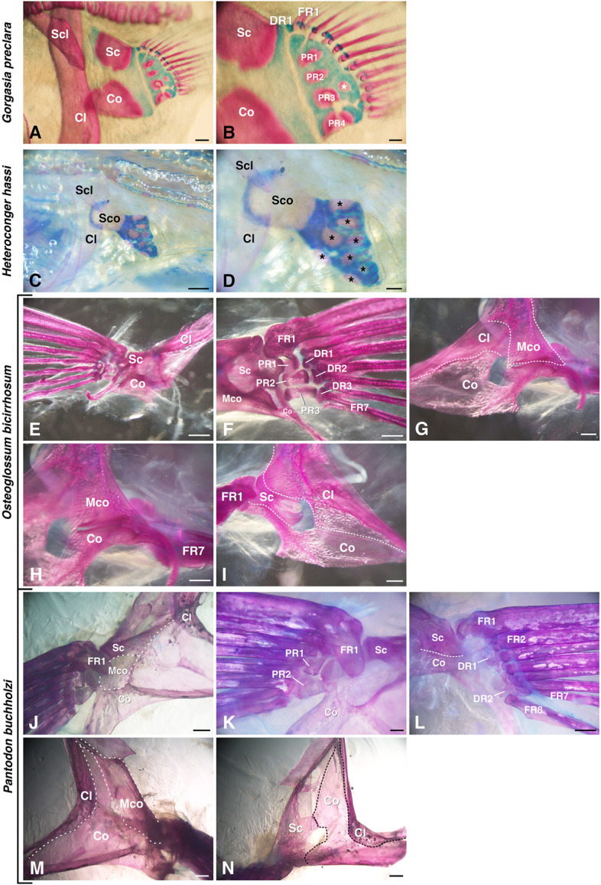

# Bài 2 — So sánh các nhóm teleost

## Mục tiêu

- Đọc một ma trận so sánh hình thái giữa nhiều nhóm cá.
- Tách đặc điểm tương đối bảo tồn khỏi đặc điểm biến đổi mạnh.
- Chuyển dữ liệu so sánh thành các variant của asset.

## Nội dung cốt lõi

Nghiên cứu khảo sát 27 loài thuộc nhiều nhánh teleost, gồm Elopomorpha, Osteoglossomorpha, Otomorpha, Protacanthopterygii/Stomiati, Paracanthopterygii và Acanthopterygii. Cách tiếp cận này giúp tránh kết luận dựa trên một loài đại diện duy nhất.

Khi so sánh, hãy ghi riêng ba lớp thông tin:

1. **Có mặt hay vắng mặt**: ví dụ mesocoracoid.
2. **Hình thái liên tục**: radial hình chữ nhật, đồng hồ cát hoặc dạng dumbbell.
3. **Kiểu kết nối**: một–một, một–nhiều hoặc hỗn hợp.

Không nên gộp cả ba thành một nhãn “loài A” hoặc “loài B”. Trong Blender, mỗi lớp nên là một tham số độc lập; nhờ vậy có thể tạo các mẫu trung gian và thể hiện đúng sự đa dạng quan sát được.

## Workflow dựng variant

- Tạo một base mesh cho đai vây.
- Dùng Geometry Nodes hoặc collection instances cho proximal radial.
- Tạo thuộc tính `mesocoracoid_present` dạng Boolean.
- Tạo danh sách connection map giữa distal radial và fin ray.
- Lưu từng loài dưới dạng preset, không nhân bản thủ công toàn scene.

## Hình tham khảo

## Bài tập

Lập bảng 3 cột cho 5 loài giả định: mesocoracoid, dạng proximal radial, kiểu nối distal radial–fin ray. Từ bảng đó tạo hai variant đối lập và một variant hỗn hợp.

