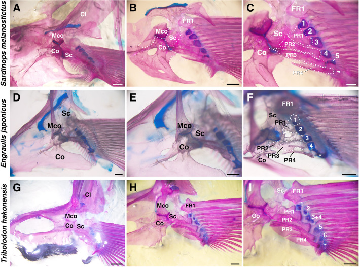

# Bài 3 — Proximal radials: bảo tồn và biến đổi

## Mục tiêu

- Hiểu “four-basal rule” như một xu hướng, không phải luật tuyệt đối.
- Dựng radial có hình dạng và khoảng cách phù hợp.
- Tránh nhầm số lượng xương với mức độ tương đồng chức năng.

## Nội dung cốt lõi

Phần lớn mẫu có khoảng bốn proximal radials, nhưng nghiên cứu cũng ghi nhận ngoại lệ. Bởi vậy, “four-basal rule” hữu ích như một điểm khởi đầu khi dựng model, không nên dùng như ràng buộc cứng cho mọi loài.

Hình dạng radial biến đổi từ khối tương đối chữ nhật đến dạng hourglass hoặc dumbbell. Các biến đổi này ảnh hưởng trực tiếp đến chiều dài tay đòn, vùng tiếp xúc và khoảng trống giữa các xương. Với asset 3D, cần giữ cạnh khớp và mặt cắt riêng biệt; một khối sculpt liền mạch sẽ khó kiểm soát khi muốn so sánh các variant.

## Quy trình dựng

1. Tạo một radial chuẩn với mặt khớp ở hai đầu.
2. Dùng proportional editing để tạo eo hourglass.
3. Dùng mirror chỉ ở giai đoạn blockout, sau đó áp dụng khi cần tạo bất đối xứng.
4. Đánh dấu vùng khớp bằng material hoặc vertex group.
5. Đặt tên theo thứ tự gần–xa và lưu connection map.

## Hình tham khảo

## Kiểm tra nhanh

Nếu loài có 5 proximal radials, asset có sai ngay không? Không. Cần kiểm tra thêm hình thái, vị trí, cách liên kết và bằng chứng mẫu trước khi kết luận.

