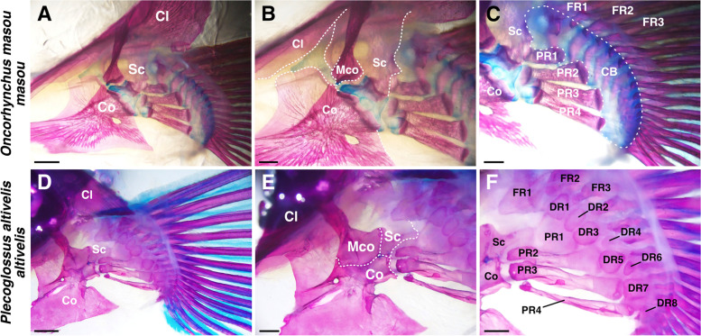

# Bài 4 — Mesocoracoid và vị trí vây

## Mục tiêu

- Nhận biết mesocoracoid là biến giải phẫu có giá trị so sánh.
- Hiểu mối liên hệ giả thuyết giữa vị trí vây, cơ và hình thái xương.
- Tạo variant có và không có mesocoracoid.

## Nội dung cốt lõi

Mesocoracoid hiện diện rõ ở nhiều dạng cơ sở nhưng bị mất ở nhiều dạng tiến hóa hơn. Nghiên cứu thảo luận rằng sự mất này có thể liên quan tới vị trí vây và thay đổi cơ học của hệ cơ–xương; đây là mối liên hệ chức năng cần mô hình hóa như giả thuyết, không phải kết luận nhân quả tuyệt đối.

Trong Blender, mesocoracoid nên là object độc lập. Variant không có xương này không nên chỉ ẩn object mà cần cập nhật cả:

- vị trí gắn cơ,
- khoảng trống giữa cleithrum và radial,
- đường truyền lực giả lập,
- nhãn chú thích trong scene.

## Bài tập dựng hai variant

- Variant A: mesocoracoid hiện diện, proximal radials tương đối chữ nhật.
- Variant B: mesocoracoid vắng mặt, proximal radials dạng hourglass/dumbbell.
- Dùng cùng camera và cùng tỉ lệ để việc so sánh không bị sai do phối cảnh.
- Thêm đường cong biểu diễn hướng co cơ, chỉ dùng như sơ đồ minh họa.

## Hình tham khảo

## Lưu ý khoa học

Không suy ra khả năng bơi chỉ từ sự có mặt của mesocoracoid. Cần kết hợp vị trí vây, cơ, khớp và dữ liệu động học.

