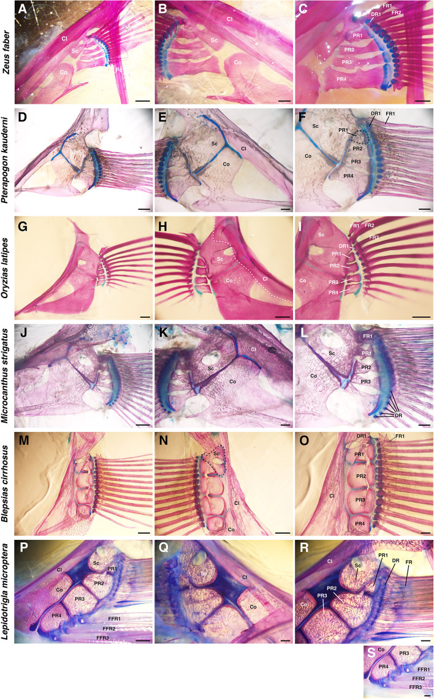

# Bài 5 — Distal radial–fin ray connections

## Mục tiêu

- Phân biệt kết nối một–một, một–nhiều và hỗn hợp.
- Biểu diễn topology của khớp bằng curve hoặc armature.
- Dựng fin rays có thể đổi số lượng mà không phá rig.

## Nội dung cốt lõi

Ba kiểu kết nối chính được dùng để mô tả phần tận cùng của vây:

- **Một–một**: mỗi distal radial liên kết với một fin ray.
- **Một–nhiều**: một radial liên kết với nhiều ray.
- **Hỗn hợp**: hai kiểu cùng xuất hiện trong một vây.

Các dạng derived thường có xu hướng một–một, còn dạng basal thường gặp một–nhiều hơn, nhưng ma trận thực tế có ngoại lệ. Vì vậy, topology phải được lưu dưới dạng dữ liệu thay vì “đóng cứng” trong mesh.

## Gợi ý rig

Tạo một bone cho mỗi radial và một bone cho mỗi ray. Dùng custom property `parent_radial_id` để lưu quan hệ. Với kết nối một–nhiều, cho nhiều ray kế thừa cùng một radial nhưng thêm constraint xoay nhỏ để tạo độ xòe. Với kiểu hỗn hợp, đặt tên theo bảng dữ liệu để có thể kiểm tra tự động.

## Hình tham khảo

## Bài tập

Tạo một vây 4 radial–8 ray theo kiểu một–nhiều, sau đó chuyển sang 4 radial–4 ray kiểu một–một bằng một preset. So sánh độ phức tạp của armature và chuyển động.

