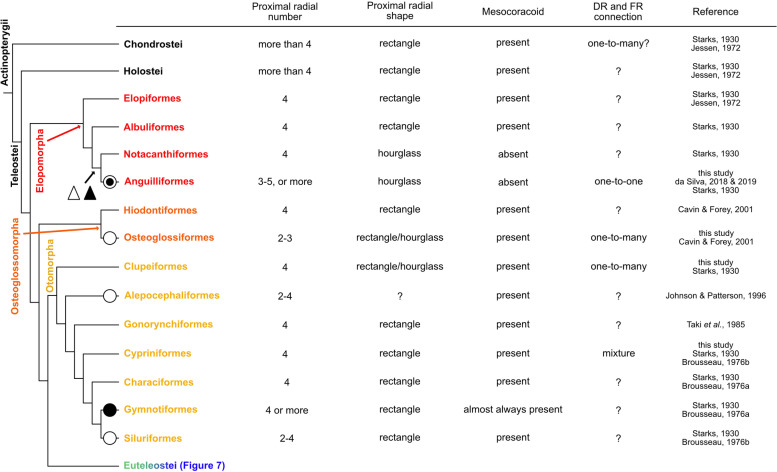

# Bài 6 — Từ dữ liệu so sánh đến asset Blender

## Mục tiêu

- Thiết kế asset có thể tái sử dụng cho nhiều loài.
- Tách dữ liệu hình thái khỏi phần trình bày.
- Xuất một scene reference có chú thích và provenance.

## Pipeline đề xuất

1. **Schema**: lưu loài, nhóm phát sinh, số radial, mesocoracoid và connection map.
2. **Blockout**: dựng đai vây và các radial ở cùng một hệ tọa độ.
3. **Topology**: tạo quan hệ radial–ray theo dữ liệu, không theo vị trí mắt nhìn.
4. **Variant**: dùng collection hoặc Geometry Nodes để thay đổi hình dạng.
5. **Rig**: đặt origin, bone và constraint tại vùng khớp.
6. **QA**: kiểm tra số phần tử, tên, hướng và tỉ lệ trước khi render.

## Bố cục scene

Mỗi mẫu nên có một frame thông tin: tên loài, nhóm, nguồn, mức độ chắc chắn và các đặc điểm đã quan sát. Có thể dùng material màu cho girdle, proximal radial, distal radial và fin ray; khi xuất bản, giữ một bản grayscale để tránh màu làm người xem hiểu nhầm đó là mô sinh học.

## Hình tham khảo

Xem thêm các hình còn lại trong [FIGURES.md](../FIGURES.md) và ghi chú nguồn tại [source/IMAGE_SOURCES.md](../source/IMAGE_SOURCES.md).

## Bài tập cuối khóa

Hoàn thiện hai mẫu vây ngực đối lập, xuất một ảnh orthographic có nhãn và một file `.blend` có collection variant. Trong README của asset, ghi rõ phần nào là dữ liệu bài báo và phần nào là diễn giải dựng hình.

