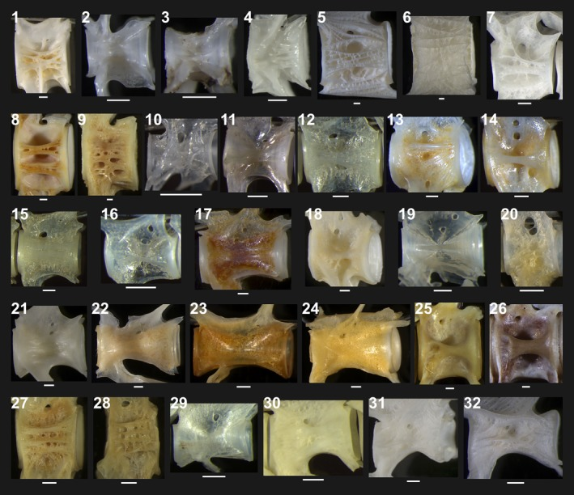

# Bài 1 — Cấu trúc thân đốt sống và câu hỏi nghiên cứu

## Mục tiêu

- Phân biệt hình dạng ngoài và cấu trúc bên trong của thân đốt sống teleost.
- Hiểu vì sao micro-CT cần thiết khi kính hiển vi thường không đủ phân giải.
- Xác định các feature cần giữ trong reference 3D.

## Nội dung cốt lõi

Một thân đốt sống có thể nhìn ngoài như ridge dày, mạng lưới hoặc bề mặt gần như trơn, nhưng các hình dạng đó vẫn có thể bắt nguồn từ những cấu trúc chung bên trong. Nghiên cứu dùng micro-CT để nối quan sát bề mặt với lát cắt và cấu hình 3D.

Khi dựng reference, hãy tách ba lớp: sclerotomal bone, neural/hemal arches và khoảng rỗng. Không nên dựng mọi chi tiết thành một khối đặc, vì hollow spaces là một phần của kết quả hình thái.

## Bài tập

Tạo một vertebra blockout có thân đốt, neural arch, hemal arch và một ridge bên. Đặt tên object theo giải phẫu, không theo màu hoặc vị trí màn hình.

