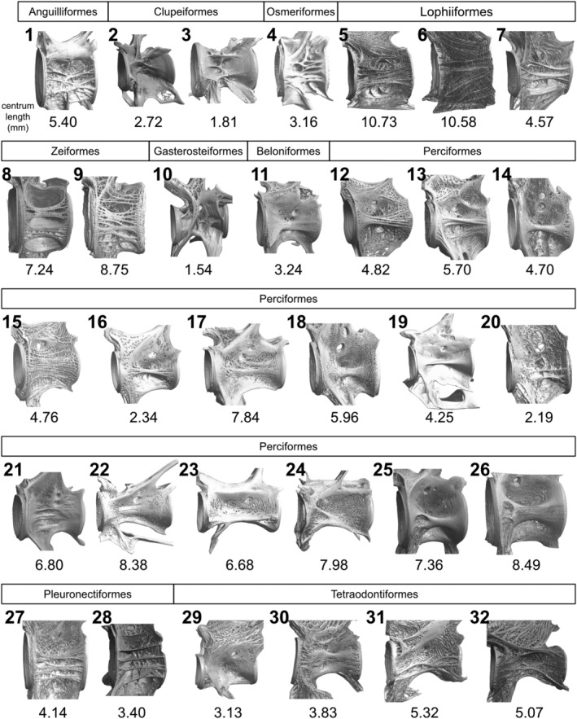

# Bài 2 — Chọn mẫu và chuẩn hóa so sánh

## Mục tiêu

- Hiểu giá trị của mẫu rộng: 32 loài, 10 bộ, 51 cá thể.
- Chuẩn hóa hướng, scale và vùng đốt sống khi làm reference.
- Tránh kết luận từ một mẫu duy nhất.

## Nội dung cốt lõi

Các loài được đặt trong cùng một hệ so sánh nhưng vẫn giữ đặc điểm riêng. Hình ảnh được quy về các hướng dorsal–ventral, left–right và trục cranial–caudal. Một số mẫu ghi standard length, một số trường hợp dùng total length hoặc tổng chiều dài cột sống theo chú thích bài báo.

Trong Blender, tạo Empty cho ba trục chuẩn và dùng một scale reference. Với mỗi mẫu, lưu metadata: loài, vùng đốt, chiều dài đo, độ phân giải và trạng thái xử lý. Đây là cách tránh nhầm khác biệt sinh học với khác biệt do crop hoặc scale.

## Bài tập

Nhập hai reference, căn cùng hướng và ghi rõ phép đo dùng để scale. Không kéo giãn mesh trước khi lưu bản gốc.

