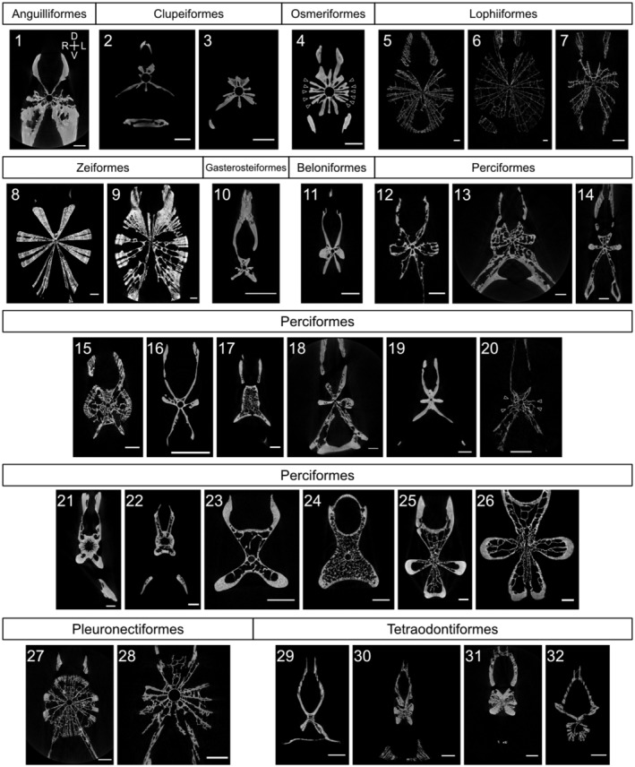

# Bài 3 — Quy trình chuẩn bị và micro-CT

## Mục tiêu

- Nắm chuỗi xử lý mẫu trước khi quét.
- Hiểu ý nghĩa của độ phân giải 2–14 μm/pixel.
- Ghi provenance cho dữ liệu hình ảnh.

## Quy trình tóm tắt

Mẫu được luộc, loại cơ, xử lý trypsin hoặc NaOH 2%, làm khô và quét bằng micro-CT SkyScan 1172. Nhóm tác giả kiểm tra các bước xử lý trên một số mẫu để xác nhận vi cấu trúc không bị thay đổi đáng kể. Volume rendering được xem bằng CT Vox.

Ảnh CT có thể dùng cho ba mục đích khác nhau: hình thái ngoài, lát cắt và đo feature nhỏ. Khi đưa vào Blender, cần giữ ảnh gốc, ảnh đã threshold và mesh tái tạo ở các thư mục khác nhau.

## Bài tập

Viết một file metadata cho asset gồm nguồn ảnh, voxel size, hướng cắt, threshold và các bước xử lý. Không gọi mesh đã threshold là “giải phẫu thật” nếu chưa kiểm chứng.

