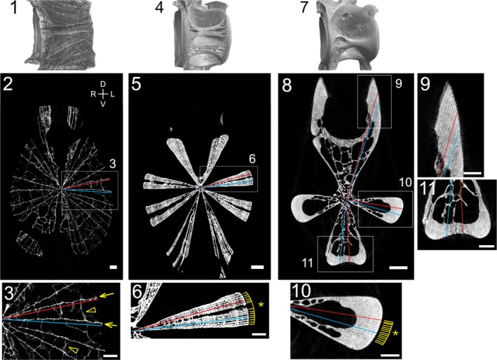

# Bài 4 — Hai đơn vị cấu trúc chung

## Mục tiêu

- Nhận diện trabeculae dạng tấm và hollow spaces.
- Hiểu cách hai yếu tố này tạo ra các dạng ridge khác nhau.
- Dựng mô hình parametric thay vì sculpt từng loài.

## Nội dung cốt lõi

Trabeculae dạng tấm phẳng, tỏa từ tâm và có độ dày tương đối đều. Khi các tấm cách nhau, chúng tạo mạng lưới; khi xếp sát, chúng tạo ridge dạng bản dày. Hollow spaces là vùng không có mô xương ở phần bên trong, làm thay đổi độ đặc của ridge nhưng không nhất thiết thay đổi góc của tấm ở đầu ngoài.

Một mô hình tối giản có thể dùng hai node group: `Radial_Sheets` và `Hollow_Spaces`. Tham số chính là số tấm, góc, khoảng cách, độ dày, vùng xếp chồng và bán kính khoang rỗng.

## Bài tập

Tạo một vertebra dạng lưới và một dạng ridge dày bằng cùng một node group, chỉ thay đổi khoảng cách và mức xếp chồng.

