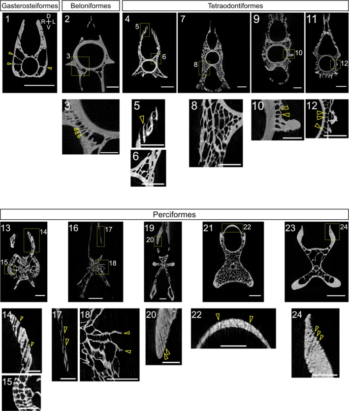

# Bài 5 — Trabeculae, hollow spaces và mô hình hình thành

## Mục tiêu

- Đọc sự khác nhau giữa ridge dày do xếp tấm và ridge đặc.
- Hiểu hollow space như một biến hình thái độc lập.
- Tạo hai hypothesis asset để so sánh.

## Nội dung cốt lõi

Độ dày tổng thể của ridge có thể tăng vì số trabeculae tăng, không nhất thiết vì từng trabecula dày hơn. Trong một cá thể, độ dày tấm thường gần như đồng nhất giữa thân đốt và cung neural/hemal. Ngược lại, hollow spaces có thể xuất hiện ở vùng gần tâm và được hiểu là dấu hiệu của quá trình resorption/remodeling hoặc một cơ chế phát triển khác.

Hãy tạo hai variant: (A) các tấm liên tục từ tâm ra ngoài; (B) tấm chủ yếu ở vùng ngoài, bên trong có khoang rỗng. Giữ cùng silhouette bên ngoài để thấy biến bên trong có thể thay đổi cấu trúc mà không đổi đường bao.

## Kiểm tra

Nếu ridge ngoài dày gấp bảy lần ở đầu xa, hãy kiểm tra xem nguyên nhân là độ dày mỗi tấm hay số lượng tấm. Đây là một phép phân biệt quan trọng trong dựng hình khoa học.

