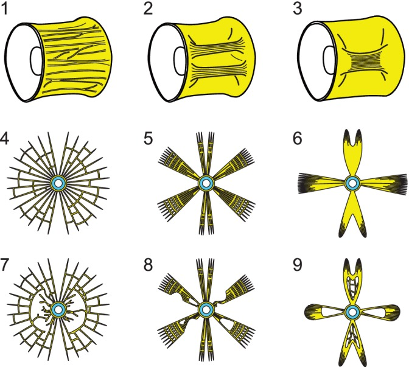

# Bài 6 — Đọc micro-CT cho reference 3D

## Mục tiêu

- Chuyển lát cắt thành mô hình 3D có kiểm soát.
- Ghi rõ phần quan sát được và phần nội suy.
- Xuất asset phục vụ anatomy board hoặc animation reference.

## Pipeline cuối khóa

1. Kiểm tra voxel size và orientation.
2. Tạo volume/lát cắt reference, giữ ảnh gốc bất biến.
3. Threshold thử nghiệm, ghi giá trị đã dùng.
4. Dựng thân đốt và arches ở mức blockout.
5. Thêm radial sheets và hollow spaces theo mẫu.
6. So khớp orthographic với ảnh CT.
7. Xuất mesh, screenshot và metadata cùng một phiên bản.

Độ dày trabeculae trong nguồn khoảng 30–100 μm; nếu scene được scale ở mức hiển thị, ghi rõ hệ số phóng đại. Không dùng bản render đẹp thay cho dữ liệu gốc.

## Bài tập cuối khóa

Hoàn thiện hai vertebra variant: một dạng trabecular network và một dạng plate-like ridge có hollow space. Mỗi variant cần một camera orthographic, nhãn hướng và bảng provenance.

