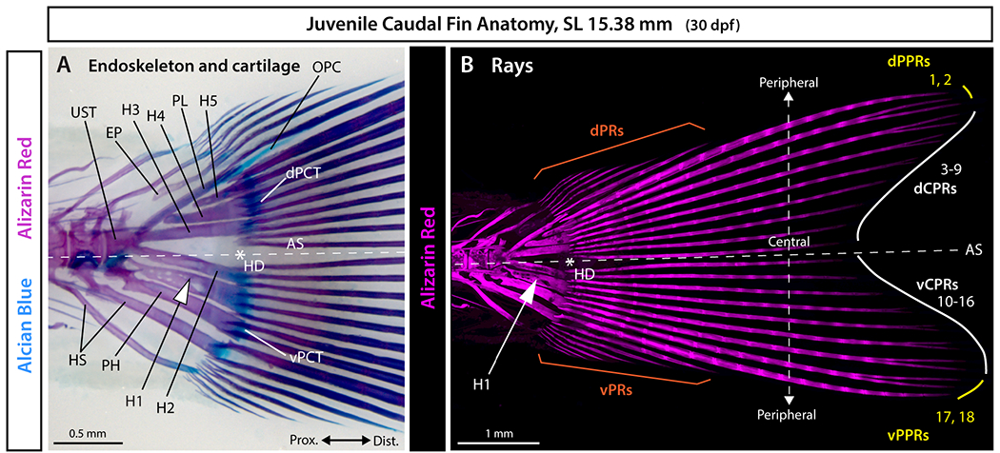

# Bài 1 — Hypural diastema và symmetry axis

## Mục tiêu

- Đặt hypural diastema vào đúng vị trí giải phẫu.
- Phân biệt đối xứng ngoài với tổ chức phát triển bên trong.
- Dựng trục đối xứng làm xương sống cho scene.

## Nội dung cốt lõi

Hypural diastema là khoảng giữa hypurals 2 và 3, nằm trên trục đối xứng lưng–bụng của vây đuôi. Trong cá teleost, vùng này không chỉ là một khoảng trống; nó liên quan tới hai tấm mô liên kết và vùng phân nhánh mạch máu. Khi notochord cong lên, các thành phần đuôi xoay theo và tạo nên silhouette homocercal đối xứng.

Trong Blender, tạo Empty `HDOC_axis` qua tâm diastema. Các ray trung tâm nên được sinh theo cặp quanh trục này, thay vì đặt thủ công từng ray.

## Bài tập

Dựng hypurals 1–5, parhypural và hai nhóm ray hai bên diastema. Kiểm tra đối xứng ở orthographic front view trước khi thêm chi tiết.

