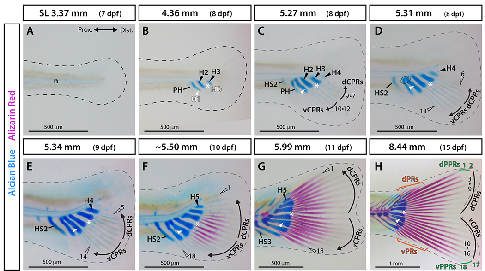

# Bài 2 — CPRs, PPRs và trình tự xuất hiện

## Mục tiêu

- Phân loại principal rays thành CPRs và PPRs.
- Mô phỏng trình tự phát triển bằng keyframe hoặc visibility.
- Giữ đúng số ray đặc trưng của zebrafish.

## Nội dung cốt lõi

Zebrafish có 18 principal rays. CPRs là rays 3–16, hình thành tuần tự và đối xứng theo cặp quanh HDOC. PPRs là rays 1–2 và 17–18, xuất hiện độc lập hơn, sớm hơn các CPR lân cận và có khoảng tách rõ trong giai đoạn đầu. Procurrent rays nằm ở mép lưng/bụng, ngắn hơn và thường không phân đốt như principal rays.

Tạo ba collection: `CPR_03_16`, `PPR_01_02_17_18`, `Procurrent`. Dùng driver theo `development_day` để bật ray theo thứ tự. Đừng dùng một scale chung cho mọi ray nếu muốn thể hiện dữ liệu ontogeny.

## Bài tập

Tạo timeline 7–15 dpf: 7 dpf không có ray, 8–10 dpf ray trung tâm xuất hiện theo cặp, khoảng 11 dpf đủ 18 principal rays và 15 dpf có thêm procurrent rays.

