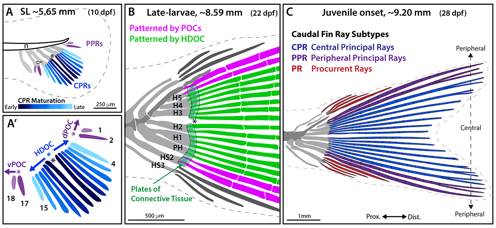

# Bài 3 — Three-organizer model

## Mục tiêu

- Hiểu mô hình HDOC + hai POC.
- Chuyển organizer thành các module procedural.
- Ghi rõ đâu là dữ liệu quan sát, đâu là mô hình giải thích.

## Nội dung cốt lõi

HDOC tạo trường phản ứng hai chiều, định hình các tấm mô liên kết và CPRs. Hai POC nằm ở hai phía dọc trục trước–sau, tạo các nhóm PPR. Mô hình này giải thích vì sao silhouette cuối cùng đối xứng nhưng lịch sử hình thành của ray trung tâm và ray ngoại vi khác nhau.

Trong Geometry Nodes, HDOC có thể là điểm phát hai nhánh đối xứng; mỗi POC là một emitter riêng với tham số khoảng cách, số ray và hướng phát triển. Lưu các tham số trong custom properties để dễ làm variant phá đối xứng có chủ đích.

## Bài tập

Tạo một bản chuẩn đối xứng và một bản thay đổi duy nhất vị trí POC. Gắn nhãn để người xem không nhầm variant thử nghiệm với kiểu phát triển đã được quan sát.

