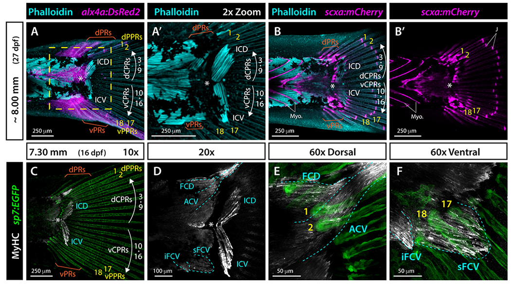

# Bài 4 — Cơ, gân và tính chất cơ học

## Mục tiêu

- Liên hệ nhóm ray với nhóm cơ gắn vào chúng.
- Dựng sơ đồ cơ–ray tối thiểu.
- Tránh biến symmetry hình thái thành giả định symmetry chức năng.

## Nội dung cốt lõi

ICD và ICV nối chủ yếu với CPRs 3–16, theo bố trí lưng–bụng tương ứng quanh diastema. ACV, sFCV và iFCV gắn với các ray ngoại vi hoặc procurrent rays. Các nhóm cơ ngoại vi khác nhau về hình dạng, chiều dài và ray gắn; do đó đối xứng của vây không đồng nghĩa mọi cơ đều là ảnh gương hoàn hảo.

Dựng cơ bằng curve có profile mềm, đặt đầu curve tại vùng gắn cơ. Tạo constraint hoặc parent relation riêng cho CPR, PPR và procurrent. Các vector lực trong scene chỉ là sơ đồ minh họa nếu chưa có dữ liệu cơ học định lượng.

## Bài tập

Gắn ICD/ICV vào nhóm CPRs và tạo ba nhóm cơ ngoại vi. Kiểm tra rằng đổi góc một CPR không làm PPR tự động biến thành ảnh gương.

