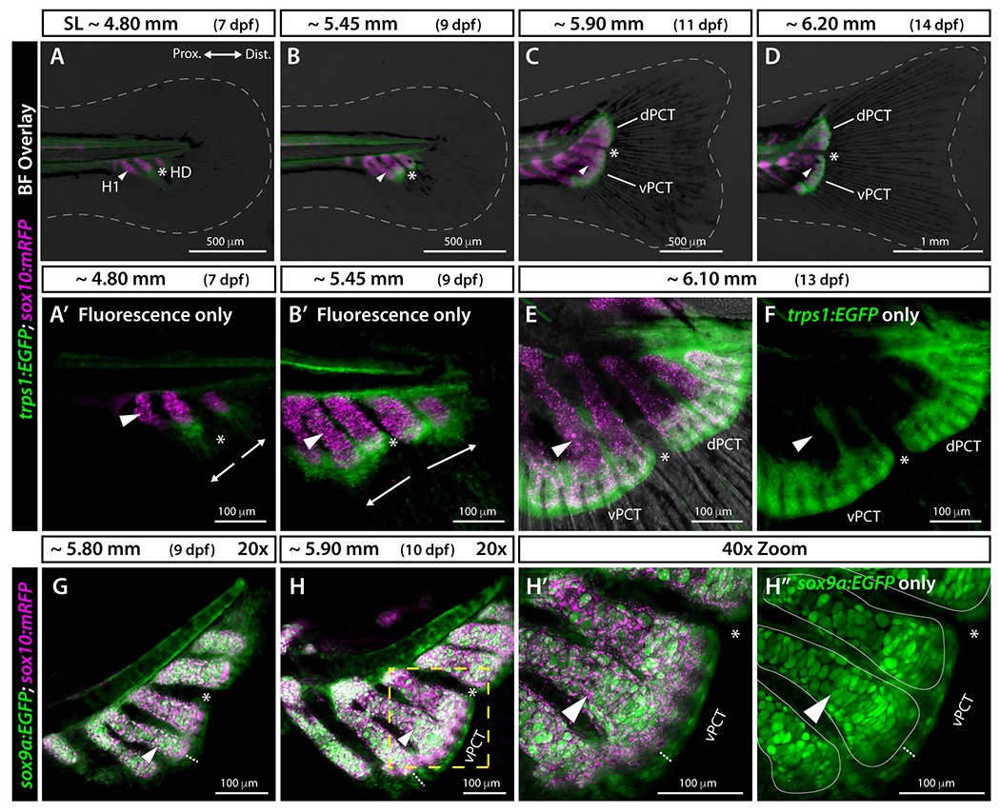

# Bài 5 — Phương pháp và workflow caudal-fin 3D

## Mục tiêu

- Tổ chức scene theo giai đoạn phát triển.
- Kết hợp anatomy, marker và cơ trong một board.
- Xuất asset có provenance.

## Pipeline

1. Tạo trục HDOC và blockout hypurals.
2. Chia ray thành CPR, PPR và procurrent.
3. Tạo timeline phát triển theo dpf và standard length.
4. Thêm connective-tissue plates như hai object riêng.
5. Thêm marker/label bằng material hoặc text, không sửa mesh.
6. Gắn muscle/tendon curves và ghi rõ giả định.
7. Xuất view đối xứng, view phát triển và view cơ học.

Whole-mount Alcian Blue/Alizarin Red, reporter lines và confocal/widefield imaging là các loại dữ liệu nguồn khác nhau. Khi trình bày, dùng màu/nhãn phân biệt cartilage, bone, progenitor marker và mô hình diễn giải.

## Bài tập cuối khóa

Hoàn thiện một board gồm 7, 9, 11 và 15 dpf; mỗi frame có scale, hướng, nhóm ray và nguồn. Kèm file [SOURCE_NOTES.md](../SOURCE_NOTES.md) để người khác phân biệt dữ liệu bài báo với phần dựng thêm.

