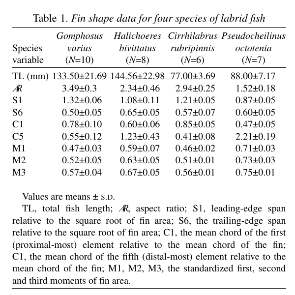

# Bài 04 - Moment of area và ý nghĩa cơ học

> **Loại:** Lesson  
> **Nguồn chính:** phần Fin morphometrics và Erratum.

## Mục tiêu học tập

- Hiểu cách tạo các moment diện tích chuẩn hóa M1, M2, M3.
- Diễn giải M1 theo vị trí tâm diện tích của vây.
- Nhận biết Erratum sửa M2 và M3 trong Table 1.

## Công thức chuẩn hóa

Mỗi phần tử diện tích được chuẩn hóa:

\[
\hat a_j = \frac{a_j}{A}
\]

Vị trí theo bán kính được chuẩn hóa:

\[
\hat r_j = \frac{r_j-\Delta r}{R}
\]

Moment diện tích bậc `k` được viết dưới dạng:

\[
M_k = \sum_{j=1}^{5}\hat r_j^{k}\hat a_j
\]

## Ý nghĩa của M1

`M1` biểu diễn vị trí tương đối của **tâm diện tích** so với gốc vây.

- M1 thấp hơn: phần lớn diện tích tập trung gần gốc hơn, phù hợp vây tapering/wing-like.
- M1 cao hơn: diện tích dồn ra xa gốc hơn, phù hợp vây distally expanding/paddle-like.

## Ý nghĩa của M2 và M3 trong bài báo

Bài báo nêu:

- `M2` tỉ lệ với các thành phần lực khí/thuỷ động và lực quán tính, bao gồm acceleration reaction;
- `M3` tỉ lệ với mean profile power.

Hai đại lượng này giúp nối hình học phân bố diện tích với hậu quả cơ học của việc dao động vây.

## Erratum quan trọng

File PDF đi kèm một trang sửa lỗi: phiên bản in ban đầu có giá trị **M2 và M3 trong Table 1 không đúng**. Khóa học này sử dụng bảng đã sửa.

Một số giá trị đã sửa:

| Loài | M1 | M2 | M3 |
|---|---:|---:|---:|
| *G. varius* | 0.47 | 0.52 | 0.57 |
| *H. bivittatus* | 0.59 | 0.63 | 0.67 |
| *C. rubripinnis* | 0.46 | 0.51 | 0.56 |
| *P. octotaenia* | 0.71 | 0.73 | 0.75 |

Các số trên là giá trị trung bình; bảng gốc có kèm độ lệch chuẩn.

## Tự kiểm tra

1. Hai loài nào có M1 thấp nhất?
2. M1 thấp gợi ý tâm diện tích gần gốc hay gần tip?
3. Tại sao phải ưu tiên Table 1 ở trang Erratum khi xây dựng dữ liệu học tập?
