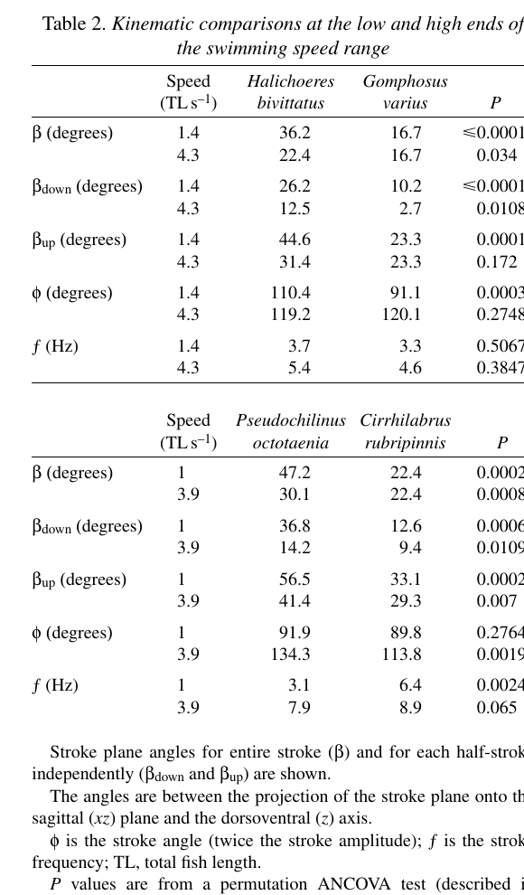

# Bài 07 - Đo động học và kiểm định thống kê

> **Loại:** Lesson  
> **Nguồn chính:** phần kinematic variables và statistical tests.

## Mục tiêu học tập

- Định nghĩa các biến `φ`, `β`, `βdown`, `βup`, `f`.
- Hiểu cách tái dựng thành phần 3D từ video lateral 2D trong nghiên cứu.
- Giải thích vì sao tác giả dùng permutation test thay cho ANCOVA chuẩn trong một số phép so sánh.

## Các biến động học

Sau giai đoạn hồi phục, cá được quay ở nhiều tốc độ. Từ chuỗi video số hóa, nghiên cứu tạo năm biến chính, trong đó các đại lượng được phân tích nổi bật gồm:

- `f`: frequency của chu kỳ đập vây;
- `φ`: stroke angle, độ dịch chuyển góc cực đại của tia leading-edge qua một fin beat;
- `β`: stroke plane angle;
- `βdown`: mặt phẳng của half-stroke abduction/downstroke;
- `βup`: mặt phẳng của half-stroke adduction/upstroke.

## Stroke angle φ

`φ` được xác định từ góc giữa vector vị trí của tip leading-edge ray ở maximum adduction và maximum abduction.

Do video là lateral 2D, thành phần thứ ba phải được tái dựng bằng giả định hình học về vị trí tia vây khi adduction và chiều dài tia. Với *G. varius*, tác giả kiểm tra sai số bằng dữ liệu 3D trước đó và báo cáo median absolute error khoảng `3.5°`.

## Stroke plane angle β

`β` mô tả độ dốc của đường đi đầu tia vây trên mặt phẳng giải phẫu. Trong quy ước của bài báo, **β giảm nghĩa là stroke plane trở nên dốc hơn/more dorsoventral**.

Nghiên cứu tách downstroke và upstroke vì hai nửa chu kỳ không nằm trên cùng một mặt phẳng: abduction thường dốc hơn adduction.

## Vì sao không dùng ANCOVA chuẩn ở mọi nơi?

Động học thay đổi theo tốc độ, nên ANCOVA với speed làm covariate là lựa chọn tự nhiên. Tuy nhiên, bài báo phát hiện tương tác `speed × species` có ý nghĩa, tức slope của quan hệ động học-tốc độ khác giữa loài. Điều này vi phạm điều kiện của ANCOVA chuẩn.

Giải pháp của tác giả là một permutation procedure:

- fit hồi quy bậc hai riêng cho từng loài;
- tính chênh lệch kỳ vọng ở low/high speed chung;
- hoán vị nhãn loài;
- tính lại pseudodifference 9,999 lần;
- so observed difference với phân bố 10,000 giá trị gồm observed.

## Table 2

Bảng này tổng hợp các so sánh ở đầu thấp và cao của dải tốc độ cho hai cặp loài.

## Tự kiểm tra

1. Trong quy ước của bài báo, β giảm tương ứng với stroke plane nông hơn hay dốc hơn?
2. Vì sao cần tách `βdown` và `βup`?
3. Tương tác speed × species gây vấn đề gì cho ANCOVA chuẩn?
