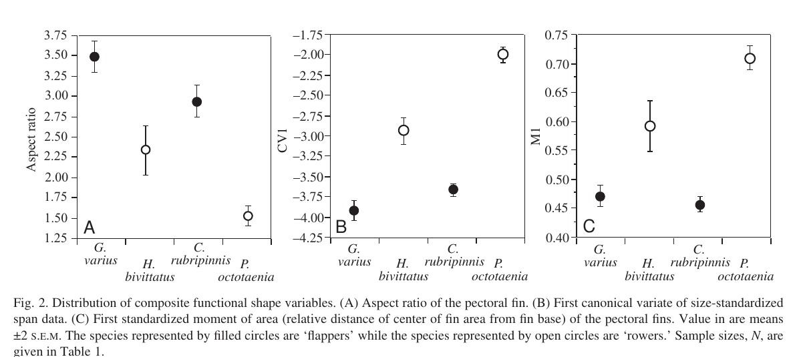
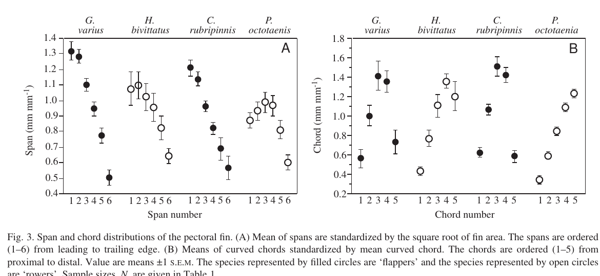

# Bài 08 - Kết quả hình dạng vây

> **Loại:** Lesson  
> **Nguồn chính:** Results - Fin shape analysis; Figures 2-3; corrected Table 1.

## Mục tiêu học tập

- So sánh AR, span, chord và M1 giữa bốn loài.
- Nhận diện mẫu hình "flapper = wing-like" trong dữ liệu.
- Đọc Figures 2 và 3.

## Figure 2 - các biến hình dạng chức năng

Aspect ratio trải từ khoảng `1.5` ở *P. octotaenia* đến `3.5` ở *G. varius*. Trong cả hai cặp, flapper có AR cao hơn rower một cách có ý nghĩa thống kê.

Các giá trị AR trung bình từ bảng đã sửa:

| Loài | Kiểu | AR |
|---|---|---:|
| *G. varius* | flapper | 3.49 |
| *H. bivittatus* | rower | 2.34 |
| *C. rubripinnis* | flapper | 2.94 |
| *P. octotaenia* | rower | 1.52 |

Figure 2C cho thấy M1 thấp ở hai flapper, nghĩa là tâm diện tích nằm gần gốc vây hơn.

## Figure 3 - phân bố span và chord

Mẫu hình chính:

- *G. varius* và *C. rubripinnis*: anterior spans tương đối dài; vây taper rõ sau chord thứ ba.
- *H. bivittatus*: trung gian; taper chủ yếu sau chord thứ tư.
- *P. octotaenia*: anterior spans ngắn hơn và hầu như không taper theo chord.

Do đó, dữ liệu hình thái ủng hộ trục liên tục từ **distally tapering, wing-like** đến **distally expanded/paddle-like**.

## Kết luận của bài

Các flapper không chỉ khác rower ở một chỉ số. Nhiều đặc trưng đồng thời cùng hướng:

- AR cao;
- leading/anterior span dài tương đối;
- chord giảm về đầu xa;
- M1 thấp hơn.

Sự nhất quán này quan trọng vì nó cho thấy "kiểu vây" là một thiết kế hình thái tích hợp, không phải một nhãn dựa trên một số đo duy nhất.

## Tự kiểm tra

1. Loài nào có AR thấp nhất?
2. Loài nào không thể hiện taper rõ ở Figure 3B?
3. Vì sao M1 thấp phù hợp với vây wing-like?
