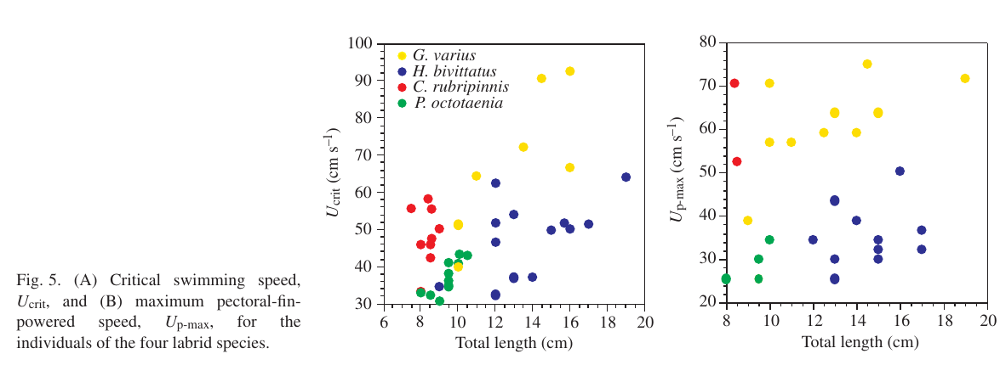
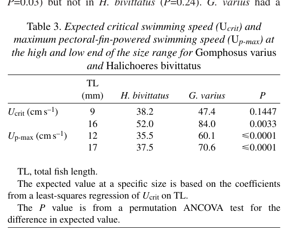
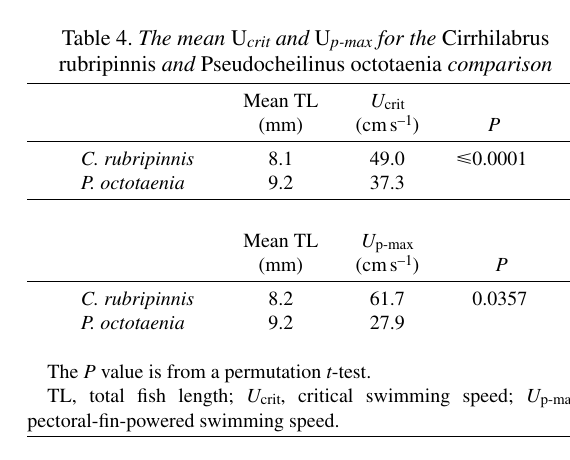

# Bài 10 - Kết quả hiệu suất bơi

> **Loại:** Lesson  
> **Nguồn chính:** Swimming performance; Figure 5; Tables 3-4.

## Mục tiêu học tập

- So sánh Ucrit và Up-max trong hai cặp loài.
- Hiểu ảnh hưởng của body length trong cặp *G. varius* - *H. bivittatus*.
- Đọc Figures/Tables hiệu suất.

## Figure 5

Figure 5 biểu diễn:

- `Ucrit` theo total length;
- `Up-max` theo total length.

Nhìn chung, các flapper nằm ở vùng hiệu suất cao hơn so với rower cùng cặp.

## Cặp G. varius - H. bivittatus

`Ucrit` tăng với body length ở cả hai loài. Ở chiều dài lớn trong vùng so sánh, *G. varius* có Ucrit cao hơn rõ. Với `Up-max`, *G. varius* cao hơn *H. bivittatus* ở các kích thước được so sánh.

Các giá trị kỳ vọng nổi bật trong Table 3:

| Chỉ số | TL | *H. bivittatus* | *G. varius* |
|---|---:|---:|---:|
| Ucrit | 9 | 38.2 | 47.4 |
| Ucrit | 16 | 52.0 | 84.0 |
| Up-max | 12 | 35.5 | 60.1 |
| Up-max | 17 | 37.5 | 70.6 |

Đơn vị tốc độ là `cm/s`.

## Cặp C. rubripinnis - P. octotaenia

Bài báo báo cáo:

- mean Ucrit: `49.0 cm/s` ở *C. rubripinnis* so với `37.3 cm/s` ở *P. octotaenia*;
- mean Up-max: `61.7 cm/s` so với `27.9 cm/s`.

Cả hai khác biệt đều có ý nghĩa theo permutation test được tác giả sử dụng.

## Axial kicking và chênh lệch Ucrit - Up-c

Tác giả ghi nhận axial kicking làm Ucrit vượt giới hạn chỉ-vây-ngực ở một số loài. Chênh lệch trung bình giữa Ucrit và Up-c được báo cáo khoảng:

- 9.1% ở *H. bivittatus*;
- 0% ở *G. varius*;
- 12.4% ở *P. octotaenia*;
- 3.7% ở *C. rubripinnis*.

Điều này củng cố ý tưởng rằng nếu chỉ xét hệ vây ngực, khoảng cách hiệu suất rower-flapper còn có thể rõ hơn.

## Tự kiểm tra

1. Loài nào có mean Up-max cao hơn trong cặp *C. rubripinnis* - *P. octotaenia*?
2. Vì sao body length cần được xử lý khi so sánh cặp *G. varius* - *H. bivittatus*?
3. Axial kicking làm Ucrit phản ánh hoàn toàn khả năng vây ngực hay không?
