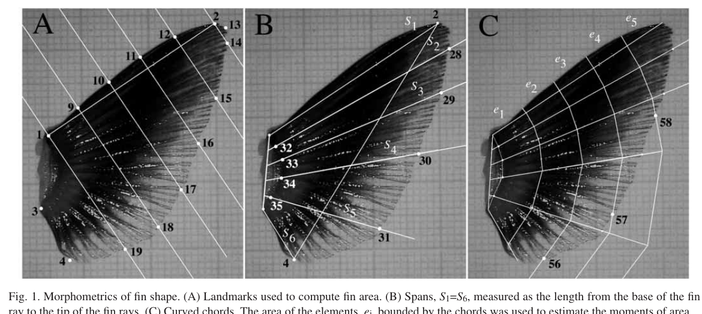
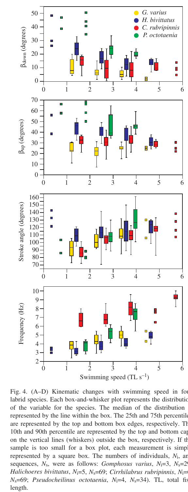

# Bài 13 - Tổng ôn khái niệm và đọc hình

> **Loại:** Review

## Bản đồ kiến thức

## Các cặp khái niệm cần nhớ

| Khái niệm A | Khái niệm B | Điểm khác nhau |
|---|---|---|
| Ucrit | Up-c | Ucrit có thể được tăng nhờ axial kicks; Up-c nhấn mạnh giới hạn prolonged chỉ-vây-ngực |
| Up-c | Up-max | prolonged capacity vs sprint capacity của hệ vây ngực |
| Rowing | Flapping | quỹ đạo nông trước-sau vs dốc lưng-bụng |
| Paddle-like | Wing-like | distally expanded/AR thấp vs taper/AR cao |
| φ | β | stroke angular excursion vs stroke-plane orientation |
| βdown | βup | mặt phẳng của hai half-stroke khác nhau |

## Đọc nhanh Figure 1-5

- **Figure 1:** cách đo vây: landmarks, span, curved chord và element area.
- **Figure 2:** flapper có AR cao và M1 thấp hơn.
- **Figure 3:** flapper có anterior spans dài hơn và chord taper mạnh hơn.
- **Figure 4:** động học thay đổi theo tốc độ; rower làm stroke plane dốc hơn khi tăng tốc.
- **Figure 5:** flapper đạt Ucrit/Up-max cao hơn trong các cặp so sánh.

## Hình ảnh ôn tập

## Kết luận một câu

Trong bốn loài Labridae được so sánh, thiết kế vây ngực dài-thon, taper và quỹ đạo đập dốc kiểu flapping đồng biến với khả năng đạt và duy trì tốc độ bơi bằng vây ngực cao hơn, trong khi thiết kế thiên rowing có thể giữ lợi ích cho maneuver/hover ở tốc độ thấp.
