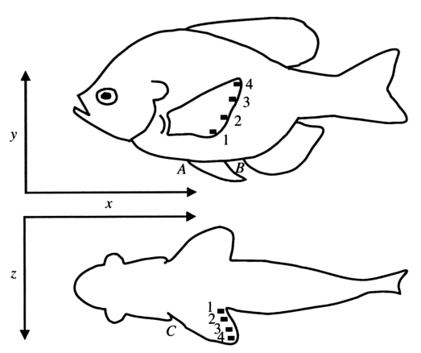

# Bài 02 — Thiết kế thí nghiệm và hệ tọa độ 3D

## 1. Tóm tắt bài học

Để định lượng chuyển động của một vây mỏng và trong suốt, nhóm nghiên cứu cần biến chuyển động liên tục của vây thành các tọa độ có thể đo được. Họ thực hiện điều này bằng cách gắn bốn marker lên mép xa của vây ngực trái, quay đồng thời từ bên hông và từ phía bụng, rồi ghép hai góc nhìn để thu được chuyển động theo ba trục x-y-z.



*Nguồn hình: Figure 1, PDF trang 5.*

## 2. Mục tiêu học tập

Sau bài này, người học có thể:

- mô tả thiết kế flow tank và hệ thống ghi hình;
- xác định ý nghĩa của ba trục x, y, z;
- giải thích cách bốn marker đại diện cho các vùng khác nhau của vây;
- hiểu cách định nghĩa các biến excursion, frequency, velocity và phase lag.

## 3. Mẫu nghiên cứu và điều kiện bơi

Nghiên cứu sử dụng **4 cá thể bluegill sunfish** có kích thước tương đối gần nhau để hạn chế ảnh hưởng của chênh lệch kích thước.

Năm tốc độ bơi được kiểm tra:

| Mức | Tốc độ |
|---|---:|
| 1 | 0.3 TL s⁻¹ |
| 2 | 0.5 TL s⁻¹ |
| 3 | 0.75 TL s⁻¹ |
| 4 | 1.0 TL s⁻¹ |
| 5 | 1.1 TL s⁻¹ |

Ở tốc độ lớn hơn khoảng 1.1 TL s⁻¹, bluegill bắt đầu dùng thân và vây đuôi cùng với, hoặc thay cho, vây ngực. Vì vậy dải tốc độ trên bao phủ vùng locomotion bằng vây ngực mà paper muốn tập trung.

Mỗi cá thể được quay ở cả năm tốc độ, và tại mỗi tốc độ nhóm nghiên cứu phân tích **4 nhịp đánh vây liên tiếp**.

## 4. Flow tank và hệ thống quay

Cá bơi trong một flow tank chứa khoảng 1000 L nước. Vùng làm việc của tank có kích thước khoảng:

- dài 45 cm;
- rộng 18 cm;
- cao 18 cm.

Tốc độ dòng được điều khiển bằng động cơ biến tốc gắn cánh quạt.

Hai góc nhìn được ghi đồng thời bằng hệ thống video tốc độ cao **200 fields per second**:

- camera bên hông cho lateral view;
- camera thứ hai dùng gương dưới tank để thu ventral view.

Việc đồng bộ hai góc nhìn là điều kiện quan trọng để khôi phục quỹ đạo 3D.

## 5. Bốn marker trên mép vây

Các marker được đánh số **1 → 4 từ ventral đến dorsal**:

- marker 1: vùng ventral nhất;
- marker 2: vùng ventral-trung gian;
- marker 3: vùng dorsal-trung gian;
- marker 4: vùng dorsal nhất và cũng là vùng gần tip/leading edge quan trọng trong phân tích.

Các marker nhỏ bằng nhựa đen được gắn vào mép xa của vây để tăng tương phản khi digitize từng frame.

## 6. Ba trục chuyển động

### 6.1. Trục x — longitudinal

Trục x mô tả chuyển động trước-sau dọc theo thân cá:

- **protraction**: đưa vây về phía trước;
- **retraction**: đưa vây về phía sau.

### 6.2. Trục y — vertical

Trục y mô tả chuyển động lên-xuống:

- **levation**: nâng vây lên;
- **depression**: hạ vây xuống.

### 6.3. Trục z — lateral

Trục z mô tả chuyển động ra-vào so với thân:

- **abduction**: đưa vây ra xa thân;
- **adduction**: khép vây về phía thân.

Trong lateral view, nhóm nghiên cứu lấy tọa độ x và y. Trong ventral view, họ lấy x và z. Khi ghép hai góc nhìn, mỗi marker có thể được mô tả trong không gian ba chiều.

## 7. Các điểm tham chiếu trên thân

Ngoài marker trên vây, nhóm nghiên cứu digitize các điểm cố định trên thân để loại bỏ chuyển động của toàn thân khỏi chuyển động tương đối của vây.

Figure 1 ký hiệu:

- A: điểm bám phía trước của vây bụng;
- B: điểm bám phía trước của vây hậu môn;
- C: gốc vây ngực trái.

Điều này cho phép trả lời hai câu hỏi khác nhau:

1. vây chuyển động **so với thân** như thế nào;
2. vây chuyển động **so với nước/hệ quy chiếu cố định** như thế nào.

Hai loại hệ quy chiếu này phục vụ hai mục đích khác nhau: giải phẫu chức năng và thủy động lực học.

## 8. Cách định nghĩa một chu kỳ đánh vây

Paper định nghĩa chu kỳ dựa trên **hai lần liên tiếp marker 4 đạt độ lệch lateral cực đại**.

Lý do là đường cong lateral có đỉnh khá rõ, giúp đo thời gian chu kỳ chính xác.

Tuy vậy, khi mô tả bằng lời, tác giả thường bắt đầu chu kỳ ở thời điểm **bắt đầu abduction**, tức lúc vây rời khỏi vị trí gần thân.

## 9. Các biến động học chính

### 9.1. Excursion — biên độ quãng chuyển động

Với mỗi marker và mỗi trục:

```text
excursion = giá trị lớn nhất - giá trị nhỏ nhất trong một chu kỳ
```

Có 4 marker × 3 trục = **12 biến excursion**.

Ví dụ:

- `4XEX`: excursion theo x của marker 4;
- `2YEX`: excursion theo y của marker 2;
- `1ZEX`: excursion theo z của marker 1.

### 9.2. Fin beat frequency

Nếu chu kỳ kéo dài `T` giây:

```text
FREQ = 1 / T
```

Đơn vị là Hz.

### 9.3. Vận tốc cực đại của marker 4

Nhóm nghiên cứu tính vận tốc chuyển động đầu vây trong ba trục cho hai nửa chu kỳ:

- abduction;
- adduction.

Về bản chất, vận tốc giữa hai ảnh liên tiếp được tính từ:

```text
velocity = displacement / time interval
```

### 9.4. Phase lag — lệch pha

Paper so thời điểm các marker ventral đạt lateral displacement cực đại với marker 4.

Công thức quy đổi sang độ:

```text
phase lag = (Δt / cycle duration) × 360°
```

Giá trị dương nghĩa là marker ventral đạt cực đại **sau** marker 4.

## 10. Quy mô dữ liệu

Khoảng 20 frame được digitize cho mỗi nhịp vây. Tổng cộng paper phân tích xấp xỉ **1600 video frames**.

Dữ liệu sau đó được đưa vào spreadsheet để tính các biến động học và thực hiện ANOVA nhằm kiểm tra ảnh hưởng của:

- tốc độ;
- vị trí marker;
- khác biệt giữa cá thể.

## 11. Bài luyện tập ngắn

1. Nếu một chu kỳ dài 0.5 s, tần số đánh vây là bao nhiêu Hz?
2. Một marker đạt lateral maximum muộn hơn marker 4 là 0.04 s trong chu kỳ 0.8 s. Phase lag là bao nhiêu độ?
3. Vì sao phải có điểm tham chiếu trên thân thay vì chỉ theo dõi marker vây?
4. Hãy mô tả hướng chuyển động tương ứng với `+x`, `-x`, `+y`, `-y`, `+z`, `-z` theo quy ước của paper.

## 12. Checklist kiến thức

- [ ] Tôi nhớ marker 1 → 4 đi từ ventral → dorsal.
- [ ] Tôi phân biệt x, y, z và sáu thuật ngữ chuyển động.
- [ ] Tôi hiểu excursion, frequency, velocity và phase lag.
- [ ] Tôi hiểu vì sao cần lateral + ventral view.
- [ ] Tôi hiểu sự khác nhau giữa chuyển động so với thân và so với nước.

## 13. Tổng kết

Thiết kế thí nghiệm biến một chuyển động vây mềm khó quan sát thành một bài toán tọa độ 3D. Đây là nền tảng để các bài sau phân tích hình dạng quỹ đạo, lệch pha, góc tấn và cơ chế tạo lực.
