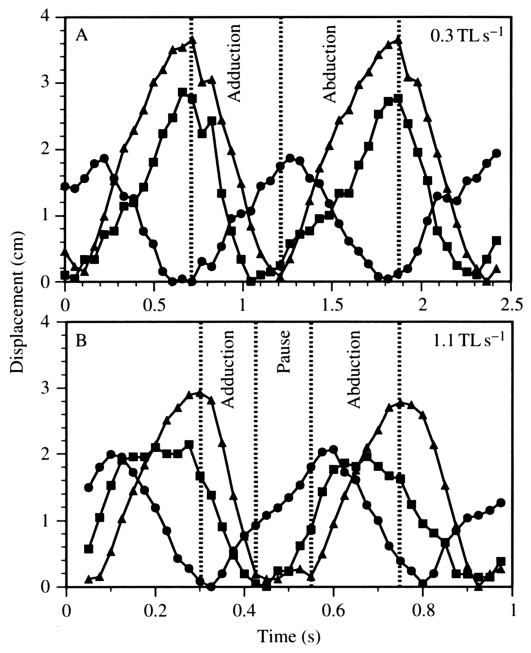
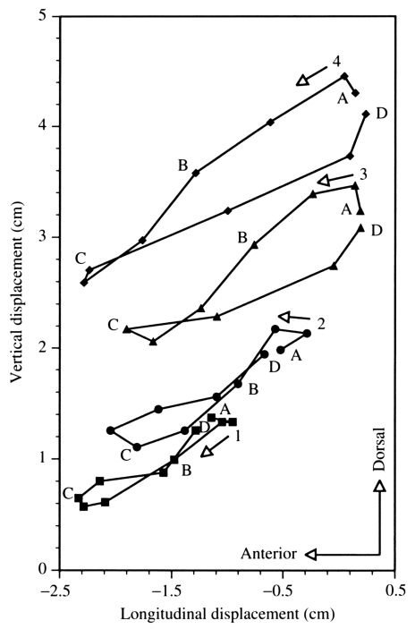
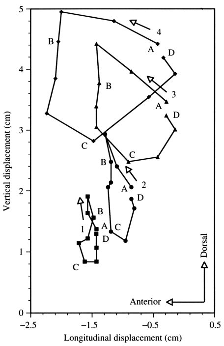

# Bài 03 — Chu kỳ đánh vây và động học ba chiều

## 1. Tóm tắt bài học

Một nhịp vây ngực của bluegill không đơn giản là “mở ra rồi khép lại”. Trong một chu kỳ, đầu vây đồng thời thay đổi vị trí theo ba trục: trước-sau, lên-xuống và ra-vào thân. Quan hệ pha giữa ba chuyển động này làm quỹ đạo của mép vây thành các vòng lặp phức tạp.

*Nguồn hình: Figure 2, PDF trang 8.*

## 2. Mục tiêu học tập

Sau bài này, người học có thể:

- mô tả thứ tự các chuyển động chính trong một fin beat;
- giải thích quan hệ giữa abduction, depression, protraction và các chuyển động ngược lại;
- đọc quỹ đạo marker trong lateral view;
- so sánh cấu trúc chu kỳ ở tốc độ thấp và cao.

## 3. Ba chuyển động dao động đồng thời

Figure 2 biểu diễn marker 4 theo ba trục:

- x: protraction ↔ retraction;
- y: levation ↔ depression;
- z: abduction ↔ adduction.

Các đại lượng này đều biến thiên theo chu kỳ, nhưng không hoàn toàn đạt cực đại cùng một lúc.

Một quan hệ rõ rệt trong dữ liệu là **maximal abduction gần đồng bộ với maximal depression của đầu vây**.

## 4. Chu kỳ ở tốc độ thấp

Ở **0.3 TL s⁻¹**, chuyển động nhìn chung liên tục và trơn:

1. vây bắt đầu abduction;
2. trong phần lớn abduction, vây đồng thời **depress** và **protract**;
3. sau khi đạt vùng mở rộng, vây chuyển sang adduction;
4. trong phần lớn adduction, vây đồng thời **retract** và **levate**;
5. vây trở về gần thân và chu kỳ mới bắt đầu gần như ngay lập tức.

Ở tốc độ thấp, không có “pause” rõ rệt giữa hai chu kỳ.

## 5. Chu kỳ ở tốc độ cao

Ở **1.1 TL s⁻¹**, hình dạng chu kỳ thay đổi:

- sau adduction, vây có thể nằm gần thân tới khoảng **25% thời lượng chu kỳ**;
- paper gọi phần này là **pause**;
- các chuyển đổi hướng theo x và z có thể xuất hiện plateau hoặc khoảng gần như không đổi;
- quỹ đạo không còn giống đơn giản với quỹ đạo ở tốc độ thấp.

Tại tốc độ này bluegill cũng bắt đầu dùng chuyển động thân và vây đuôi, cho thấy hệ locomotion đang tiến gần vùng chuyển gait.

## 6. Quỹ đạo trong lateral view ở tốc độ thấp

*Nguồn hình: Figure 3, PDF trang 9.*

Ở 0.3 TL s⁻¹:

- mọi phần của mép vây nhìn chung đi **về trước + xuống dưới**, sau đó **về sau + lên trên**;
- marker 3 và 4 tạo loop có xu hướng **ngược chiều kim đồng hồ** trong lateral view;
- marker 1 và 2 lại có thể tạo loop **theo chiều kim đồng hồ**.

Đây là bằng chứng quan trọng rằng các vùng của cùng một vây không đơn giản là bản sao co giãn của nhau.

## 7. Quỹ đạo trong lateral view ở tốc độ cao

*Nguồn hình: Figure 4, PDF trang 10.*

Ở 1.1 TL s⁻¹:

- marker 3 và 4 tạo quỹ đạo tròn hơn so với tốc độ thấp;
- loop của marker 1 và 2 có trục chính thiên về phương thẳng đứng hơn;
- đầu chu kỳ có thể bắt đầu bằng **protraction + levation**;
- sau maximal levation, vây chuyển sang depression với một phần protraction nhỏ;
- sau maximal protraction có giai đoạn retraction + depression ngắn;
- sau maximal depression là retraction + levation để đưa vây về thân;
- trong pause, có thể có một ít levation + protraction để chuẩn bị chu kỳ kế tiếp.

## 8. Tại sao quỹ đạo loop quan trọng?

Nếu vây là tấm cứng quay quanh một bản lề đơn giản, ta kỳ vọng các điểm trên vây có quỹ đạo liên hệ chặt chẽ theo một phép biến đổi hình học tương đối đơn giản.

Nhưng dữ liệu cho thấy:

- hướng loop có thể khác nhau giữa dorsal và ventral;
- hình dạng loop thay đổi theo tốc độ;
- tỉ lệ chuyển động theo x và y khác nhau giữa các vùng.

Do đó, **động học nội tại của vây** phải được xem xét, không chỉ góc quay toàn vây tại gốc.

## 9. Tốc độ lớn nhất không nằm ở cực trị vị trí

Một điểm chuyển động nhanh nhất thường xảy ra khi đường displacement có độ dốc lớn nhất, không phải khi displacement đạt cực đại.

Trong paper, tốc độ adduction và retraction lớn nhất thường xuất hiện khoảng giữa các thời điểm cực đại của trạng thái mở và khép vây.

Điều này hữu ích khi phân tích animation hoặc robot:

- key pose chỉ mô tả hình dạng;
- timing giữa key pose mới quyết định vận tốc và gia tốc;
- một chu kỳ sinh học cần quan tâm cả đường cong chuyển động, không chỉ hai vị trí đầu-cuối.

> Nhận xét trên về key pose/timing là diễn giải ứng dụng; dữ liệu về thời điểm vận tốc cực đại đến từ paper.

## 10. Bài luyện tập ngắn

1. Hãy mô tả một fin beat bằng sáu thuật ngữ: abduction, adduction, protraction, retraction, levation, depression.
2. Vì sao maximal abduction gần maximal depression không có nghĩa toàn bộ vây đạt mọi cực trị cùng lúc?
3. Figure 3 cho bằng chứng nào chống lại mô hình “rigid plate”?
4. Figure 4 khác Figure 3 ở những đặc điểm quỹ đạo nào?

## 11. Checklist kiến thức

- [ ] Tôi mô tả được chu kỳ ở tốc độ thấp.
- [ ] Tôi biết pause xuất hiện rõ ở tốc độ cao nhất.
- [ ] Tôi hiểu quỹ đạo dorsal và ventral có thể quay theo hướng khác nhau.
- [ ] Tôi biết displacement cực đại và velocity cực đại là hai khái niệm khác nhau.
- [ ] Tôi hiểu một fin beat là chuyển động phối hợp 3D.

## 12. Tổng kết

Bluegill không đánh vây bằng một phép quay duy nhất. Một chu kỳ là sự phối hợp có pha giữa ba trục, và hình dạng quỹ đạo thay đổi đáng kể theo vị trí trên vây và tốc độ bơi. Đây là nền tảng để hiểu biến dạng của vây ở bài 05.
