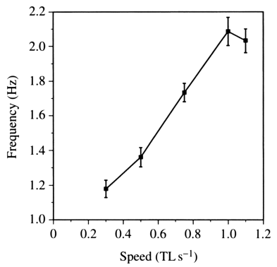
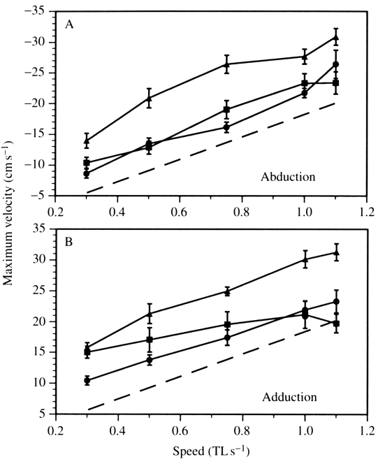
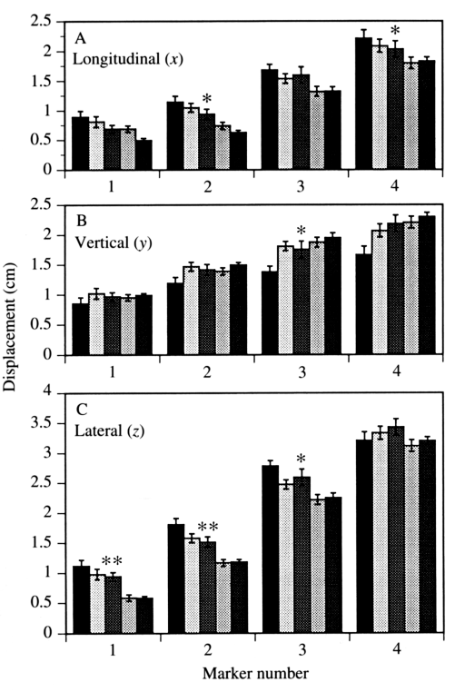

# Bài 04 — Ảnh hưởng của tốc độ bơi lên động học vây

## 1. Tóm tắt bài học

Khi bluegill bơi nhanh hơn, nó không chỉ “đánh vây nhanh hơn”. Paper cho thấy nhiều đại lượng thay đổi đồng thời: tần số, vận tốc đầu vây, biên độ theo từng trục, độ lệch pha, thời gian pause và xu hướng chuyển sang dùng thân + vây đuôi.



*Nguồn hình: Figure 5, PDF trang 11.*

## 2. Mục tiêu học tập

Sau bài này, người học có thể:

- mô tả quan hệ giữa tốc độ bơi và fin beat frequency;
- giải thích thay đổi của vận tốc đầu vây;
- phân tích xu hướng thay đổi excursion theo x, y, z;
- hiểu khái niệm distance traveled per cycle và sự chuyển gait quanh 1.1 TL s⁻¹.

## 3. Tần số đánh vây tăng rõ rệt

Biến có quan hệ rõ nhất với tốc độ là **fin beat frequency**.

Khi tốc độ tăng từ **0.3 lên 1.0 TL s⁻¹**, tần số tăng từ khoảng:

```text
1.2 Hz → 2.1 Hz
```

Tức gần như tăng gấp đôi.

Từ 1.0 lên 1.1 TL s⁻¹, tần số không tăng đáng kể nữa. Đồng thời, bluegill thường bắt đầu bổ sung chuyển động thân và vây đuôi.

Điều này cho thấy tăng tốc bằng vây ngực có giới hạn; đến một ngưỡng, hệ locomotion có xu hướng chuyển chiến lược.

## 4. Quãng đường đi được trên mỗi chu kỳ

Paper lấy:

```text
swimming speed / fin beat frequency
```

để ước lượng quãng đường cá đi được trong một chu kỳ.

Từ tốc độ thấp đến cao, các giá trị lần lượt là:

| Tốc độ | Quãng đường mỗi chu kỳ |
|---:|---:|
| 0.3 TL s⁻¹ | 4.5 cm/cycle |
| 0.5 TL s⁻¹ | 6.4 cm/cycle |
| 0.75 TL s⁻¹ | 7.9 cm/cycle |
| 1.0 TL s⁻¹ | 8.5 cm/cycle |
| 1.1 TL s⁻¹ | 9.9 cm/cycle |

Vì quãng đường mỗi cycle tăng, tốc độ bơi tăng nhanh hơn mức tăng tần số. Do đó, **không thể giải thích tăng tốc chỉ bằng việc tăng fin beat frequency**.

## 5. Vận tốc cực đại của đầu vây



*Nguồn hình: Figure 6, PDF trang 12.*

Trong 6 biến vận tốc cực đại của marker 4, **5 biến thay đổi có ý nghĩa theo tốc độ**.

Xu hướng chính:

- khi bơi nhanh hơn, vận tốc đầu vây trong abduction tăng;
- vận tốc trong adduction cũng tăng ở phần lớn thành phần;
- ngoại lệ đáng chú ý là thành phần longitudinal của adduction không cho hiệu ứng tốc độ rõ như các biến khác.

Như vậy bluegill kết hợp cả:

- đánh vây thường xuyên hơn;
- chuyển động đầu vây nhanh hơn;
- thay đổi hình học quỹ đạo.

## 6. Tỉ lệ retraction speed / swimming speed

Một đại lượng rất quan trọng là:

```text
maximal retraction speed / swimming speed
```

Giá trị trung bình giảm dần:

```text
2.75 → 1.90 → 1.45 → 1.18 → 1.00
```

khi tốc độ bơi tăng từ 0.3 lên 1.1 TL s⁻¹.

Ở tốc độ thấp, đầu vây có thể đi về sau nhanh hơn cá đi về trước, tạo ra **backward slip** của vây so với nước.

Khi tỉ lệ tiến gần 1.00, độ slip giảm mạnh. Paper đưa ra hai khả năng:

- hiệu suất của locomotion bằng vây ngực tăng theo tốc độ;
- hoặc, có khả năng hơn theo thảo luận của tác giả, tỷ trọng các cơ chế tạo lực thay đổi khi tốc độ tăng.

## 7. Biên độ chuyển động thay đổi không đồng đều



*Nguồn hình: Figure 8, PDF trang 15.*

### 7.1. Longitudinal excursion

Khi có thay đổi đáng kể, biên độ theo x nhìn chung **giảm khi tốc độ tăng**.

### 7.2. Lateral excursion

Xu hướng giảm theo tốc độ đặc biệt rõ ở ba marker ventral hơn.

Marker 4 — vùng dorsal nhất — không cho cùng xu hướng giảm lateral rõ như marker 1–3.

### 7.3. Vertical excursion

Khác với x và z, chuyển động theo y có xu hướng **tăng** ở một số vùng khi tốc độ tăng, rõ hơn ở nửa dorsal của vây.

Paper giải thích xu hướng này chủ yếu do đầu leading edge được nâng cao hơn khi levation ở tốc độ cao, chứ không phải vì vị trí maximal depression đi thấp hơn nhiều.

## 8. Pause ở tốc độ cao

Ở 1.1 TL s⁻¹, vây có thể nằm sát thân tới **25% chu kỳ** sau adduction.

Trong pause:

- hình dạng vây không thuận lợi cho tạo thrust;
- vây ở trạng thái chuẩn bị cho chu kỳ kế tiếp.

Điểm thú vị là pause lại xuất hiện ở tốc độ cao nhất trong bluegill, trong khi một số loài khác có thể giảm refractory period khi tốc độ tăng. Điều này cho thấy các loài có thể giải quyết bài toán tăng tốc bằng chiến lược kinematics khác nhau.

## 9. Chuyển gait ở vùng tốc độ cao

Tại khoảng 1.1 TL s⁻¹, bluegill bắt đầu dùng:

- body undulation;
- caudal fin locomotion;

cùng với hoặc thay cho pectoral fin locomotion.

Đây là một ví dụ locomotor transition: hệ thống không nhất thiết tiếp tục tăng biên độ hoặc tần số vây ngực vô hạn, mà chuyển sang huy động cơ quan đẩy khác.

## 10. Bài luyện tập ngắn

1. Vì sao tăng frequency từ 1.2 lên 2.1 Hz chưa đủ giải thích toàn bộ tăng swimming speed?
2. Tỉ lệ retraction/swimming speed giảm từ 2.75 xuống 1.00 cho biết điều gì về slip?
3. Hãy so sánh xu hướng excursion theo x/z với y.
4. Tại sao việc xuất hiện body + caudal locomotion ở 1.1 TL s⁻¹ quan trọng khi xây dựng một mô hình chuyển động cá theo tốc độ?

## 11. Checklist kiến thức

- [ ] Tôi nhớ tần số tăng khoảng 1.2 → 2.1 Hz từ 0.3 → 1.0 TL s⁻¹.
- [ ] Tôi hiểu distance per cycle tăng cùng tốc độ.
- [ ] Tôi hiểu maximal fin velocity nhìn chung tăng.
- [ ] Tôi biết x/z excursion có xu hướng giảm, còn y có thể tăng ở vùng dorsal.
- [ ] Tôi biết bluegill bắt đầu chuyển sang body + caudal locomotion quanh 1.1 TL s⁻¹.

## 12. Tổng kết

Tăng tốc không phải là một phép scale đơn giản của animation. Bluegill điều chỉnh frequency, velocity, excursion, timing, orientation và cuối cùng cả locomotor mode. Vì vậy, một mô hình sinh học tốt phải cho phép nhiều tham số thay đổi đồng thời theo tốc độ.
