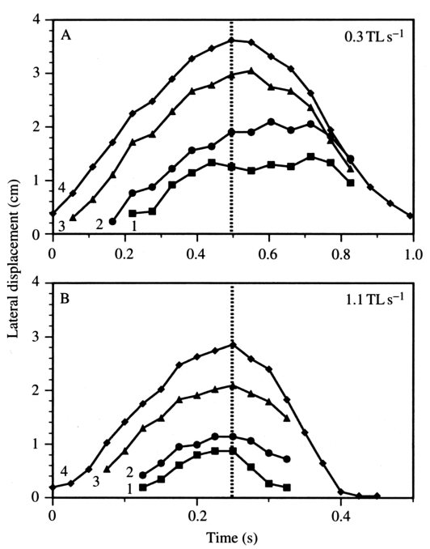

# Bài 05 — Vây mềm, biến dạng và lệch pha giữa các tia vây

## 1. Tóm tắt bài học

Một kết luận quan trọng nhất của paper là vây ngực bluegill **không vận động như một tấm cứng**. Các marker ở những vùng khác nhau của mép vây có biên độ, quỹ đạo, thời điểm cực đại và góc tấn khác nhau. Đặc biệt ở tốc độ thấp, phần dorsal thường đi trước phần ventral, tạo ra một dạng biến dạng lan truyền trên bề mặt vây.



*Nguồn hình: Figure 7, PDF trang 13.*

## 2. Mục tiêu học tập

Sau bài này, người học có thể:

- liệt kê các bằng chứng chống lại mô hình rigid plate;
- giải thích phase lag dorsal → ventral;
- mô tả vai trò của dorsal leading edge;
- phân biệt biến thiên do chiều dài tia vây với biến thiên do động học thực sự khác nhau.

## 3. Bằng chứng 1 — Biên độ khác nhau theo vị trí

Trong cả ba chiều x, y, z, excursion thay đổi đáng kể theo marker.

Nhìn chung, biên độ chuyển động tăng từ vùng ventral lên vùng dorsal của mép vây.

Một phần của xu hướng này có thể do tia vây dorsal dài hơn. Paper cho biết chiều dài trung bình của các tia được đánh dấu từ marker 1 → 4 xấp xỉ:

```text
1.9, 2.7, 3.6, 4.2 cm
```

Nếu mọi tia chỉ quay cùng một góc, điểm ở tia dài hơn đương nhiên sẽ đi xa hơn.

Nhưng dữ liệu cho thấy chiều dài tia **không giải thích được tất cả**.

## 4. Bằng chứng 2 — Phase lag ở tốc độ thấp

Ở 0.3 TL s⁻¹, thời điểm đạt lateral displacement cực đại xuất hiện muộn dần khi đi từ dorsal xuống ventral.

So với marker 4:

| So sánh | Phase lag |
|---|---:|
| marker 3 so với 4 | 12° |
| marker 2 so với 4 | 18° |
| marker 1 so với 4 | 32° |

Điều này cho thấy phần dorsal mở ra trước, sau đó biến dạng lan xuống các vùng ventral hơn.

Ở hầu hết các tốc độ cao hơn, phase lag này không còn có ý nghĩa thống kê rõ rệt. Vây vì vậy có xu hướng **đồng bộ hơn và plate-like hơn** ở tốc độ cao.

## 5. Bằng chứng 3 — Hướng và hình dạng loop khác nhau

Ở tốc độ thấp:

- marker 3–4 có thể tạo loop ngược chiều kim đồng hồ;
- marker 1–2 có thể tạo loop theo chiều kim đồng hồ.

Ở tốc độ cao, hình dạng loop lại thay đổi theo hướng khác.

Một tấm cứng quay đơn giản khó tạo ra các quỹ đạo với hướng loop trái ngược như vậy trên cùng một mép vây.

## 6. Bằng chứng 4 — Dorsal và ventral có góc tấn khác nhau

Paper dựng hai planar fin elements:

- phần dorsal: marker 4 + 3 + một điểm ở gốc;
- phần ventral: marker 2 + 1 + một điểm ở gốc.

Góc tấn của hai phần có thể khác đáng kể tại cùng một thời điểm. Điều này nghĩa là không thể gán một angle of attack duy nhất cho toàn bộ vây.

## 7. Bằng chứng 5 — Phản ứng với tốc độ khác nhau theo vùng

Ví dụ, lateral displacement của ba marker ventral giảm đáng kể khi tốc độ tăng, trong khi marker dorsal nhất không giảm theo cùng kiểu.

Nếu toàn vây chỉ là một plate có cùng điều khiển góc, ta kỳ vọng các phần thay đổi theo tỷ lệ đơn giản hơn.

## 8. Dorsal leading edge

Paper ủng hộ ý tưởng rằng phần dorsal — đặc biệt các tia đầu tiên — hoạt động như một **leading edge**.

Mọi phase lag có ý nghĩa giữa marker 4 và các marker khác đều theo hướng:

```text
marker ventral đi sau marker 4
```

Tác giả dùng một hình dung trực quan: khi abduction/protraction bắt đầu, vây giống như **bóc một miếng băng keo hình tam giác khỏi bề mặt bằng cách kéo góc dorsal-distal trước**.

Cách khởi động này có thể giúp giảm suction giữa vây và thân ở đầu abduction — paper nêu đây là một khả năng cần nghiên cứu thêm, không phải kết luận đo trực tiếp.

## 9. Biến thiên do hình thái và biến thiên do điều khiển

### 9.1. Vertical motion

Khi chia vertical excursion cho chiều dài tia vây, giá trị ở 1.1 TL s⁻¹ cho marker 1–4 xấp xỉ:

```text
0.51, 0.56, 0.54, 0.55 ray lengths
```

Các giá trị gần nhau cho thấy các tia có thể quay theo phương vertical với lượng tương đối giống nhau.

### 9.2. Lateral và longitudinal motion

Tại cùng tốc độ, relative excursion tăng mạnh từ ventral → dorsal:

- lateral: khoảng `0.30, 0.44, 0.62, 0.76` ray lengths;
- longitudinal: khoảng `0.26, 0.23, 0.36, 0.44` ray lengths.

Vì vậy khác biệt theo x và z không thể giải thích chỉ bằng việc tia dorsal dài hơn; mức quay tương đối cũng lớn hơn.

## 10. Active hay passive deformation?

Paper đặt câu hỏi: biến dạng vây được tạo chủ động bởi cơ hay thụ động bởi lực nước?

Một số gợi ý:

- retraction có lúc nhanh hơn swimming speed, cho thấy ít nhất một phần chuyển động phải có đóng góp cơ chủ động;
- tuy nhiên nước ép vây trở lại thân có thể đóng góp vào một số giai đoạn chậm hơn;
- cấu trúc cơ và màng vây cho phép nhiều kiểu truyền lực khác nhau.

Tác giả cho rằng electromyography là hướng cần thiết để tách đóng góp active và passive.

## 11. Bài luyện tập ngắn

1. Vì sao chỉ so excursion tuyệt đối giữa marker 1 và 4 có thể gây hiểu nhầm?
2. Phase lag 32° giữa marker 1 và 4 có ý nghĩa hình học gì?
3. Nêu ít nhất bốn bằng chứng cho thấy vây không phải rigid plate.
4. Vì sao tốc độ cao có thể làm vây trông plate-like hơn?

## 12. Checklist kiến thức

- [ ] Tôi nhớ phase lag lớn nhất được báo cáo là khoảng 32° ở tốc độ thấp.
- [ ] Tôi hiểu dorsal leading edge đi trước ventral region.
- [ ] Tôi phân biệt ảnh hưởng của fin-ray length với sự khác biệt rotation thật.
- [ ] Tôi hiểu curvature và phase lag giảm ở tốc độ cao hơn.
- [ ] Tôi biết active/passive contribution chưa được giải quyết hoàn toàn trong paper.

## 13. Tổng kết

Để mô tả vây ngực bluegill, cần một mô hình có nhiều phần tử hoặc nhiều tia với timing khác nhau. Dorsal edge thường đóng vai trò dẫn đầu, còn vùng ventral theo sau và biến dạng, đặc biệt rõ ở bơi chậm.
