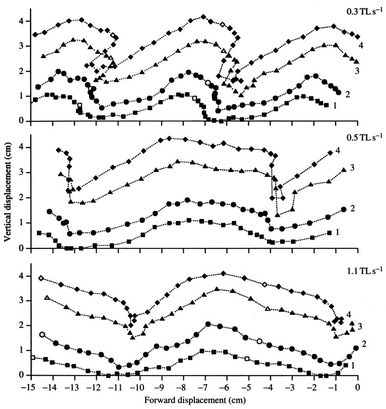
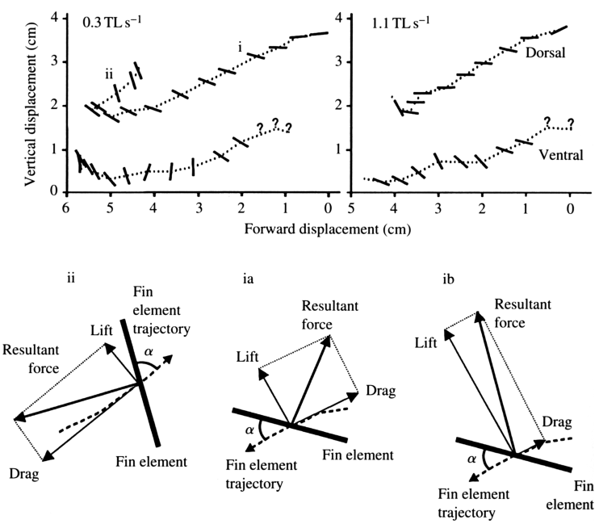

# Bài 06 — Góc tấn và phần tử vây trong không gian 3D

## 1. Tóm tắt bài học

Để thảo luận lift và drag, chỉ biết vị trí của vây so với thân là chưa đủ. Ta phải biết **quỹ đạo của vây so với nước** và **hướng của bề mặt vây so với dòng tới**. Paper dùng các điểm 3D để dựng planar fin elements và tính một góc tấn hình học.



*Nguồn hình: Figure 9, PDF trang 17.*

## 2. Mục tiêu học tập

Sau bài này, người học có thể:

- giải thích sự khác nhau giữa body-relative và fluid-relative motion;
- hiểu cách dựng planar fin element;
- tính ý tưởng angle of attack từ path angle và planar angle;
- giải thích vì sao projection 2D có thể cho kết quả sai lớn.

## 3. Từ chuyển động so với thân sang chuyển động so với nước

Ở các bài trước, ta chủ yếu xem marker so với các điểm tham chiếu trên thân. Cách này giúp hiểu cơ chế giải phẫu.

Nhưng lực thủy động lực học phụ thuộc vào **vận tốc tương đối giữa vây và nước**.

Paper vì vậy hiệu chỉnh quỹ đạo theo flow-tank speed để mô phỏng quỹ đạo nếu cá đang bơi qua nước tĩnh.

Figure 9 cho thấy đường đi của bốn marker trong hệ quy chiếu cố định. Khoảng cách giữa các điểm liên tiếp cũng phản ánh sự thay đổi vận tốc của marker.

## 4. Backward slip

Ở tốc độ thấp, trong giai đoạn mid-retraction, đầu vây có thể retraction nhanh hơn tốc độ bơi của cá.

Khi đó đầu vây thực sự trượt ngược qua nước — **backward slip**.

Tỉ lệ maximal retraction speed / swimming speed giảm:

```text
2.75 → 1.90 → 1.45 → 1.18 → 1.00
```

nên slip giảm khi tốc độ bơi tăng.

Một điểm tinh tế: cùng một thời điểm, vùng dorsal có thể slip trong khi vùng ventral gần như không slip. Vì thế ngay cả “vận tốc vây so với nước” cũng không phải một giá trị duy nhất cho toàn vây.

## 5. Dựng planar fin element

Paper lấy ba điểm để xác định một mặt phẳng cục bộ:

- hai marker ở mép xa;
- một điểm ở gốc vây.

Hai phần tử được xét điển hình:

- **dorsal element**: marker 4 + 3 + gốc dorsal ray;
- **ventral element**: marker 2 + 1 + gốc ventral ray.

Mặt phẳng này là xấp xỉ cục bộ của bề mặt vây tại thời điểm đang xét.



*Nguồn hình: Figure 10, PDF trang 18.*

## 6. Path angle, planar angle và angle of attack

### 6.1. Path angle

Path angle là hướng quỹ đạo của phần tử vây trong lateral x-y plane.

### 6.2. Planar angle

Planar angle là góc giữa:

- đường giao của mặt phẳng fin element với x-y plane;
- trục x.

### 6.3. Geometrical angle of attack

Theo quy ước dấu trong bảng của paper, góc tấn hình học có thể được hiểu từ chênh lệch:

```text
α = planar angle - path angle
```

Ví dụ một hàng trong Table 5:

```text
path angle = -25°
planar angle = 15°
α = 40°
```

Tác giả nhấn mạnh đây là một **geometrical angle of attack**, dựa trên giao tuyến với parasagittal plane. Nó không nhất thiết là góc tấn “thật tuyệt đối” của bề mặt với trường dòng 3D phức tạp.

## 7. Góc tấn thay đổi trong chu kỳ

Một số xu hướng trong dữ liệu:

- đầu abduction: dorsal element có thể gần song song với quỹ đạo hoặc có α nhỏ/âm;
- khoảng 25–40% chu kỳ: α của planar element thường đạt khoảng **40–50°** trong các ví dụ được phân tích;
- early levation/retraction ở tốc độ thấp có thể xuất hiện α dương lớn;
- khi tốc độ bơi tăng, hướng planar element trong nhiều giai đoạn trở nên gần hướng di chuyển tổng thể hơn.

## 8. Vì sao 2D có thể sai lớn?

Nếu chỉ dùng lateral projection, ta thấy hai marker như một đoạn thẳng trên ảnh 2D. Nhưng vây đồng thời xoay ra-vào theo z.

Do đó cùng một cấu hình 3D có thể có projection 2D gây hiểu nhầm về hướng bề mặt.

Paper cho thấy chênh lệch giữa:

- angle of attack từ 3D planar analysis;
- angle of attack ước lượng chỉ từ lateral view;

có thể rất lớn, đặc biệt ở **early abduction**.

Điểm này là một bài học phương pháp luận quan trọng: **không suy ra orientation của một bề mặt mềm 3D chỉ từ một hình chiếu 2D nếu chuyển động out-of-plane đáng kể**.

## 9. Incident flow và giới hạn của phép tính

Để suy ra lực, paper giả định dòng tới liên quan đến vector tổng của:

- vận tốc bơi tổng thể;
- vận tốc của vây so với thân.

Nhưng trên thực tế:

- flow quanh vây có thể chứa vortex;
- bề mặt vây cong;
- vận tốc incident flow khác nhau dọc theo span;
- một điểm ở tip và một điểm proximal không trải nghiệm cùng dòng tới.

Vì vậy góc tấn là công cụ phân tích hữu ích, nhưng không phải một mô tả đầy đủ của thủy động lực học toàn vây.

## 10. Bài luyện tập ngắn

1. Nếu path angle = -33° và planar angle = 3°, α theo quy ước trên là bao nhiêu?
2. Vì sao một marker motionless theo x so với nước không có nghĩa toàn bộ vây motionless theo x?
3. Giải thích bằng hình học vì sao lateral projection có thể làm sai angle of attack.
4. Vì sao cần tách dorsal element và ventral element thay vì dùng một plane duy nhất?

## 11. Checklist kiến thức

- [ ] Tôi phân biệt body-relative và fluid-relative motion.
- [ ] Tôi biết planar element cần ba điểm.
- [ ] Tôi hiểu ý nghĩa path angle và planar angle.
- [ ] Tôi biết 2D angle of attack có thể sai đáng kể.
- [ ] Tôi hiểu angle of attack trong paper vẫn là một xấp xỉ hình học.

## 12. Tổng kết

Bước chuyển từ “vây nằm ở đâu” sang “vây định hướng thế nào so với dòng nước” là cầu nối từ kinematics sang hydrodynamics. Dữ liệu 3D cho thấy bề mặt vây xoay phức tạp đến mức một góc nhìn lateral đơn giản không đủ để suy ra góc tấn đáng tin cậy.
