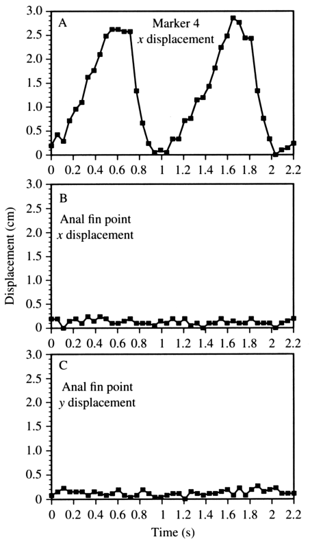

# Bài 07 — Cơ chế tạo lực đẩy: drag, lift và acceleration reaction

## 1. Tóm tắt bài học

Paper không ủng hộ cách phân loại bluegill là một “drag swimmer thuần túy” hay “lift swimmer thuần túy”. Thay vào đó, nhiều bằng chứng chỉ ra rằng **drag, lift và acceleration reaction cùng đóng góp vào lực đẩy**, với vai trò tương đối thay đổi theo giai đoạn của fin beat.



*Nguồn hình: Figure 11, PDF trang 24.*

## 2. Mục tiêu học tập

Sau bài này, người học có thể:

- kiểm tra các dự đoán của mô hình drag-based và lift-based;
- giải thích vì sao không cơ chế đơn lẻ nào giải thích toàn bộ cycle;
- mô tả vai trò của acceleration reaction;
- nêu các giới hạn khi định lượng lực từ dữ liệu kinematics.

## 3. Kiểm tra mô hình drag-based

### 3.1. Dự đoán của drag-based thuần túy

Nếu vây giống mái chèo:

- power stroke và recovery stroke phải khá rõ;
- tốc độ tiến của thân có thể dao động theo nhịp vây;
- khi retraction tạo lực đẩy mạnh, body speed có thể tăng theo chu kỳ;
- recovery stroke nên feather vây để giảm drag.

### 3.2. Dữ liệu body motion không cho power/recovery rõ

Figure 11 cho thấy displacement của body reference point theo x và y rất nhỏ và không có pattern tuần hoàn rõ gắn với fin beat.

Điều đó không phù hợp với kỳ vọng đơn giản của một hệ drag-based thuần túy kiểu “chèo-thu hồi”.

### 3.3. Drag vẫn có vai trò

Trong một đoạn ngắn của cycle, retraction speed của dorsal fin tip lớn hơn swimming speed, làm `u - V > 0` nếu `u` là tốc độ retraction tương đối với thân và `V` là tốc độ bơi.

Paper nhắc rằng với mô hình flat plate đơn giản, lực drag liên quan đến:

```text
(u - V)^2
```

Tại năm tốc độ, mean maximal retraction speed minus `V` lần lượt khoảng:

```text
9.5, 8.1, 6.1, 3.3, 0 cm/s
```

Tuy nhiên điều kiện này chỉ xuất hiện trong một phần nhỏ của cycle và chủ yếu ở vùng dorsal distal. Ví dụ tại 0.3 TL s⁻¹, marker 4 có giai đoạn như vậy khoảng **17% chu kỳ**.

Vì thế drag không đủ để giải thích toàn bộ cycle.

## 4. Kiểm tra mô hình lift-based

### 4.1. Dự đoán đơn giản

Một hệ lift-based dao động mạnh có thể đi kèm vertical body oscillation, như một số kiểu “underwater flying”.

### 4.2. Bluegill không có vertical oscillation rõ

Figure 11C không cho body oscillation dọc y rõ rệt theo fin beat ở các tốc độ được nghiên cứu.

Điều này không chứng minh lift không tồn tại. Thực tế, một cấu hình lực với orientation thay đổi có thể tạo forward thrust mà không làm thân dao động dọc rõ.

### 4.3. Angle of attack cho thấy lift có thể đóng góp

Từ Figure 10 và Table 5, paper cho rằng trong nhiều giai đoạn abduction/depression, hướng fin element và quỹ đạo có thể tạo một resultant force có thành phần hướng trước nếu lift đủ lớn.

Việc không thấy body deceleration rõ trong depression + protraction cũng phù hợp với khả năng lift đóng góp vào forward force.

## 5. Kết hợp lift và drag

Sơ đồ vector trong Figure 10 minh họa:

- drag song song với incident flow;
- lift vuông góc với incident flow;
- resultant force là tổng vector của hai lực.

Một phần tử vây có thể có trajectory hướng sau và orientation khiến drag tạo thành phần lực tiến rõ. Ở những giai đoạn trajectory hướng trước, muốn có net forward component thì lift phải bù đủ cho thành phần drag bất lợi.

Từ phân tích này, paper đưa ra diễn giải tổng quát:

- **adduction**: drag có vẻ là nguồn lực đẩy chính;
- **abduction**: lift có thể giúp tạo forward thrust;
- toàn cycle: không thể mô tả bằng một cơ chế duy nhất.

## 6. Acceleration reaction

### 6.1. Vì sao cần xét unsteady force?

Bluegill có những giai đoạn fin acceleration/deceleration nhanh, đặc biệt:

- đầu abduction-protraction;
- cuối adduction-retraction.

Trong các giai đoạn này, lực do gia tốc của “added mass” nước quanh vây có thể lớn.

### 6.2. Hai tham số paper dùng để biện luận

Paper ước lượng:

```text
Reynolds number Re ≈ 5 × 10^3
reduced frequency s ≈ 0.85
```

Theo khung lý thuyết mà paper viện dẫn, khi `s > 0.4`, acceleration reaction có thể chiếm vai trò lớn và các hiệu ứng unsteady không thể bỏ qua.

Vì `s ≈ 0.85`, bluegill nằm rõ trong vùng cần xét unsteady effects.

### 6.3. Hướng lực trong tăng/giảm tốc

Khi vây giảm tốc ở cuối abduction, khối nước “đi kèm” có xu hướng tiếp tục chuyển động, có thể tạo thành phần lực hướng trước.

Tương tự, ở cuối adduction, added mass tiếp tục đẩy vây về sau, cũng có thể tạo phản lực thúc cá về trước.

## 7. Tại sao không định lượng acceleration reaction chính xác?

Một biến khó là **added mass coefficient**. Nó thay đổi vì:

- orientation của vây với dòng thay đổi liên tục;
- shape của vây biến đổi trong stroke;
- vortex shedding có thể làm lực không ổn định hơn;
- vây không phải một plate cứng có hệ số cố định.

Vì vậy paper kết luận acceleration reaction quan trọng về mặt cơ chế, nhưng không định lượng chính xác được toàn bộ lực do nó tạo ra.

## 8. Kết luận cơ chế lực của paper

Tổng hợp bốn nhóm bằng chứng:

1. không có propulsive/recovery phase rõ như mô hình drag thuần;
2. drag-producing backward slip chỉ chiếm một đoạn ngắn;
3. 3D angle of attack cho phép lift đóng góp trong abduction;
4. Re, reduced frequency và các đoạn tăng/giảm tốc nhanh cho thấy acceleration reaction quan trọng.

Kết luận hợp lý nhất theo paper:

```text
Bluegill pectoral propulsion = drag + lift + acceleration reaction
```

nhưng tỷ lệ chính xác của từng thành phần chưa được đo đầy đủ.

## 9. Bài luyện tập ngắn

1. Vì sao không thấy body x-oscillation rõ là vấn đề cho mô hình drag-based thuần túy?
2. Drag có thể là lực chính trong adduction nhưng vẫn không giải thích toàn bộ cycle như thế nào?
3. `s ≈ 0.85` có ý nghĩa gì trong lập luận của paper?
4. Nêu ba nguyên nhân khiến added mass coefficient khó xác định.

## 10. Checklist kiến thức

- [ ] Tôi hiểu vì sao drag-based thuần túy không đủ.
- [ ] Tôi hiểu lift có thể đóng góp trong abduction.
- [ ] Tôi biết acceleration reaction liên quan đến unsteady acceleration/deceleration.
- [ ] Tôi nhớ Re ≈ 5 × 10³ và s ≈ 0.85 theo paper.
- [ ] Tôi không nhầm kết luận “có đóng góp” với “đã đo chính xác phần trăm lực”.

## 11. Tổng kết

Điểm mạnh của paper là không ép dữ liệu vào một nhãn duy nhất. Chuyển động vây ngực bluegill nằm giữa nhiều cơ chế cổ điển và khai thác cả lực quasi-steady lẫn unsteady. Chính biến dạng 3D của vây làm sự phối hợp này trở nên khả thi nhưng cũng khiến mô hình hóa khó hơn.
