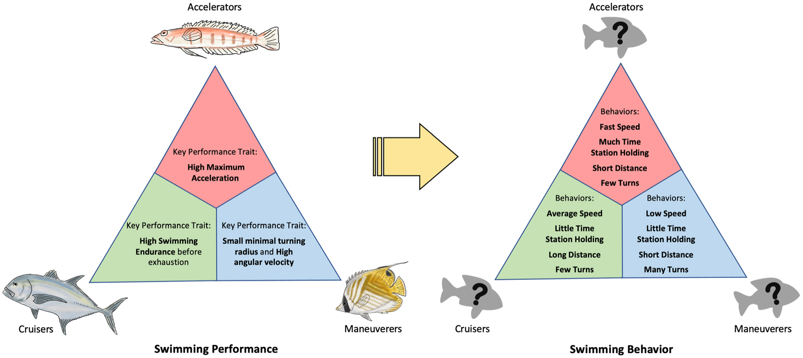

# Bài 01 — Ba trục hiệu suất bơi và mô hình Webb

- **Module:** 01. Cơ sở ecomorphology
- **Loại:** Lesson
- **Nguồn chính:** Introduction; Figure 1

## Mục tiêu học tập

Sau bài này, người học có thể mô tả ba trục hiệu suất bơi kinh điển và giải thích cách chúng được gắn với hình dạng cơ thể.

## 1. Ba trục hiệu suất bơi

Tài liệu đặt nền tảng bằng ba trục thường được dùng trong ecomorphology của cá:

1. **Maneuverability** — khả năng đổi hướng, quay với bán kính nhỏ hoặc tốc độ góc cao.
2. **Swimming endurance / cruising** — khả năng duy trì bơi trong thời gian dài và ở tốc độ cao.
3. **Acceleration** — khả năng tăng tốc nhanh trong các pha bơi ngắn.

Trong mô hình cổ điển, mỗi đỉnh hiệu suất được liên hệ với một kiểu hình thái khác nhau.

### 1.1 Maneuverer

Cá thân **cao, dẹt theo chiều ngang** thường được xem là thuận lợi cho thao tác quay. Hình thái này gắn với bán kính quay nhỏ và khả năng đổi hướng nhanh.

### 1.2 Cruiser

Cá có thân **thuôn, phần giữa sâu hơn và thu hẹp về hai đầu**, cùng cuống đuôi mảnh, thường được gắn với bơi bền và giảm lực cản khi bơi thẳng.

### 1.3 Accelerator

Cá **dài**, có phần sau cơ thể và vây tạo diện tích bên lớn, có thể uốn thân với biên độ lớn, thường được gắn với các pha tăng tốc ngắn.

## 2. Giả thuyết trade-off

Mô hình của Webb xem ba kiểu trên như ba chuyên hóa. Một cá thể hoặc loài rất mạnh ở một trục được kỳ vọng sẽ đánh đổi một phần khả năng ở trục khác. Cá có hình thái trung gian được xem là **generalist**.

Điểm quan trọng của bài nghiên cứu là: mô hình vốn mô tả **khả năng hiệu suất** đã thường xuyên được suy rộng thành dự đoán về **hành vi bơi thường ngày**.

## 3. Figure 1 — Từ hiệu suất sang hành vi

Hình 1 đặt hai tam giác cạnh nhau:

- Bên trái: ba kiểu chuyên hóa theo **swimming performance**.
- Bên phải: cách người ta kỳ vọng các chuyên hóa ấy xuất hiện trong **routine swimming behaviour**.

Kỳ vọng hành vi điển hình:

| Kiểu | Tốc độ | Giữ vị trí | Quãng bơi thẳng | Rẽ |
| --- | --- | --- | --- | --- |
| Accelerator | nhanh | nhiều | ngắn | ít |
| Cruiser | trung bình/cao | ít | dài | ít |
| Maneuverer | thấp | ít | ngắn | nhiều |

## 4. Câu hỏi trung tâm của nghiên cứu

Nếu hình dạng cơ thể thật sự ràng buộc hành vi thường nhật, các biến hành vi phải tạo thành những trade-off tương tự mô hình hiệu suất. Nghiên cứu kiểm tra trực tiếp giả thuyết này ngoài tự nhiên.

## Tự kiểm tra

1. Vì sao một mô hình về **maximum performance** không nhất thiết tự động là mô hình về **routine behaviour**?
2. Một cruiser cổ điển được kỳ vọng có quãng bơi thẳng và tần suất rẽ như thế nào?
3. Đặc điểm hình thái nào thường được gắn với maneuverer?
