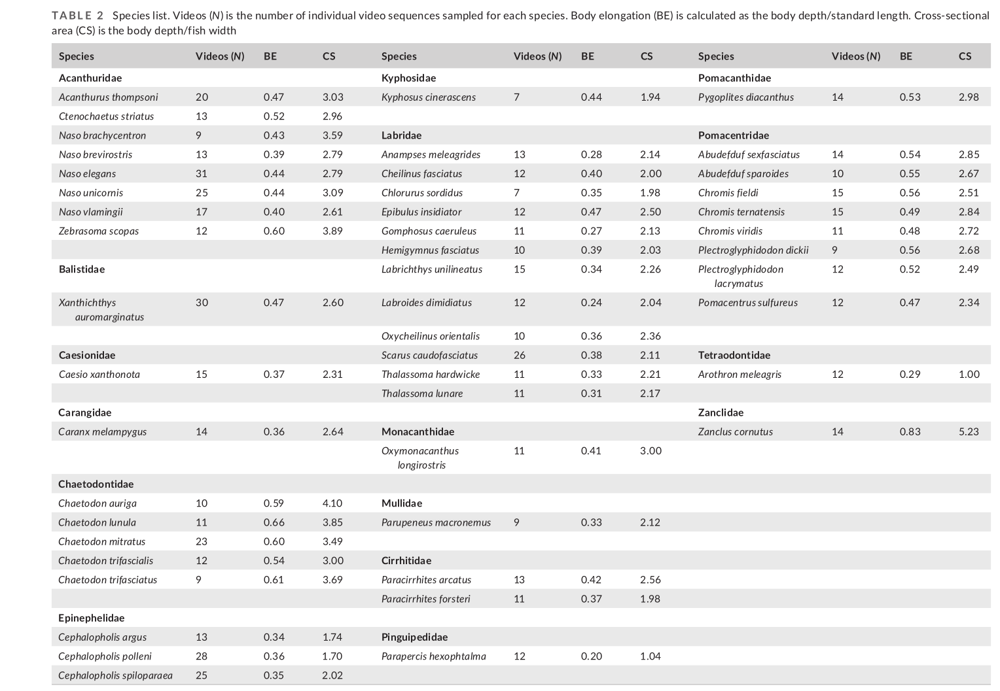

# Bài 04 — Các biến hình thái và hiệu chỉnh kích thước

- **Module:** 02. Thiết kế nghiên cứu
- **Loại:** Lesson phương pháp
- **Nguồn chính:** Materials and Methods 2.2–2.3; Table 2

## Mục tiêu học tập

Hiểu các đại lượng hình thái được dùng và vì sao phải loại ảnh hưởng của kích thước cơ thể trước khi so sánh hành vi giữa loài.

## 1. Các đại lượng hình thái

Nghiên cứu dùng bộ dữ liệu hình thái gồm tám biến liên quan đến hình dạng. Các ký hiệu quan trọng gồm:

- **SL:** chiều dài chuẩn.
- **BD:** chiều cao cơ thể lớn nhất.
- **FW:** bề rộng cơ thể lớn nhất.
- **BE = BD / SL:** tỷ lệ biểu diễn trục elongation trong nghiên cứu.
- **CS = BD / FW:** tỷ lệ phản ánh mức dẹt theo chiều ngang.
- **HD:** độ sâu/chiều cao đầu đã hiệu chỉnh kích thước.
- **JL:** chiều dài hàm dưới đã hiệu chỉnh kích thước.
- **MW:** bề rộng miệng đã hiệu chỉnh kích thước.
- **CD:** độ sâu nhỏ nhất của cuống đuôi.
- **CW:** bề rộng lớn nhất của cuống đuôi.

Nghiên cứu còn tính **SMA — second moment of area**, một đại lượng liên quan đến độ cứng cơ thể. Công thức được trình bày trong bài là:

\[
SMA = \frac{\pi \times BD \times FW^3}{4}
\]

Sau đó SMA được hiệu chỉnh kích thước bằng residual của hồi quy `ln(SMA)` theo `ln(SL)`.

## 2. Bảng loài

Table 2 cho thấy mẫu nghiên cứu trải rộng trên nhiều họ cá rạn san hô và có biến thiên đáng kể về BE và CS. Vì vậy dữ liệu không chỉ tập trung vào một dạng thân duy nhất.

## 3. Vì sao phải hiệu chỉnh kích thước?

Trước khi kiểm tra hình dạng, nhóm nghiên cứu nhận thấy:

- tốc độ bơi tăng theo chiều dài cơ thể;
- quãng đường bơi thẳng tăng theo chiều dài cơ thể;
- tần suất rẽ giảm theo chiều dài cơ thể.

Do đó, nếu không loại ảnh hưởng của SL, một tương quan có thể phản ánh đơn giản “cá lớn hơn” chứ không phải “hình dạng khác hơn”.

## 4. Công thức residual size correction

Các biến hành vi được log tự nhiên rồi hiệu chỉnh bằng:

\[
X' = \ln(X) - k\ln(L) - b
\]

Trong đó:

- `X'` là biến hành vi đã hiệu chỉnh;
- `X` là giá trị hành vi gốc;
- `L` là SL;
- `k` và `b` là hệ số từ hồi quy.

Tỷ lệ thời gian station holding không có quan hệ rõ với SL nên không được hiệu chỉnh theo kích thước.

## Tự kiểm tra

1. Vì sao so sánh tốc độ thô giữa hai loài có kích thước rất khác nhau có thể gây nhiễu?
2. BE và CS được tính từ những đại lượng nào?
3. Biến hành vi nào không được size-correct trong nghiên cứu?
