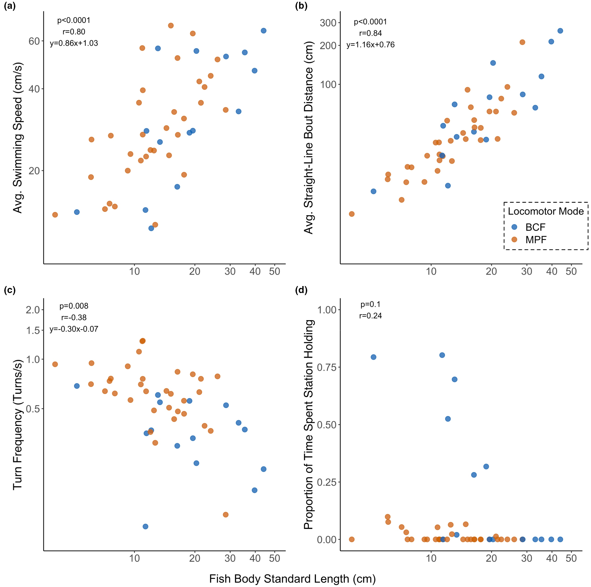

# Bài 06 — Kích thước cơ thể liên hệ với hành vi bơi

- **Module:** 03. Kết quả thực nghiệm
- **Loại:** Lesson kết quả
- **Nguồn chính:** Results; Figure 2

## Mục tiêu học tập

Đọc Figure 2 và hiểu vì sao kích thước là biến nhiễu quan trọng.

## Figure 2

## 1. Tốc độ và chiều dài cơ thể

Quan hệ giữa SL và tốc độ bơi trung bình rất rõ:

- `p < 0.0001`
- `r = 0.80`

Cá lớn hơn có xu hướng có tốc độ bơi trung bình cao hơn trong các đoạn bơi thẳng.

## 2. Quãng bơi thẳng và chiều dài cơ thể

Đây là quan hệ mạnh nhất trong Figure 2:

- `p < 0.0001`
- `r = 0.84`

Cá lớn hơn có xu hướng đi được quãng đường thẳng dài hơn giữa các lần rẽ.

## 3. Tần suất rẽ và chiều dài cơ thể

Quan hệ là âm:

- `p = 0.008`
- `r = -0.38`

Trong dữ liệu, cá lớn hơn có xu hướng rẽ ít lần hơn trên một đơn vị thời gian di chuyển.

## 4. Station holding và chiều dài cơ thể

Không thấy quan hệ có ý nghĩa thống kê:

- `p = 0.1`
- `r = 0.24`

Vì vậy biến này không được hiệu chỉnh theo SL ở các phân tích tiếp theo.

## 5. Kết luận phương pháp

Figure 2 không phải kết luận cuối về hình dạng; nó cho thấy **body size** phải được kiểm soát trước khi nghiên cứu các trục hình thái khác.

## Tự kiểm tra

Biến nào có tương quan mạnh nhất với SL? Biến nào không có quan hệ có ý nghĩa với SL?
