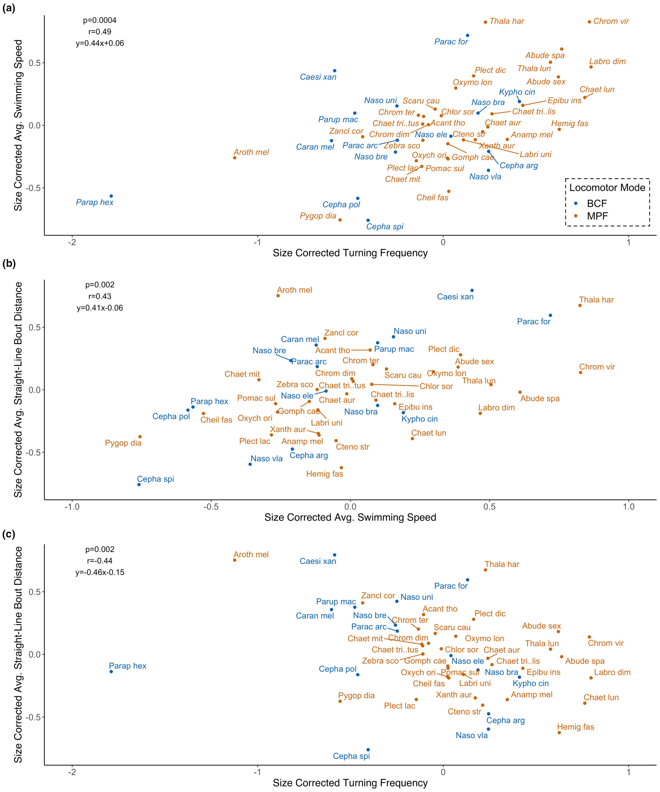

# Bài 07 — Các tương quan và trade-off giữa hành vi

- **Module:** 03. Kết quả thực nghiệm
- **Loại:** Lesson kết quả
- **Nguồn chính:** Results 3.1; Table 1; Figure 3

## Mục tiêu học tập

So sánh các dự đoán của mô hình cổ điển với các quan hệ thực sự quan sát được.

## 1. Bảng dự đoán và kết quả

| Cặp hành vi | Dự đoán | Quan sát |
| --- | ---: | ---: |
| Tốc độ ↔ tần suất rẽ | âm | **dương** |
| Tốc độ ↔ quãng bơi thẳng | dương | **dương** |
| Tốc độ ↔ station holding | dương | **không rõ** |
| Tần suất rẽ ↔ quãng bơi thẳng | âm | **âm** |
| Tần suất rẽ ↔ station holding | âm | **âm yếu / gần 0** |
| Quãng bơi thẳng ↔ station holding | âm | **không rõ** |

Bài báo nhấn mạnh rằng **4/6 cặp** không cho kết quả phù hợp rõ với dự đoán cổ điển.

## 2. Figure 3

### 2.1 Tốc độ và tần suất rẽ

Trái với kỳ vọng trade-off:

- `p = 0.0004`
- `r = 0.49`

Các loài rẽ thường xuyên hơn trong dữ liệu lại có xu hướng dùng tốc độ cao hơn, không phải thấp hơn.

### 2.2 Tốc độ và quãng bơi thẳng

Phù hợp dự đoán cruiser:

- `p = 0.002`
- `r = 0.43`

Tốc độ cao hơn đi cùng các bout bơi thẳng dài hơn.

### 2.3 Tần suất rẽ và quãng bơi thẳng

Phù hợp dự đoán:

- `p = 0.002`
- `r = -0.44`

Rẽ nhiều hơn gắn với các đoạn bơi thẳng ngắn hơn.

## 3. Station holding

Station holding không liên hệ có ý nghĩa với quãng đường (`p = 0.63, r = 0.07`) hay tốc độ (`p = 0.24, r = 0.17`). Quan hệ với tần suất rẽ là âm nhưng yếu (`p = 0.04, r = -0.30`) và cần thận trọng vì số loài có station holding cao là ít.

## Kết luận

Các hành vi không xếp gọn vào ba cụm “cruiser–maneuverer–accelerator”. Một loài có thể vừa bơi tương đối nhanh vừa rẽ thường xuyên, điều mà mô hình trade-off đơn giản không dự đoán.
