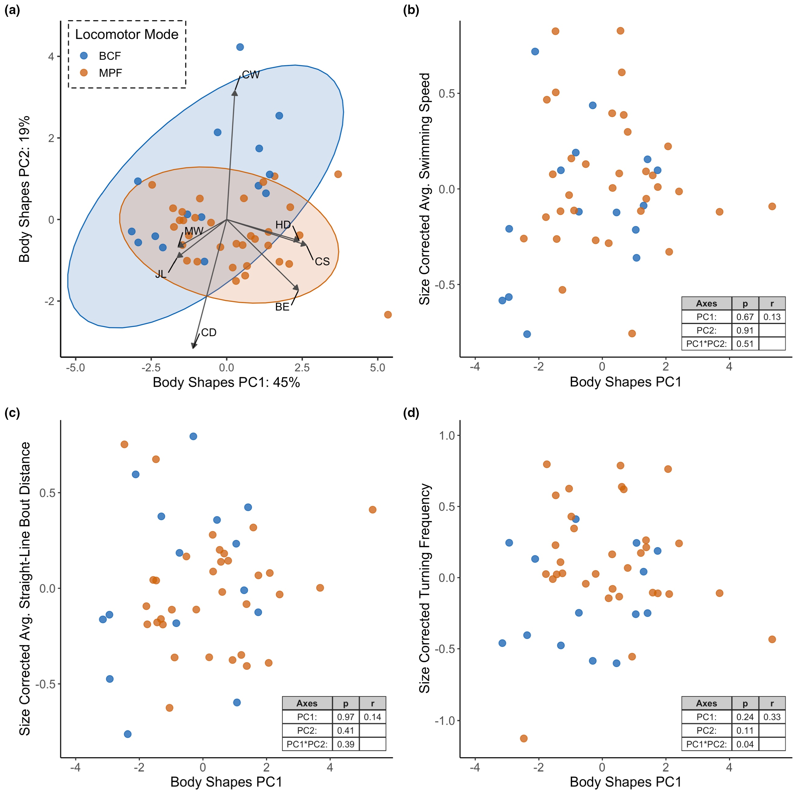

# Bài 08 — Hình dạng cơ thể có dự đoán hành vi không?

- **Module:** 03. Kết quả thực nghiệm
- **Loại:** Lesson kết quả
- **Nguồn chính:** Results 3.2; Figure 4

## Mục tiêu học tập

Đọc morphospace PCA và đánh giá trực tiếp mối liên hệ giữa hình dạng cơ thể với hành vi bơi thường nhật.

## Figure 4

## 1. Hai trục hình dạng chính

- **PC1 = 45%** biến thiên hình dạng. Phía dương thiên về cá thân sâu và dẹt bên; phía âm thiên về cá kéo dài hơn.
- **PC2 = 19%** biến thiên và phản ánh mạnh hình dạng cuống đuôi qua CD và CW.

## 2. Kết quả PGLS

Không có ảnh hưởng có ý nghĩa của PC1, PC2 hoặc tương tác của chúng lên:

- tốc độ bơi trung bình;
- quãng bơi thẳng trung bình.

Với tần suất rẽ, PC1 và PC2 riêng lẻ cũng không có ảnh hưởng có ý nghĩa. Có một tương tác yếu giữa PC1 × PC2 (`p ≈ 0.043`), nhưng hiệu ứng này phụ thuộc mạnh vào một điểm dữ liệu là **Parapercis hexophtalma**; khi bỏ điểm này, ý nghĩa thống kê mất đi (`p = 0.141`).

## 3. Những ví dụ phá vỡ khuôn mẫu

- **Caranx melampygus**, có hình dạng điển hình của cruiser, lại có tốc độ thường nhật tương đối thấp.
- Nhiều **Chaetodon**, **Zanclus cornutus** và **Zebrasoma scopas** có thân sâu nhưng phần lớn chỉ ở mức trung gian về tần suất rẽ.
- **Parapercis hexophtalma** là loài kéo dài nhất trong dữ liệu và có station holding cao nhất, nhưng hai loài kéo dài kế tiếp lại không dùng station holding.
- Các loài có tốc độ trung bình cao nhất trải trên nhiều giá trị elongation khác nhau.

## 4. Kết luận của bài báo

Các biến hình dạng được đo trong nghiên cứu **không đủ để ước lượng hành vi bơi thường nhật**. Cá có hình dạng giống nhau có thể có hành vi khác nhau đáng kể; cá có hình dạng rất khác nhau có thể nằm gần nhau trong “behaviour space”.

## Tự kiểm tra

1. PC1 và PC2 giải thích tổng cộng bao nhiêu phần trăm biến thiên hình dạng?
2. Vì sao hiệu ứng PC1 × PC2 lên tần suất rẽ được xem là yếu?
