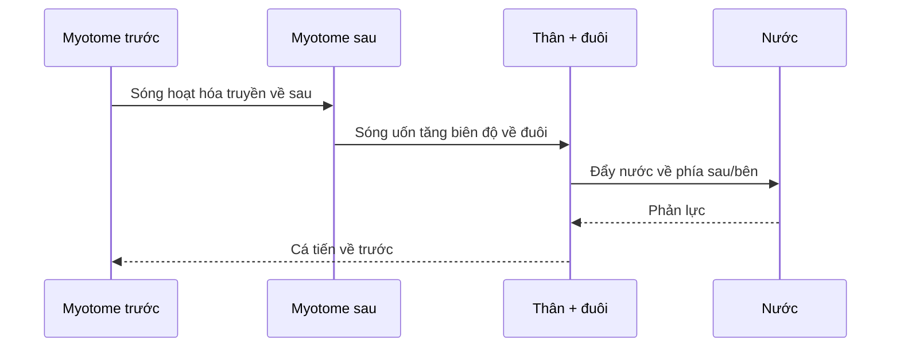

# Bài 01 — Bơi uốn sóng và cơ chế tạo lực đẩy

## 1. Tóm tắt

Bơi dạng uốn sóng (*undulatory swimming*) được tạo bởi hoạt động tuần tự của các myotome dọc thân. Sự hoạt hóa này sinh ra một sóng uốn truyền từ đầu về đuôi. Thân và vây đuôi đẩy nước, còn phản lực của nước tạo lực đẩy đưa cá tiến về trước.

Điểm quan trọng của bài báo là cơ chế này không chỉ phụ thuộc vào “đuôi quẫy”. Nó là kết quả của tương tác giữa đặc tính cơ, hình dạng thân, kiểu bơi, tốc độ bơi và các cấu trúc cơ–xương thụ động.

## 2. Mục tiêu

Sau bài này, người học có thể:

1. Mô tả chuỗi sự kiện từ hoạt hóa cơ đến lực đẩy.
2. Phân biệt hướng truyền của sóng uốn với hướng chuyển động của cá.
3. Giải thích vì sao cùng một nguyên lý chung nhưng chức năng cơ có thể khác giữa các loài.

## 3. Bối cảnh

Cá có thể bơi nhờ chuyển động uốn của thân và/hoặc các vây đôi, vây lẻ. Bài báo tập trung vào **bơi ổn định bằng uốn thân**, trong đó hệ cơ phân đoạn ở hai bên thân là nguồn công suất cơ học chính.

Các nghiên cứu được tổng hợp cho thấy mô hình hoạt hóa và biến dạng cơ khác nhau đáng kể giữa các loài. Vì vậy, không thể giả định rằng mọi loài cá đều dùng cơ theo đúng một cách giống nhau.

## 4. Cơ chế cốt lõi

### 4.1. Sóng hoạt hóa cơ

Các myotome không co đồng thời trên toàn thân. Hoạt hóa bắt đầu ở vùng trước và truyền dần về phía đuôi. Hai bên thân hoạt hóa luân phiên, làm thân uốn sang trái rồi sang phải.

### 4.2. Sóng uốn cơ thể

Hoạt hóa cơ, đặc tính của bộ xương và mô thụ động, cùng phản lực của nước kết hợp tạo nên sóng cong của thân. Sóng cong này cũng truyền về phía sau.

### 4.3. Chuyển công suất thành lực đẩy

Khi thân và đuôi đẩy nước, nước tác dụng phản lực lên cá. Thành phần phản lực theo hướng tiến tạo ra thrust — lực đẩy tiến về trước.

## 5. Vì sao chức năng cơ khác nhau giữa các loài?

Bài báo nhấn mạnh năm nhóm yếu tố tương tác:

1. **Đặc tính cơ học của cơ** — tốc độ co, khả năng sinh lực, phản ứng với kéo dài/rút ngắn.
2. **Hình dạng cơ thể** — thân dài, thân thoi, vùng đuôi hẹp hay rộng.
3. **Kiểu bơi** — bước sóng đẩy dài hay ngắn, mức độ dùng toàn thân hay tập trung ở đuôi.
4. **Tốc độ bơi** — tốc độ cao đòi hỏi tuyển mộ các sợi cơ nhanh hơn.
5. **Quan hệ phát sinh loài** — các nhóm cá khác nhau có thể đã tiến hóa những giải pháp cơ học khác nhau.

## 6. Điểm cần nhớ

- Sóng uốn đi **về phía đuôi**, trong khi cá đi **về phía trước**.
- Lực đẩy không chỉ do đuôi tự tạo; công suất được sinh ra dọc thân và có thể được truyền về vùng đuôi.
- Muốn hiểu bơi của cá cần ghép dữ liệu **cơ**, **động học thân** và **tương tác với nước**.

## 7. Câu hỏi tự kiểm tra

1. Vì sao nói bơi dạng uốn là một quá trình “tuần tự” thay vì “đồng thời”?  
2. Sóng uốn truyền theo hướng nào so với hướng bơi?  
3. Tại sao chỉ quan sát hình dạng quẫy đuôi chưa đủ để suy ra chức năng của từng vùng cơ?  
4. Kể tên ít nhất ba yếu tố làm chức năng cơ khác nhau giữa các loài.

## 8. Checklist

- [ ] Tôi mô tả được chuỗi hoạt hóa cơ → sóng uốn → phản lực nước → lực đẩy.
- [ ] Tôi phân biệt được hướng sóng và hướng bơi.
- [ ] Tôi hiểu vì sao không nên dùng một mô hình chức năng cơ duy nhất cho mọi loài cá.

## 9. Tổng kết

Nền tảng của bơi uốn sóng là **sự phối hợp theo không gian và thời gian của cơ dọc thân**. Những bài tiếp theo sẽ tách cơ chế này thành các lớp: cấu trúc myotome, loại sợi cơ, thời điểm hoạt hóa, động học thân và công suất cơ.

**Phạm vi nguồn:** phần Summary và Introduction, trang 3397.
