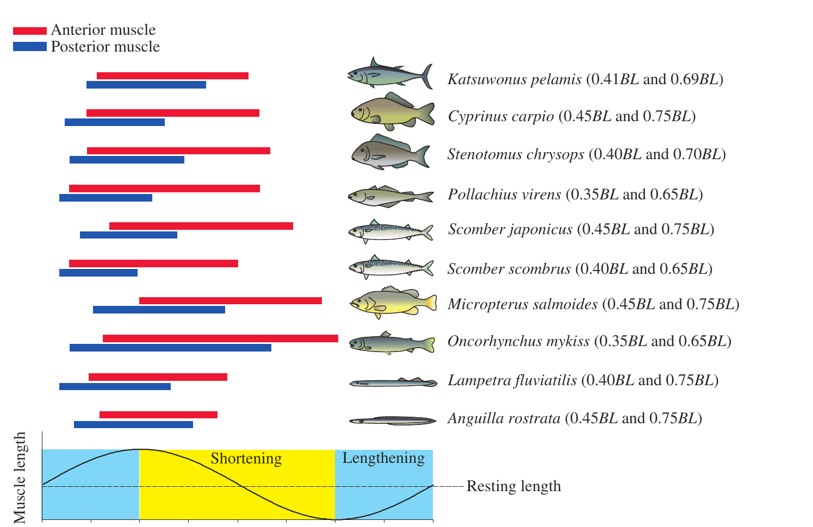
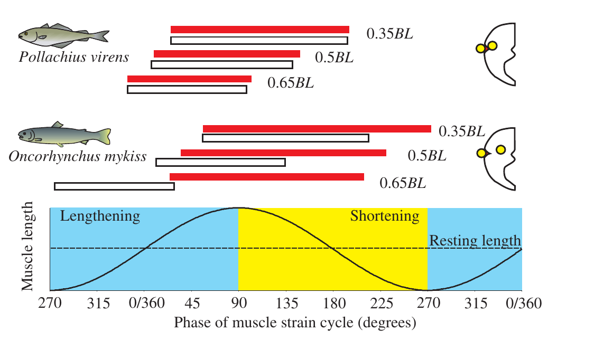

# Bài 03 — Hoạt hóa cơ khi bơi

## 1. Tóm tắt

Điện cơ đồ (EMG) cho biết thời điểm cơ hoạt động. Trong bơi chậm ổn định, hai bên thân hoạt hóa luân phiên; vùng cơ phía trước được hoạt hóa trước và một sóng hoạt hóa truyền về đuôi. Khi tốc độ và tần số đập đuôi tăng, các sợi nhanh ở sâu hơn được tuyển mộ.

## 2. Mục tiêu

Sau bài này, người học có thể:

1. Giải thích EMG đo điều gì trong nghiên cứu bơi.
2. Mô tả mẫu hoạt hóa cơ chậm trong bơi ổn định.
3. Giải thích tuyển mộ cơ khi tốc độ bơi tăng.
4. Phân biệt thời điểm khởi phát và thời lượng hoạt hóa giữa vùng trước và vùng sau.

## 3. EMG và câu hỏi “khi nào cơ hoạt động?”

EMG được dùng để theo dõi thời gian hoạt hóa cơ. Nó không trực tiếp cho biết lực hay công suất, nhưng cung cấp mốc thời gian cần thiết để ghép với dữ liệu strain.

## 4. Mẫu hoạt hóa trong bơi chậm

### 4.1. Hai bên hoạt hóa luân phiên

Ở các loài được nghiên cứu, bơi chậm ổn định được đặc trưng bởi hoạt hóa xen kẽ hai bên thân. Khi một bên tạo uốn theo một hướng, chu kỳ tiếp theo bên đối diện đảm nhiệm.

### 4.2. Sóng hoạt hóa từ đầu về đuôi

Cơ phía trước bắt đầu hoạt hóa trước. Sóng **activation** truyền về phía sau. Sóng **deactivation** thường truyền nhanh hơn, nên cơ phía trước hoạt động trong khoảng thời gian dài hơn.

## 5. Tốc độ bơi và tuyển mộ sợi cơ

Khi tốc độ bơi và tần số đập đuôi tăng, cá tuyển mộ các sợi nằm sâu hơn và nhanh hơn. Bài báo cho biết các sợi nhanh này vẫn thể hiện mô hình chung: sóng hoạt hóa truyền về sau và khoảng hoạt hóa ở myotome trước thường dài hơn.

## 6. Xu hướng dọc thân

### 6.1. Thời lượng hoạt hóa giảm về đuôi

Ở các loài có **bước sóng đẩy dài**, thời lượng EMG giảm đáng kể khi đi về phía đuôi. Điều này cho phép một vùng lớn của một bên thân cùng hoạt động trong một phần chu kỳ, phù hợp với việc phần lớn thân uốn theo cùng hướng.

### 6.2. Loài có bước sóng đẩy ngắn

Lươn và lamprey có bước sóng đẩy ngắn hơn một chiều dài cơ thể. Chúng có thời gian hoạt hóa vùng trước ngắn và ít hoặc không giảm thêm về phía đuôi. Kết quả là các vùng khác nhau của thân có thể đồng thời uốn theo hai hướng ngược nhau.

Hình 4 so sánh thời điểm hoạt hóa cơ chậm ở vùng trước và sau trên nhiều taxa. Xu hướng chung của danh sách là bước sóng đẩy giảm dần từ trên xuống.

## 7. Khởi phát hoạt hóa sớm hơn ở vùng sau

Ở đa số loài được khảo sát, EMG bắt đầu **sớm hơn trong chu kỳ strain** ở các myotome phía sau. Xu hướng này xuất hiện ở cả cơ chậm và cơ nhanh.

Cá ngừ skipjack là một ngoại lệ đáng chú ý: pha khởi phát EMG so với rút ngắn của cơ chậm sâu thay đổi rất ít dọc thân.

Hình 5 biểu diễn dữ liệu tại khoảng 0.35, 0.5 và 0.65 BL, cho thấy cách hoạt hóa của cơ chậm và cơ nhanh dịch pha theo vị trí dọc thân.

## 8. Câu hỏi tự kiểm tra

1. EMG trả lời câu hỏi nào, và không trực tiếp trả lời câu hỏi nào?  
2. Vì sao cơ phía trước thường có thời lượng hoạt hóa dài hơn?  
3. Điều gì xảy ra với tuyển mộ sợi cơ khi tốc độ bơi tăng?  
4. Mẫu EMG của lươn/lamprey khác nhóm có bước sóng đẩy dài ở điểm nào?  
5. Ngoại lệ được bài báo nêu đối với xu hướng dịch pha về phía đuôi là loài nào?

## 9. Checklist

- [ ] Tôi mô tả được activation wave và deactivation wave.
- [ ] Tôi hiểu bơi nhanh hơn đòi hỏi tuyển mộ sợi nhanh hơn.
- [ ] Tôi phân biệt được loài có bước sóng đẩy dài và ngắn qua mẫu EMG.

## 10. Tổng kết

EMG cho thấy cơ không chỉ hoạt hóa “từ đầu tới đuôi”; **thời lượng và pha hoạt hóa cũng thay đổi theo vị trí**. Chính sự thay đổi này là chìa khóa để hiểu tại sao cơ phía trước và phía sau có thể đảm nhiệm các vai trò cơ học khác nhau.

**Phạm vi nguồn:** “Muscle activation patterns during swimming” và phần đầu “Emerging trends”, trang 3398–3400; Hình 4–5.
