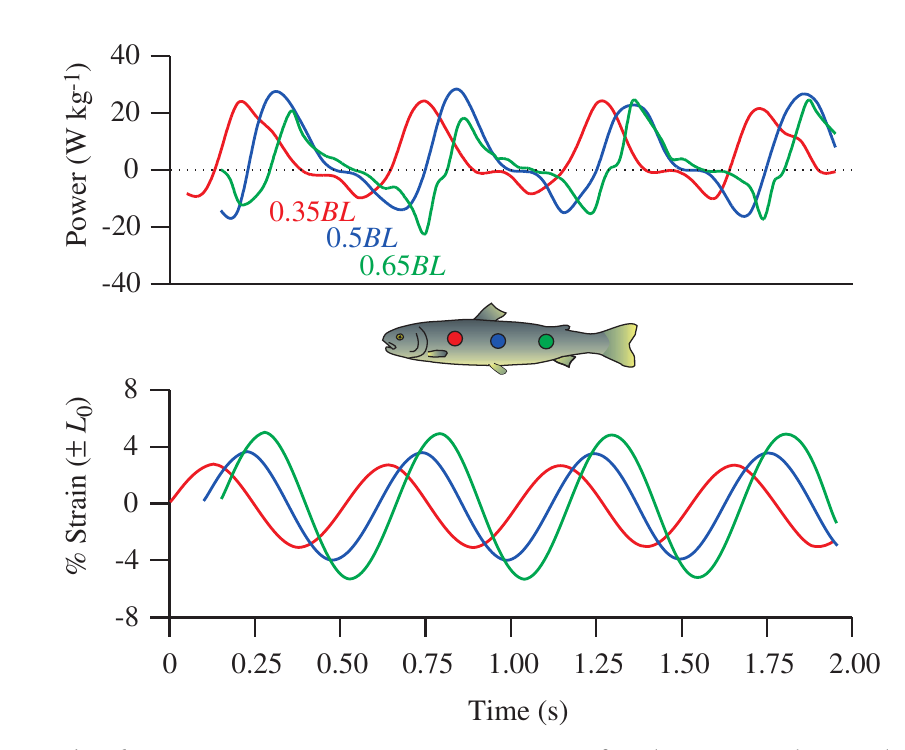

# Bài 06 — Phân công chức năng dọc thân và truyền công suất

## 1. Tóm tắt

Bài báo không ủng hộ cách chia đơn giản rằng “cơ trước tạo công suất, cơ sau chỉ truyền công suất”. Dữ liệu thí nghiệm cho thấy net power vẫn dương ở các vị trí dọc thân được nghiên cứu. Tuy nhiên, khi đi về phía đuôi, cơ có thể đồng thời tăng vai trò làm cứng thân, chịu lực cao và hỗ trợ truyền công suất tới vây đuôi.

## 2. Mục tiêu

Sau bài này, người học có thể:

1. Giải thích hai vai trò được đề xuất cho công âm ở myotome sau.
2. Phân tích vì sao vùng sau vẫn có thể vừa tạo vừa truyền công suất.
3. Giải thích ảnh hưởng của strain, khối lượng cơ hoạt hóa và động học co tới tổng công suất.
4. Mô tả các con đường truyền công suất tới đuôi.

## 3. Hai vai trò được đề xuất cho vùng cơ sau

### 3.1. Làm cứng để truyền công suất

Cơ phía sau có thể được hoạt hóa và “stiffen” trong một phần chu kỳ, phối hợp với mô thụ động để truyền công suất về đuôi.

### 3.2. Điều chỉnh độ cứng và cộng hưởng

Một giả thuyết khác là cá điều chỉnh độ cứng thân sao cho tần số cộng hưởng tự nhiên của thân gần với tần số đập đuôi. Nếu đạt được điều này, chi phí cơ học của chuyển động có thể giảm.

Hai chức năng trên không loại trừ nhau.

## 4. Net power vẫn dương dọc thân

Trong các nghiên cứu có thí nghiệm in vitro mô phỏng bơi trên:

- fast muscle của saithe;
- slow muscle của scup;
- slow muscle của trout;

**net power output dương ở mọi vị trí đã đo dọc thân**.

Do đó, không nên gắn một nhãn duy nhất “producer” hoặc “transmitter” cho cơ phía sau. Một vùng cơ có thể thực hiện nhiều nhiệm vụ trong cùng hoặc các phần khác nhau của chu kỳ.

## 5. Strain tăng về phía sau

Trong bơi ổn định, strain cơ điển hình tăng khoảng từ **±2% tới ±8%** trong vùng giữa 40–50% chiều dài thân.

Tổng công suất tại một vị trí phụ thuộc vào:

1. Biên độ strain.
2. Thể tích cơ đang hoạt hóa.
3. Pha giữa strain và EMG.
4. Động học co cơ.
5. Tốc độ bơi.

## 6. Nguồn công suất khi bơi nhanh

Khối lượng fast muscle giảm mạnh ở vùng caudal vì hình dạng thân cần thon để giảm cản. Khi bơi nhanh, phần lớn fast muscle có thể hoạt hóa; do đó cơ vùng trước phải là nguồn công suất lớn.

Công suất này có thể được truyền tới vây đuôi qua:

- bộ xương;
- myosepta;
- da;
- và các cấu trúc gân chuyên hóa ở một số loài.

## 7. Ứng suất cao ở vùng đuôi

Bài báo trích tính toán cho thấy cơ vùng caudal có thể phải chịu stress tới khoảng **hai lần** cơ vùng trước. Cơ bị kéo dài khi đang hoạt hóa có thể chịu stress rất lớn, hỗ trợ giả thuyết về vai trò truyền công suất.

Ở cá chép, các đặc điểm của myotendinous junction phía sau cũng được diễn giải như thích nghi với stress cao hơn.

## 8. Gearing và khởi động nhanh

Ở carp trong fast start, độ cong cột sống tăng nhưng strain ở cơ chậm và nhanh lại giảm. Điều này được liên hệ với giảm bề rộng thân và thay đổi gearing ratio dọc thân.

Strain và strain rate thấp hơn giúp tạo lực cao hơn, nhưng đổi lại công suất có thể thấp hơn. Đây là ví dụ cho thấy hình học thân và gearing thay đổi cách cơ được “dùng” theo vị trí.

## 9. Đọc Hình 6 theo góc nhìn phân công chức năng

Các đường công suất khác pha giữa `0.35`, `0.5`, `0.65 BL`, cho thấy cùng một chu kỳ bơi nhưng thời điểm tạo/hấp thụ công thay đổi theo vị trí. Đây là nền tảng để nói về “division of labour” dọc thân.

## 10. Câu hỏi tự kiểm tra

1. Hai vai trò được đề xuất cho công âm vùng sau là gì?  
2. Vì sao không nên gọi cơ phía sau đơn thuần là “bộ truyền công suất”?  
3. Những yếu tố nào quyết định công suất tuyệt đối tại một vị trí?  
4. Vì sao cơ vùng trước trở nên quan trọng trong bơi nhanh?  
5. Những cấu trúc nào có thể truyền công suất về vây đuôi?

## 11. Checklist

- [ ] Tôi hiểu một vùng cơ có thể vừa tạo công vừa hỗ trợ truyền công.
- [ ] Tôi nhớ strain có thể tăng từ khoảng ±2% tới ±8% dọc vùng giữa thân.
- [ ] Tôi mô tả được ít nhất ba con đường truyền công suất tới đuôi.
- [ ] Tôi hiểu sự thay đổi gearing có thể làm thay đổi strain và chức năng cơ.

## 12. Tổng kết

Sự phân công chức năng dọc thân là **liên tục**, không phải một ranh giới cứng giữa “nguồn” và “bộ truyền”. Cơ sau vẫn tạo net power nhưng có thể tăng vai trò truyền lực, điều chỉnh độ cứng và chịu ứng suất lớn.

**Phạm vi nguồn:** phần “Emerging trends”, trang 3400–3402; Hình 6.
