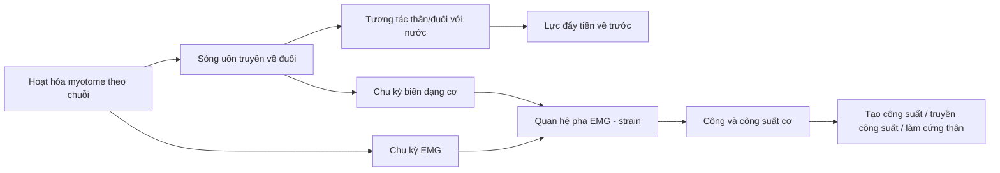
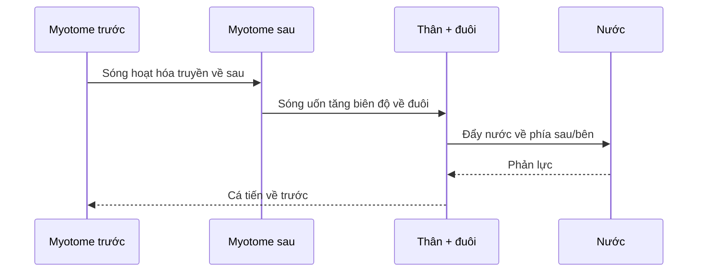
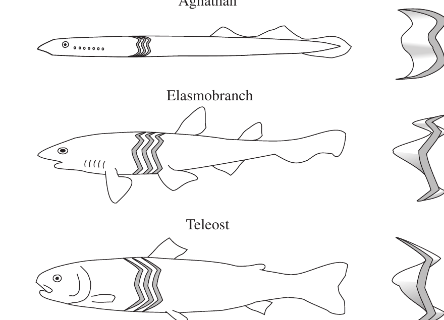
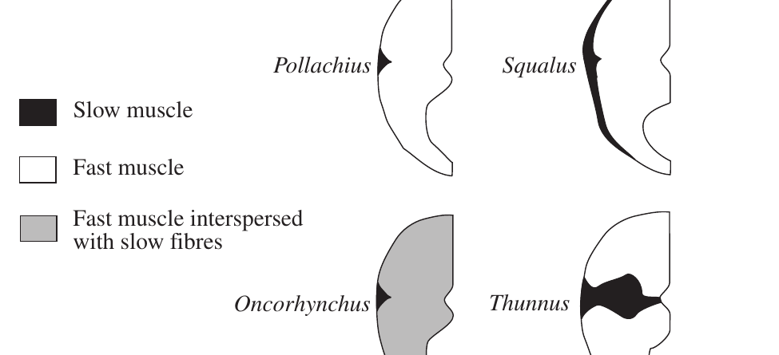
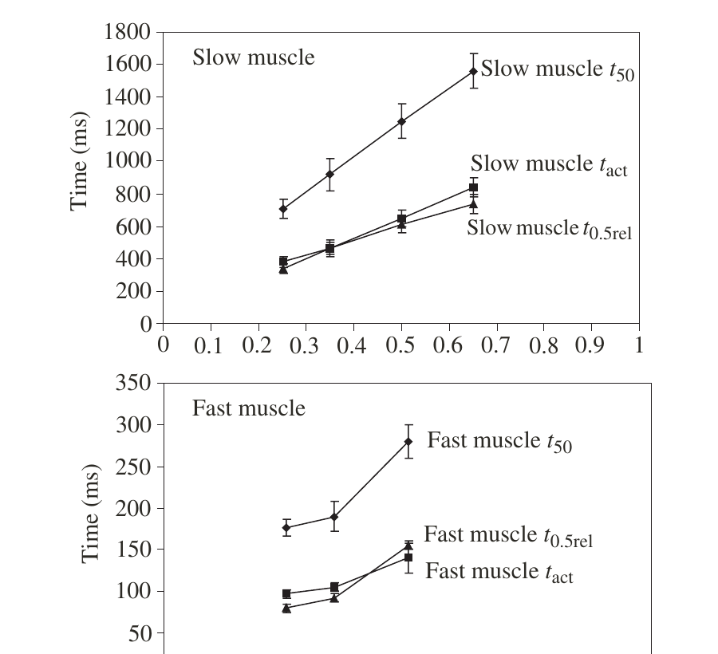

# Khóa học: Cơ sinh học bơi ở cá — từ myotome đến lực đẩy

Khóa học này được biên soạn lại từ bài báo **“Fish swimming: patterns in muscle function”** của **John D. Altringham và David J. Ellerby**, *The Journal of Experimental Biology* 202, 3397–3403 (1999).

Mục tiêu của bộ tài liệu là biến bài báo nghiên cứu ngắn thành một chuỗi bài học có thể học độc lập, có lộ trình, hình minh họa, thuật ngữ, câu hỏi tự kiểm tra và bài đánh giá cuối khóa. Phần kiến thức chuyên môn bám sát nội dung của bài báo; các mục tiêu học tập, câu hỏi và hoạt động ôn tập là phần tổ chức sư phạm được xây dựng từ nội dung đó.

## 1. Kết quả học tập

Sau khi hoàn thành khóa học, người học có thể:

1. Giải thích cơ chế bơi dạng uốn sóng của cá và cách sóng uốn truyền từ đầu về đuôi tạo lực đẩy.
2. Mô tả cấu trúc myotome, hướng sợi cơ và sự phân bố của cơ nhanh, cơ chậm và lớp cơ trung gian.
3. Giải thích cách hoạt hóa cơ thay đổi theo vị trí dọc thân và theo tốc độ bơi.
4. Phân tích các đại lượng động học chính: biên độ sóng, bước sóng đẩy, tần số đập đuôi, stride length và slip.
5. Liên hệ chu kỳ EMG, chu kỳ biến dạng cơ, lực, công và công suất.
6. Phân biệt vai trò tạo công suất, truyền công suất và làm cứng thân của các vùng cơ trước–sau.
7. Trình bày vì sao cá ngừ là một trường hợp chuyên hóa đáng chú ý trong cơ chế truyền công suất tới đuôi.
8. Nhận diện các giới hạn phương pháp luận và các câu hỏi nghiên cứu còn bỏ ngỏ mà bài báo nêu ra.

## 2. Lộ trình học

| Bài | Chủ đề | Hình chính |
|---|---|---|
| 01 | Bơi uốn sóng và cơ chế tạo lực đẩy | — |
| 02 | Giải phẫu myotome và các loại cơ | Hình 1, 2, 3 |
| 03 | Hoạt hóa cơ khi bơi | Hình 4, 5 |
| 04 | Động học thân cá và sóng uốn | — |
| 05 | Biến dạng, EMG, công và công suất | Hình 4, 5, 6 |
| 06 | Phân công chức năng dọc thân và truyền công suất | Hình 6 |
| 07 | Cá ngừ, giới hạn nghiên cứu và kết luận | Hình 2 |

Tài liệu bổ trợ:

- `08-on-tap-va-danh-gia.md`: bài tập tổng hợp cuối khóa.
- `09-dap-an-va-goi-y.md`: đáp án và gợi ý giải.
- `10-thuat-ngu.md`: bảng thuật ngữ Anh–Việt.
- `11-tai-lieu-tham-khao.md`: thư mục tài liệu của bài báo.
- `assets/`: sáu hình đã được tách khỏi PDF.
- `source/`: bản PDF gốc.

## 3. Cách học đề xuất

Mỗi bài nên học theo thứ tự: **Tóm tắt → Mục tiêu → Khái niệm → Cơ chế → Hình minh họa → Câu hỏi tự kiểm tra → Checklist**. Với các bài có đồ thị, hãy đọc trục, đơn vị và quan hệ pha trước khi đọc phần diễn giải.

## 4. Quy ước

- **BL**: body length — chiều dài cơ thể, đo từ mõm.
- **EMG**: electromyography — điện cơ đồ.
- **Anterior**: phía trước, gần đầu.
- **Posterior / caudal**: phía sau / vùng gần đuôi.
- **Positive work**: công dương — cơ tạo công khi đang hoạt hóa và rút ngắn.
- **Negative work**: công âm — cơ đang hoạt hóa nhưng bị kéo dài.

## 5. Sơ đồ toàn khóa



---

# Bài 01 — Bơi uốn sóng và cơ chế tạo lực đẩy

## 1. Tóm tắt

Bơi dạng uốn sóng (*undulatory swimming*) được tạo bởi hoạt động tuần tự của các myotome dọc thân. Sự hoạt hóa này sinh ra một sóng uốn truyền từ đầu về đuôi. Thân và vây đuôi đẩy nước, còn phản lực của nước tạo lực đẩy đưa cá tiến về trước.

Điểm quan trọng của bài báo là cơ chế này không chỉ phụ thuộc vào “đuôi quẫy”. Nó là kết quả của tương tác giữa đặc tính cơ, hình dạng thân, kiểu bơi, tốc độ bơi và các cấu trúc cơ–xương thụ động.

## 2. Mục tiêu

Sau bài này, người học có thể:

1. Mô tả chuỗi sự kiện từ hoạt hóa cơ đến lực đẩy.
2. Phân biệt hướng truyền của sóng uốn với hướng chuyển động của cá.
3. Giải thích vì sao cùng một nguyên lý chung nhưng chức năng cơ có thể khác giữa các loài.

## 3. Bối cảnh

Cá có thể bơi nhờ chuyển động uốn của thân và/hoặc các vây đôi, vây lẻ. Bài báo tập trung vào **bơi ổn định bằng uốn thân**, trong đó hệ cơ phân đoạn ở hai bên thân là nguồn công suất cơ học chính.

Các nghiên cứu được tổng hợp cho thấy mô hình hoạt hóa và biến dạng cơ khác nhau đáng kể giữa các loài. Vì vậy, không thể giả định rằng mọi loài cá đều dùng cơ theo đúng một cách giống nhau.

## 4. Cơ chế cốt lõi

### 4.1. Sóng hoạt hóa cơ

Các myotome không co đồng thời trên toàn thân. Hoạt hóa bắt đầu ở vùng trước và truyền dần về phía đuôi. Hai bên thân hoạt hóa luân phiên, làm thân uốn sang trái rồi sang phải.

### 4.2. Sóng uốn cơ thể

Hoạt hóa cơ, đặc tính của bộ xương và mô thụ động, cùng phản lực của nước kết hợp tạo nên sóng cong của thân. Sóng cong này cũng truyền về phía sau.

### 4.3. Chuyển công suất thành lực đẩy

Khi thân và đuôi đẩy nước, nước tác dụng phản lực lên cá. Thành phần phản lực theo hướng tiến tạo ra thrust — lực đẩy tiến về trước.



## 5. Vì sao chức năng cơ khác nhau giữa các loài?

Bài báo nhấn mạnh năm nhóm yếu tố tương tác:

1. **Đặc tính cơ học của cơ** — tốc độ co, khả năng sinh lực, phản ứng với kéo dài/rút ngắn.
2. **Hình dạng cơ thể** — thân dài, thân thoi, vùng đuôi hẹp hay rộng.
3. **Kiểu bơi** — bước sóng đẩy dài hay ngắn, mức độ dùng toàn thân hay tập trung ở đuôi.
4. **Tốc độ bơi** — tốc độ cao đòi hỏi tuyển mộ các sợi cơ nhanh hơn.
5. **Quan hệ phát sinh loài** — các nhóm cá khác nhau có thể đã tiến hóa những giải pháp cơ học khác nhau.

## 6. Điểm cần nhớ

- Sóng uốn đi **về phía đuôi**, trong khi cá đi **về phía trước**.
- Lực đẩy không chỉ do đuôi tự tạo; công suất được sinh ra dọc thân và có thể được truyền về vùng đuôi.
- Muốn hiểu bơi của cá cần ghép dữ liệu **cơ**, **động học thân** và **tương tác với nước**.

## 7. Câu hỏi tự kiểm tra

1. Vì sao nói bơi dạng uốn là một quá trình “tuần tự” thay vì “đồng thời”?  
2. Sóng uốn truyền theo hướng nào so với hướng bơi?  
3. Tại sao chỉ quan sát hình dạng quẫy đuôi chưa đủ để suy ra chức năng của từng vùng cơ?  
4. Kể tên ít nhất ba yếu tố làm chức năng cơ khác nhau giữa các loài.

## 8. Checklist

- [ ] Tôi mô tả được chuỗi hoạt hóa cơ → sóng uốn → phản lực nước → lực đẩy.
- [ ] Tôi phân biệt được hướng sóng và hướng bơi.
- [ ] Tôi hiểu vì sao không nên dùng một mô hình chức năng cơ duy nhất cho mọi loài cá.

## 9. Tổng kết

Nền tảng của bơi uốn sóng là **sự phối hợp theo không gian và thời gian của cơ dọc thân**. Những bài tiếp theo sẽ tách cơ chế này thành các lớp: cấu trúc myotome, loại sợi cơ, thời điểm hoạt hóa, động học thân và công suất cơ.

**Phạm vi nguồn:** phần Summary và Introduction, trang 3397.

---

# Bài 02 — Giải phẫu myotome và các loại cơ

## 1. Tóm tắt

Cơ thân cá được tổ chức thành các **myotome phân đoạn** có cấu trúc ba chiều phức tạp. Sợi cơ không đơn giản chạy song song với trục thân mà có thể đi theo quỹ đạo xoắn và nghiêng tới khoảng 40° so với trục dọc. Cơ thân gồm chủ yếu cơ nhanh (trắng) và cơ chậm (đỏ); một số loài có lớp cơ hồng trung gian.

## 2. Mục tiêu

Sau bài này, người học có thể:

1. Mô tả cấu trúc ba chiều của myotome.
2. Giải thích ý tưởng “gearing” của cách sắp xếp sợi cơ.
3. Phân biệt cơ nhanh, cơ chậm và cơ hồng.
4. Phân tích sự thay đổi của đặc tính co cơ theo vị trí dọc thân.

## 3. Cấu trúc myotome

### 3.1. Myotome dạng phân đoạn

Myotome xếp nối tiếp dọc thân và có hình học giống các “nón lồng vào nhau”. Sợi cơ đi theo các đường xoắn phức tạp từ myotome này sang myotome kế tiếp.



**Ý nghĩa của Hình 1:** ba kiểu hình thể hiện cấu trúc myotome ở agnathan, elasmobranch và teleost; các phần myotome tách riêng cho thấy hình dạng ba chiều không đơn giản như các lát cơ phẳng.

### 3.2. Hướng sợi cơ và cơ chế “gearing”

Sợi cơ có thể nghiêng tới khoảng **40°** so với trục dọc. Mô hình của Alexander được bài báo dẫn lại cho rằng cách bố trí này có thể giúp các sợi ở những vị trí khác nhau trong tiết diện trải qua mức strain tương tự khi thân uốn. Vì thế cấu trúc myotome có thể được xem như một hệ thống **điều chỉnh tỉ số cơ học — gearing**.

## 4. Các loại cơ chính

### 4.1. Cơ nhanh và cơ chậm

- **Fast-twitch / white muscle:** chiếm phần lớn tiết diện thân, thường khoảng **80–100%** tại một vị trí nhất định.
- **Slow-twitch / red muscle:** chiếm tỉ lệ nhỏ hơn nhưng quan trọng cho bơi chậm, ổn định và kéo dài.

Tỉ lệ cơ chậm liên quan đến sinh thái: các loài bơi liên tục ở vùng nước mở thường có nhiều cơ chậm hơn các loài sống đáy.

### 4.2. Cơ hồng và các biến thể

Một số loài có lớp **pink muscle** trung gian. Bài báo cũng ghi nhận có thể phân biệt thêm các loại sợi khác dựa trên mô học và đôi khi dựa trên sinh lý.



**Ý nghĩa của Hình 2:** phân bố cơ chậm và cơ nhanh khác nhau giữa Pollachius, Squalus, Oncorhynchus và Thunnus. Ở nhiều loài, cơ chậm nằm gần vùng đường bên; ở cá ngừ, khối cơ chậm có thể nằm sâu bên trong thân.

## 5. Phân bố cơ dọc thân

Cơ chậm thường tạo một vùng dưới đường bên và chiếm tỉ lệ tăng dần về phía đuôi. Tuy nhiên, có những loài có phân bố khác thường; ý nghĩa chức năng của các kiểu phân bố này không phải lúc nào cũng đã được giải thích.

## 6. Đặc tính co cơ thay đổi theo vị trí

Hai loại cơ chính không đồng nhất dọc thân. Ở nhiều loài, động học co cơ chậm dần từ trước ra sau. Ví dụ được nêu trong bài báo là cá mập smooth hound *Mustelus californicus*, nơi thời gian co giật của cả cơ nhanh và cơ chậm tăng khoảng hai lần dọc chiều dài thân.



Các đại lượng trong Hình 3:

- `tact`: thời gian tới lực cực đại.
- `t0.5rel`: thời gian từ kích thích đến 50% thư giãn.
- `t50 = tact + t0.5rel`.

Xu hướng tổng quát trong ví dụ này là vùng sau có thời gian co/giãn dài hơn vùng trước.

## 7. Trường hợp cá ngừ

Ở yellowfin tuna, thời gian co của cơ chậm sâu bên trong giảm khi đi sâu vào khối cơ. Đây là một ví dụ cho thấy sự biến thiên đặc tính cơ không chỉ theo trục đầu–đuôi mà còn có thể theo **độ sâu trong thân**.

## 8. Câu hỏi tự kiểm tra

1. Myotome có cấu trúc ba chiều như thế nào?  
2. Vì sao hướng sợi cơ nghiêng có thể liên quan đến “gearing”?  
3. Cơ nhanh và cơ chậm khác nhau về tỉ lệ trong tiết diện thân ra sao?  
4. Phân bố cơ chậm ở cá ngừ khác kiểu điển hình như thế nào?  
5. Hình 3 cho thấy xu hướng gì khi đi từ đầu tới đuôi?

## 9. Checklist

- [ ] Tôi phân biệt được myotome với một “khối cơ đơn giản”.
- [ ] Tôi nhớ cơ nhanh chiếm phần lớn tiết diện thân ở nhiều loài.
- [ ] Tôi hiểu đặc tính co cơ có thể thay đổi theo vị trí dọc thân và theo độ sâu.

## 10. Tổng kết

Giải phẫu cơ của cá tạo nền tảng cho chuyển động uốn. Cấu trúc myotome, hướng sợi và phân bố các loại cơ làm cho khả năng sinh lực và công suất không đồng nhất dọc thân. Đây là lý do cần xem hoạt hóa cơ theo từng vị trí thay vì coi toàn thân như một cơ duy nhất.

**Phạm vi nguồn:** “Swimming muscle anatomy and physiology”, trang 3397–3398; Hình 1–3.

---

# Bài 03 — Hoạt hóa cơ khi bơi

## 1. Tóm tắt

Điện cơ đồ (EMG) cho biết thời điểm cơ hoạt động. Trong bơi chậm ổn định, hai bên thân hoạt hóa luân phiên; vùng cơ phía trước được hoạt hóa trước và một sóng hoạt hóa truyền về đuôi. Khi tốc độ và tần số đập đuôi tăng, các sợi nhanh ở sâu hơn được tuyển mộ.

## 2. Mục tiêu

Sau bài này, người học có thể:

1. Giải thích EMG đo điều gì trong nghiên cứu bơi.
2. Mô tả mẫu hoạt hóa cơ chậm trong bơi ổn định.
3. Giải thích tuyển mộ cơ khi tốc độ bơi tăng.
4. Phân biệt thời điểm khởi phát và thời lượng hoạt hóa giữa vùng trước và vùng sau.

## 3. EMG và câu hỏi “khi nào cơ hoạt động?”

EMG được dùng để theo dõi thời gian hoạt hóa cơ. Nó không trực tiếp cho biết lực hay công suất, nhưng cung cấp mốc thời gian cần thiết để ghép với dữ liệu strain.

## 4. Mẫu hoạt hóa trong bơi chậm

### 4.1. Hai bên hoạt hóa luân phiên

Ở các loài được nghiên cứu, bơi chậm ổn định được đặc trưng bởi hoạt hóa xen kẽ hai bên thân. Khi một bên tạo uốn theo một hướng, chu kỳ tiếp theo bên đối diện đảm nhiệm.

### 4.2. Sóng hoạt hóa từ đầu về đuôi

Cơ phía trước bắt đầu hoạt hóa trước. Sóng **activation** truyền về phía sau. Sóng **deactivation** thường truyền nhanh hơn, nên cơ phía trước hoạt động trong khoảng thời gian dài hơn.

## 5. Tốc độ bơi và tuyển mộ sợi cơ

Khi tốc độ bơi và tần số đập đuôi tăng, cá tuyển mộ các sợi nằm sâu hơn và nhanh hơn. Bài báo cho biết các sợi nhanh này vẫn thể hiện mô hình chung: sóng hoạt hóa truyền về sau và khoảng hoạt hóa ở myotome trước thường dài hơn.

## 6. Xu hướng dọc thân

### 6.1. Thời lượng hoạt hóa giảm về đuôi

Ở các loài có **bước sóng đẩy dài**, thời lượng EMG giảm đáng kể khi đi về phía đuôi. Điều này cho phép một vùng lớn của một bên thân cùng hoạt động trong một phần chu kỳ, phù hợp với việc phần lớn thân uốn theo cùng hướng.

### 6.2. Loài có bước sóng đẩy ngắn

Lươn và lamprey có bước sóng đẩy ngắn hơn một chiều dài cơ thể. Chúng có thời gian hoạt hóa vùng trước ngắn và ít hoặc không giảm thêm về phía đuôi. Kết quả là các vùng khác nhau của thân có thể đồng thời uốn theo hai hướng ngược nhau.


Hình 4 so sánh thời điểm hoạt hóa cơ chậm ở vùng trước và sau trên nhiều taxa. Xu hướng chung của danh sách là bước sóng đẩy giảm dần từ trên xuống.

## 7. Khởi phát hoạt hóa sớm hơn ở vùng sau

Ở đa số loài được khảo sát, EMG bắt đầu **sớm hơn trong chu kỳ strain** ở các myotome phía sau. Xu hướng này xuất hiện ở cả cơ chậm và cơ nhanh.

Cá ngừ skipjack là một ngoại lệ đáng chú ý: pha khởi phát EMG so với rút ngắn của cơ chậm sâu thay đổi rất ít dọc thân.


Hình 5 biểu diễn dữ liệu tại khoảng 0.35, 0.5 và 0.65 BL, cho thấy cách hoạt hóa của cơ chậm và cơ nhanh dịch pha theo vị trí dọc thân.

## 8. Câu hỏi tự kiểm tra

1. EMG trả lời câu hỏi nào, và không trực tiếp trả lời câu hỏi nào?  
2. Vì sao cơ phía trước thường có thời lượng hoạt hóa dài hơn?  
3. Điều gì xảy ra với tuyển mộ sợi cơ khi tốc độ bơi tăng?  
4. Mẫu EMG của lươn/lamprey khác nhóm có bước sóng đẩy dài ở điểm nào?  
5. Ngoại lệ được bài báo nêu đối với xu hướng dịch pha về phía đuôi là loài nào?

## 9. Checklist

- [ ] Tôi mô tả được activation wave và deactivation wave.
- [ ] Tôi hiểu bơi nhanh hơn đòi hỏi tuyển mộ sợi nhanh hơn.
- [ ] Tôi phân biệt được loài có bước sóng đẩy dài và ngắn qua mẫu EMG.

## 10. Tổng kết

EMG cho thấy cơ không chỉ hoạt hóa “từ đầu tới đuôi”; **thời lượng và pha hoạt hóa cũng thay đổi theo vị trí**. Chính sự thay đổi này là chìa khóa để hiểu tại sao cơ phía trước và phía sau có thể đảm nhiệm các vai trò cơ học khác nhau.

**Phạm vi nguồn:** “Muscle activation patterns during swimming” và phần đầu “Emerging trends”, trang 3398–3400; Hình 4–5.

---

# Bài 04 — Động học thân cá và sóng uốn

## 1. Tóm tắt

Động học bơi là kết quả của cơ hoạt động, cấu trúc cơ–xương thụ động và phản lực từ nước. Sóng cong truyền về đuôi, biên độ tăng dần và thường đạt cực đại gần khoảng 10% chiều dài cơ thể. Tốc độ bơi thay đổi chủ yếu nhờ thay đổi tần số đập đuôi.

## 2. Mục tiêu

Sau bài này, người học có thể:

1. Mô tả các đặc trưng định lượng của sóng uốn.
2. Giải thích điều kiện vận tốc sóng phải lớn hơn vận tốc tiến.
3. Tính và diễn giải tỉ số `u/v` và khái niệm slip.
4. Giải thích stride length theo đơn vị chiều dài cơ thể.

## 3. Sóng cong của thân

Cơ, bộ xương, các mô thụ động và nước kết hợp tạo nên một **sóng độ cong** truyền dọc thân. Biên độ tăng về phía đuôi và có thể đạt cực đại xấp xỉ **10% BL**.

Tại một thời điểm, số sóng hiện diện trên thân thay đổi giữa các loài, khoảng **0.7–1.7 sóng**.

## 4. Vận tốc sóng và vận tốc bơi

Ký hiệu:

- `v`: vận tốc sóng truyền ngược về phía đuôi.
- `u`: vận tốc cá tiến về phía trước.

Do nước “nhường” khi cá đẩy vào, sóng phải truyền về sau nhanh hơn cá tiến về trước:

```text
v > u
```

Tỉ số:

```text
u / v
```

được dùng để mô tả mức slip.

### 4.1. No slip lý tưởng

Nếu `u/v = 1`, bài báo gọi là trạng thái không slip. Trong thực tế thường có slip nên:

```text
u / v < 1
```

### 4.2. Ý nghĩa cơ học

`u/v` càng gần 1 thì chuyển động sóng càng hiệu quả trong việc chuyển thành tiến về trước theo cách định nghĩa này. Bài báo ghi nhận `u/v` tăng khi stride length tăng.

## 5. Tần số đập đuôi và tốc độ bơi

Tăng tốc độ bơi chủ yếu đến từ tăng **tailbeat frequency**. Do đó khi so sánh dữ liệu ở các tốc độ khác nhau, các nghiên cứu có thể chuẩn hóa thời gian theo **chu kỳ đập đuôi**.

## 6. Stride length

Stride length là khoảng cách cá tiến được trong một lần đập đuôi. Giá trị điển hình được nêu là khoảng:

```text
0.9 BL / tail beat
```

và biến thiên giữa các loài khoảng **0.5–1.0 BL** mỗi nhịp đập đuôi.

### Ví dụ minh họa

Nếu một cá thể dài `0.40 m` có stride length `0.9 BL`, khoảng cách tiến trong một nhịp đuôi là:

```text
0.9 × 0.40 = 0.36 m
```

Đây là phép tính minh họa trực tiếp từ định nghĩa stride length; không phải số đo của một loài cụ thể trong bài báo.

## 7. Phân biệt “sóng hình học” và “strain cơ”

Một cảnh báo quan trọng của bài báo là **độ cong thân và strain của cơ bên dưới không nhất thiết luôn cùng pha**. Vì vậy, việc suy ra strain cơ chỉ từ đường giữa của cá có thể gây sai lệch nếu không kiểm chứng bằng phương pháp khác.

## 8. Câu hỏi tự kiểm tra

1. Biên độ sóng uốn thay đổi như thế nào khi đi về đuôi?  
2. Tại sao cần `v > u` trong bơi uốn ổn định?  
3. `u/v = 1` có ý nghĩa gì?  
4. Tốc độ bơi tăng chủ yếu nhờ đại lượng nào?  
5. Stride length khoảng bao nhiêu BL theo giá trị điển hình trong bài báo?

## 9. Checklist

- [ ] Tôi nhớ biên độ sóng tối đa khoảng 10% BL.
- [ ] Tôi hiểu `v`, `u` và `u/v`.
- [ ] Tôi phân biệt được tailbeat frequency với stride length.
- [ ] Tôi không đồng nhất độ cong thân với strain cơ trong mọi trường hợp.

## 10. Tổng kết

Động học thân là cầu nối giữa hoạt hóa cơ và tương tác thủy động lực học. Các đại lượng như biên độ, vận tốc sóng, tần số đập đuôi và stride length giúp mô tả định lượng kiểu bơi, nhưng vẫn cần dữ liệu cơ để giải thích nguồn công suất bên dưới.

**Phạm vi nguồn:** “Body kinematics during swimming”, trang 3398; các cảnh báo về strain ở trang 3402.

---

# Bài 05 — Biến dạng, EMG, công và công suất cơ

## 1. Tóm tắt

Để biết cơ thực sự “làm gì” trong bơi, cần ghép **thời điểm hoạt hóa EMG** với **chu kỳ strain** và **lực**. Cơ đang hoạt hóa và rút ngắn tạo công dương; cơ đang hoạt hóa nhưng bị kéo dài tạo công âm. Quan hệ pha giữa EMG và strain vì thế quyết định chức năng cơ và công suất mà cơ tạo ra.

## 2. Mục tiêu

Sau bài này, người học có thể:

1. Phân biệt strain, force, work và power.
2. Giải thích vì sao chỉ có EMG chưa đủ để tính công suất.
3. Mô tả work loop theo chu kỳ đập đuôi.
4. Phân tích ý nghĩa của hoạt hóa khi cơ đang kéo dài hoặc rút ngắn.

## 3. Các đại lượng cơ học

### 3.1. Công

Bài báo nhắc lại quan hệ cơ bản:

```text
Work = Force × Distance moved
```

Trong mô cơ, “distance moved” tương ứng với thay đổi chiều dài của cơ.

### 3.2. Công suất

```text
Power = Work / Time
```

Công suất cho biết tốc độ tạo hoặc hấp thụ công cơ học.

## 4. Đo strain và lực

Strain trong lúc bơi có thể được ước lượng hoặc đo bằng:

1. Phân tích động học thân.
2. X-ray videography.
3. Sonomicrometry đo trực tiếp biến đổi chiều dài cơ.

Đo lực **in vivo** khó hơn vì cơ cá không có cấu trúc cứng thuận tiện để neo force transducer.

## 5. Ghép in vivo và in vitro

Nếu đã biết:

- chu kỳ strain khi cá bơi;
- thời điểm hoạt hóa từ EMG;

thì có thể tái tạo các chu kỳ đó trên sợi cơ tách rời **in vitro**. Lực sinh ra tại một thời điểm phụ thuộc vào:

- mức hoạt hóa;
- chiều dài cơ;
- tốc độ strain;
- lịch sử strain gần trước đó.

Cách tiếp cận này cho phép tính công và công suất ở các vị trí khác nhau dọc thân.

## 6. Chu kỳ strain theo pha 360°

Trong đa số nghiên cứu bơi ổn định được bài báo tổng hợp, dạng sóng strain gần hình sin. Một chu kỳ đập đuôi được biểu diễn bằng **360°**.

Quy ước được mô tả:

- `0°`: cơ đang kéo dài qua chiều dài trung bình.
- `90°`: bắt đầu rút ngắn.
- khoảng `90–270°`: pha rút ngắn.
- phần còn lại: pha kéo dài.


## 7. Công dương và công âm

### 7.1. Công dương

Nếu cơ **được hoạt hóa khi đang rút ngắn**, cơ thực hiện positive work.

### 7.2. Công âm

Nếu cơ **được hoạt hóa khi đang bị kéo dài**, môi trường hoặc cấu trúc khác đang thực hiện công lên cơ; cơ thực hiện negative work.

## 8. Mẫu hoạt hóa vùng trước

Ở các loài được nghiên cứu, cơ vùng trước thường:

1. Bắt đầu hoạt hóa vào cuối pha kéo dài, khoảng **45°**.
2. Chịu một đoạn kéo giãn nhỏ khi đang hoạt hóa trước khi bắt đầu rút ngắn ở khoảng `90°`.
3. Ngừng hoạt hóa trong pha rút ngắn, khoảng **180–250°**.
4. Tạo net power cao trong điều kiện này.

Bài báo cho rằng đoạn kéo giãn nhỏ trước rút ngắn có thể tăng lực và công suất ở pha rút ngắn tiếp theo. Ngoài ra, rút ngắn trong lúc lực đang giảm sau kích thích giúp thu hồi công đã lưu trong thành phần đàn hồi nối tiếp.

## 9. Dữ liệu công suất thực nghiệm


Hình 6 cho thấy công suất tức thời và strain tại ba vị trí `0.35 BL`, `0.5 BL`, `0.65 BL` ở *Oncorhynchus mykiss*, trong các chu kỳ dao động ở **2 Hz**. Các đường cong có pha khác nhau theo vị trí dọc thân.

## 10. Vì sao vùng sau có thể có nhiều công âm hơn?

Ở đa số loài, khởi phát EMG xảy ra sớm hơn trong chu kỳ strain ở myotome sau. Điều đó làm cơ vùng sau hoạt hóa trong pha bị kéo dài nhiều hơn, vì thế thành phần công âm có xu hướng tăng về phía đuôi.


## 11. Câu hỏi tự kiểm tra

1. Tại sao EMG không đủ để xác định công suất?  
2. Khi nào cơ tạo công dương?  
3. Khi nào cơ tạo công âm?  
4. Tại sao cần ghép thí nghiệm in vivo và in vitro?  
5. Vùng cơ trước thường bắt đầu hoạt hóa vào khoảng bao nhiêu độ của chu kỳ strain?  
6. Hình 6 cho thấy dữ liệu ở những vị trí BL nào?

## 12. Checklist

- [ ] Tôi phân biệt được activity, strain, force, work và power.
- [ ] Tôi hiểu quan hệ pha quyết định dấu và độ lớn của công cơ.
- [ ] Tôi mô tả được quy ước chu kỳ 360°.
- [ ] Tôi hiểu logic của thí nghiệm work-loop mô phỏng bơi.

## 13. Tổng kết

Chức năng cơ không thể suy ra chỉ từ việc “cơ có bật hay không”. Cần biết **cơ bật vào lúc nó đang ở pha nào của strain**. Đây là chìa khóa để chuyển từ mô tả thần kinh–cơ sang mô tả công và công suất cơ học.

**Phạm vi nguồn:** “Putting the pieces together…” và phần “Emerging trends”, trang 3398–3401; Hình 4–6.

---

# Bài 06 — Phân công chức năng dọc thân và truyền công suất

## 1. Tóm tắt

Bài báo không ủng hộ cách chia đơn giản rằng “cơ trước tạo công suất, cơ sau chỉ truyền công suất”. Dữ liệu thí nghiệm cho thấy net power vẫn dương ở các vị trí dọc thân được nghiên cứu. Tuy nhiên, khi đi về phía đuôi, cơ có thể đồng thời tăng vai trò làm cứng thân, chịu lực cao và hỗ trợ truyền công suất tới vây đuôi.

## 2. Mục tiêu

Sau bài này, người học có thể:

1. Giải thích hai vai trò được đề xuất cho công âm ở myotome sau.
2. Phân tích vì sao vùng sau vẫn có thể vừa tạo vừa truyền công suất.
3. Giải thích ảnh hưởng của strain, khối lượng cơ hoạt hóa và động học co tới tổng công suất.
4. Mô tả các con đường truyền công suất tới đuôi.

## 3. Hai vai trò được đề xuất cho vùng cơ sau

### 3.1. Làm cứng để truyền công suất

Cơ phía sau có thể được hoạt hóa và “stiffen” trong một phần chu kỳ, phối hợp với mô thụ động để truyền công suất về đuôi.

### 3.2. Điều chỉnh độ cứng và cộng hưởng

Một giả thuyết khác là cá điều chỉnh độ cứng thân sao cho tần số cộng hưởng tự nhiên của thân gần với tần số đập đuôi. Nếu đạt được điều này, chi phí cơ học của chuyển động có thể giảm.

Hai chức năng trên không loại trừ nhau.

## 4. Net power vẫn dương dọc thân

Trong các nghiên cứu có thí nghiệm in vitro mô phỏng bơi trên:

- fast muscle của saithe;
- slow muscle của scup;
- slow muscle của trout;

**net power output dương ở mọi vị trí đã đo dọc thân**.

Do đó, không nên gắn một nhãn duy nhất “producer” hoặc “transmitter” cho cơ phía sau. Một vùng cơ có thể thực hiện nhiều nhiệm vụ trong cùng hoặc các phần khác nhau của chu kỳ.

## 5. Strain tăng về phía sau

Trong bơi ổn định, strain cơ điển hình tăng khoảng từ **±2% tới ±8%** trong vùng giữa 40–50% chiều dài thân.

Tổng công suất tại một vị trí phụ thuộc vào:

1. Biên độ strain.
2. Thể tích cơ đang hoạt hóa.
3. Pha giữa strain và EMG.
4. Động học co cơ.
5. Tốc độ bơi.

## 6. Nguồn công suất khi bơi nhanh

Khối lượng fast muscle giảm mạnh ở vùng caudal vì hình dạng thân cần thon để giảm cản. Khi bơi nhanh, phần lớn fast muscle có thể hoạt hóa; do đó cơ vùng trước phải là nguồn công suất lớn.

Công suất này có thể được truyền tới vây đuôi qua:

- bộ xương;
- myosepta;
- da;
- và các cấu trúc gân chuyên hóa ở một số loài.

## 7. Ứng suất cao ở vùng đuôi

Bài báo trích tính toán cho thấy cơ vùng caudal có thể phải chịu stress tới khoảng **hai lần** cơ vùng trước. Cơ bị kéo dài khi đang hoạt hóa có thể chịu stress rất lớn, hỗ trợ giả thuyết về vai trò truyền công suất.

Ở cá chép, các đặc điểm của myotendinous junction phía sau cũng được diễn giải như thích nghi với stress cao hơn.

## 8. Gearing và khởi động nhanh

Ở carp trong fast start, độ cong cột sống tăng nhưng strain ở cơ chậm và nhanh lại giảm. Điều này được liên hệ với giảm bề rộng thân và thay đổi gearing ratio dọc thân.

Strain và strain rate thấp hơn giúp tạo lực cao hơn, nhưng đổi lại công suất có thể thấp hơn. Đây là ví dụ cho thấy hình học thân và gearing thay đổi cách cơ được “dùng” theo vị trí.

## 9. Đọc Hình 6 theo góc nhìn phân công chức năng


Các đường công suất khác pha giữa `0.35`, `0.5`, `0.65 BL`, cho thấy cùng một chu kỳ bơi nhưng thời điểm tạo/hấp thụ công thay đổi theo vị trí. Đây là nền tảng để nói về “division of labour” dọc thân.

## 10. Câu hỏi tự kiểm tra

1. Hai vai trò được đề xuất cho công âm vùng sau là gì?  
2. Vì sao không nên gọi cơ phía sau đơn thuần là “bộ truyền công suất”?  
3. Những yếu tố nào quyết định công suất tuyệt đối tại một vị trí?  
4. Vì sao cơ vùng trước trở nên quan trọng trong bơi nhanh?  
5. Những cấu trúc nào có thể truyền công suất về vây đuôi?

## 11. Checklist

- [ ] Tôi hiểu một vùng cơ có thể vừa tạo công vừa hỗ trợ truyền công.
- [ ] Tôi nhớ strain có thể tăng từ khoảng ±2% tới ±8% dọc vùng giữa thân.
- [ ] Tôi mô tả được ít nhất ba con đường truyền công suất tới đuôi.
- [ ] Tôi hiểu sự thay đổi gearing có thể làm thay đổi strain và chức năng cơ.

## 12. Tổng kết

Sự phân công chức năng dọc thân là **liên tục**, không phải một ranh giới cứng giữa “nguồn” và “bộ truyền”. Cơ sau vẫn tạo net power nhưng có thể tăng vai trò truyền lực, điều chỉnh độ cứng và chịu ứng suất lớn.

**Phạm vi nguồn:** phần “Emerging trends”, trang 3400–3402; Hình 6.

---

# Bài 07 — Cá ngừ, giới hạn nghiên cứu và kết luận

## 1. Tóm tắt

Cá ngừ là một trường hợp chuyên hóa cho bơi tốc độ cao và ổn định: khối cơ chậm lớn nằm sâu, nhiệt độ cơ được duy trì cao, hoạt hóa cơ chậm có tính gần đồng bộ dọc thân và hệ gân phía sau hỗ trợ truyền công suất tới đuôi. Bài báo dùng trường hợp này để nhấn mạnh rằng các loài khác nhau có thể giải bài toán bơi bằng những kiến trúc cơ học khác nhau.

## 2. Mục tiêu

Sau bài này, người học có thể:

1. Mô tả các đặc điểm cơ–gân nổi bật của cá ngừ trong bài báo.
2. Giải thích đánh đổi giữa hiệu quả truyền công suất và khả năng cơ động.
3. Tóm tắt các kết luận chung về cơ chậm và cơ nhanh.
4. Nhận diện giới hạn của dữ liệu nghiên cứu hiện có.

## 3. Gân và cơ trong truyền công suất

Gân có thể truyền công suất hiệu quả hơn cơ đang hoạt hóa trong điều kiện bơi thẳng, tốc độ ổn định. Tuy nhiên, cá không phải lúc nào cũng bơi trong điều kiện này.

Khi quay, tăng tốc hoặc đổi hướng, mẫu hoạt hóa cơ thay đổi mạnh và khả năng cơ động cần sự tham gia chủ động của cơ. Vì vậy có một đánh đổi:

- **gân:** truyền công suất hiệu quả trong cruising;
- **cơ:** linh hoạt hơn cho manoeuvring.

## 4. Các đặc điểm chuyên hóa của cá ngừ

### 4.1. Khối cơ chậm nằm sâu

Cá ngừ có khối cơ chậm lớn ở bên trong, giữa đường bên và cột sống, khác với kiểu phân bố cơ chậm bề mặt thường thấy ở nhiều loài.


### 4.2. Nhiệt độ cơ cao

Countercurrent heat exchangers duy trì cơ chậm ở nhiệt độ cao hơn, làm tăng khả năng tạo công suất của cơ.

### 4.3. Hoạt hóa gần đồng bộ

Ở skipjack tuna, hoạt hóa của cơ chậm giữa thân có khởi phát gần đồng bộ dọc thân; không có sự thay đổi pha strain–EMG lớn như ở nhiều loài khác.

### 4.4. Truyền công suất tới vây đuôi

Bài báo diễn giải rằng sự rút ngắn của khối cơ này tạo uốn ở các vị trí sau hơn và hướng công suất về vây đuôi. Các lực có thể truyền qua hệ gân phía sau chuyên hóa; thrust vì thế tập trung mạnh ở tail blade.

## 5. Strain không nhất thiết cùng pha với độ cong cục bộ

Một quan sát quan trọng là strain của cơ sâu có thể không cùng pha với độ cong cục bộ của thân. Điều này có hai hệ quả:

1. **Phương pháp luận:** không nên suy strain cơ sâu chỉ từ hình dạng đường giữa.
2. **Chức năng:** cơ có thể tạo hiệu ứng uốn ở vị trí khác với nơi nó nằm.

## 6. Fast muscle còn ít được hiểu

Bài báo kết luận chức năng fast muscle kém rõ ràng hơn slow muscle. Tuy vậy, hai hệ chia sẻ nhiều đặc điểm:

- thay đổi pha EMG–strain dọc thân;
- thay đổi contraction kinetics;
- giảm khối lượng cơ về phía đuôi;
- khả năng có vai trò truyền công suất ở vùng sau.

## 7. Kết luận tổng quát của bài báo

Các điểm kết luận chính:

1. Hầu hết hoặc gần như toàn bộ cơ tạo một phần công suất khi bơi.
2. Công suất được tạo tuần tự từ myotome trước tới sau.
3. Ở loài tập trung thrust ở vây đuôi, công suất phải được truyền về phía sau.
4. Cơ phía sau có thể phối hợp với cấu trúc thụ động để truyền công và làm cứng thân.
5. Chức năng cơ thay đổi dọc thân, nhưng cơ chế chi tiết còn chưa được hiểu đầy đủ.
6. Sự khác biệt giữa các loài là đáng kể; các hệ chuyên hóa như cá ngừ có thể dùng giải pháp khác biệt.

## 8. Hạn chế của bằng chứng hiện có

So sánh giữa các nghiên cứu khó vì:

- loài nghiên cứu khác nhau;
- vị trí lấy mẫu khác nhau;
- điều kiện thí nghiệm khác nhau;
- ít nghiên cứu đồng thời có đầy đủ strain, EMG và dữ liệu cơ in vitro.

Bài báo đề xuất cần nghiên cứu có hệ thống:

1. Strain và EMG tại nhiều vị trí đã xác định trong myotome.
2. Nhiều vị trí dọc chiều dài thân.
3. Nhiều tốc độ bơi.
4. Sau đó mô phỏng các điều kiện in vivo bằng thí nghiệm cơ in vitro.
5. Lý tưởng là so sánh các loài họ hàng gần nhưng khác hình dạng thân và kiểu bơi.

## 9. Câu hỏi tự kiểm tra

1. Vì sao gân có lợi cho cruising nhưng không thể thay thế hoàn toàn cơ?  
2. Kể bốn đặc điểm chuyên hóa của cá ngừ được nêu trong bài.  
3. Vì sao strain cơ sâu không cùng pha với độ cong thân là một cảnh báo quan trọng?  
4. Vì sao khó tổng hợp dữ liệu từ các nghiên cứu hiện có?  
5. Thiết kế nghiên cứu lý tưởng được bài báo đề xuất gồm những bước nào?

## 10. Checklist

- [ ] Tôi giải thích được đánh đổi giữa hiệu quả truyền công và manoeuvrability.
- [ ] Tôi mô tả được hệ cơ chậm sâu và gân sau của cá ngừ.
- [ ] Tôi hiểu các giới hạn phương pháp luận của lĩnh vực.
- [ ] Tôi có thể tóm tắt kết luận chung của toàn bài báo.

## 11. Tổng kết

Không có một “công thức duy nhất” cho cơ chế bơi của mọi loài cá. Mô hình chung là hoạt hóa myotome tạo sóng uốn và công suất, nhưng cách phân bố cơ, timing, gearing và cấu trúc truyền lực có thể được chuyên hóa mạnh. Cá ngừ minh họa rõ nhất cho nguyên tắc đó.

**Phạm vi nguồn:** trang 3402 và phần “Conclusions”, trang 3402–3403.

---

# Ôn tập và đánh giá cuối khóa

Tài liệu này kiểm tra kiến thức của 7 bài học. Tất cả câu hỏi đều được xây dựng từ nội dung của bài báo gốc và các bài học trong khóa.

## 1. Phần A — Trắc nghiệm

### Câu 1

Sóng uốn dùng để tạo lực đẩy trong bơi ổn định truyền chủ yếu:

A. Từ đuôi lên đầu  
B. Từ đầu về đuôi  
C. Đồng thời trên toàn thân  
D. Chỉ trong vây đuôi

### Câu 2

Cơ nhanh thường chiếm khoảng bao nhiêu phần trăm tiết diện thân tại một vị trí?

A. 5–10%  
B. 20–40%  
C. 50–70%  
D. 80–100%

### Câu 3

Trong bơi chậm ổn định, kiểu hoạt hóa cơ điển hình là:

A. Hai bên hoạt hóa đồng thời  
B. Hai bên thân hoạt hóa luân phiên  
C. Chỉ cơ vùng đuôi hoạt hóa  
D. Chỉ cơ nhanh hoạt hóa

### Câu 4

Khi tốc độ bơi tăng, cá thường:

A. Giảm tailbeat frequency  
B. Chỉ tăng stride length  
C. Tuyển mộ sợi cơ sâu hơn và nhanh hơn  
D. Ngừng dùng cơ nhanh

### Câu 5

Biên độ sóng uốn cực đại được bài báo mô tả xấp xỉ:

A. 1% BL  
B. 5% BL  
C. 10% BL  
D. 30% BL

### Câu 6

Trong bơi uốn ổn định, quan hệ thường gặp giữa vận tốc sóng `v` và vận tốc cá `u` là:

A. `v < u`  
B. `v = 0`  
C. `v > u`  
D. Không có quan hệ

### Câu 7

`u/v = 1` được gọi là:

A. Maximum strain  
B. No slip  
C. Negative work  
D. Resonance failure

### Câu 8

Cơ đang hoạt hóa và rút ngắn chủ yếu tạo:

A. Công dương  
B. Công âm  
C. Không tạo công  
D. Chỉ nhiệt

### Câu 9

Cơ đang hoạt hóa nhưng bị kéo dài sẽ:

A. Luôn tạo công dương  
B. Thực hiện công âm  
C. Không sinh lực  
D. Ngừng hoạt hóa ngay

### Câu 10

Trong vùng cơ trước, khởi phát hoạt hóa thường gần:

A. 0°  
B. 45°  
C. 180°  
D. 315°

### Câu 11

Xu hướng phổ biến khi đi về myotome sau là:

A. EMG bắt đầu muộn hơn  
B. EMG bắt đầu sớm hơn trong chu kỳ strain  
C. Không còn strain  
D. Luôn mất công dương

### Câu 12

Kết quả in vitro được tổng hợp cho thấy net power dọc thân:

A. Luôn âm ở vùng sau  
B. Bằng 0 ở vùng giữa  
C. Dương tại tất cả vị trí đã nghiên cứu trong các bộ dữ liệu đầy đủ được nêu  
D. Không thể đo

### Câu 13

Một vai trò được đề xuất cho cơ phía sau là:

A. Chỉ điều khiển mắt  
B. Làm cứng thân và hỗ trợ truyền công suất  
C. Chỉ tạo nhiệt  
D. Chỉ hãm cá

### Câu 14

Ở cá ngừ, cơ chậm nổi bật vì:

A. Chỉ nằm sát da  
B. Không tạo công suất  
C. Tạo khối lớn nằm sâu trong thân  
D. Hoàn toàn biến thành gân

### Câu 15

Một giới hạn lớn khi so sánh các nghiên cứu bơi cá là:

A. Tất cả dùng cùng loài và cùng vị trí  
B. Các nghiên cứu khác nhau về loài, vị trí lấy mẫu và điều kiện  
C. Không có EMG  
D. Không có bất kỳ dữ liệu công suất nào

## 2. Phần B — Câu trả lời ngắn

1. Mô tả chuỗi bốn bước từ hoạt hóa myotome đến lực đẩy.  
2. Giải thích ý tưởng “gearing” của cấu trúc myotome.  
3. So sánh cơ nhanh và cơ chậm về phân bố và vai trò trong bơi.  
4. Vì sao deactivation wave nhanh hơn có thể làm cơ trước hoạt hóa lâu hơn?  
5. Phân biệt tailbeat frequency, stride length và slip.  
6. Vì sao cần biết cả EMG và strain để suy ra chức năng cơ?  
7. Giải thích vì sao hoạt hóa sớm hơn ở vùng sau có thể làm tăng thành phần công âm.  
8. Nêu hai giả thuyết về chức năng của cơ phía sau.  
9. Vì sao fast muscle vùng trước là nguồn công suất quan trọng khi bơi nhanh?  
10. Tóm tắt cách cá ngừ truyền công suất tới tail blade.

## 3. Phần C — Phân tích hình

### Bài 1 — Hình 3

Mở `assets/figure-03-twitch-times.png` và trả lời:

1. So sánh `t50` của slow muscle giữa vị trí khoảng 0.25 BL và 0.65 BL.  
2. Xu hướng có giống nhau ở fast muscle không?  
3. Xu hướng này gợi ý điều gì về tính đồng nhất của cơ dọc thân?

### Bài 2 — Hình 4

Mở `assets/figure-04-activation-strain-taxa.png`:

1. So sánh độ dài thanh activation anterior và posterior.  
2. Xác định nhóm ở cuối danh sách có kiểu activation burst ngắn hơn.  
3. Giải thích mối liên hệ với propulsive wavelength.

### Bài 3 — Hình 6

Mở `assets/figure-06-power-strain-trout.png`:

1. Xác định ba vị trí dọc thân.  
2. So sánh pha của các đường strain.  
3. Vì sao chỉ nhìn một vị trí sẽ không đủ để mô tả chức năng toàn thân?

## 4. Phần D — Bài tổng hợp

Viết một bài giải thích 600–900 từ cho câu hỏi:

> **“Công suất bơi của cá được tạo ra và truyền về đuôi như thế nào, và vì sao chức năng cơ thay đổi dọc thân?”**

Bài trả lời tốt cần kết nối ít nhất các ý:

- myotome;
- activation wave;
- strain–EMG phase;
- positive/negative work;
- power transmission;
- body stiffness;
- fast/slow muscle;
- ví dụ cá ngừ hoặc trout.

## 5. Rubric bài tổng hợp

| Tiêu chí | Điểm tối đa |
|---|---:|
| Mô tả đúng cơ chế bơi uốn sóng | 20 |
| Liên hệ đúng EMG–strain–work–power | 25 |
| Phân tích chức năng vùng trước/sau | 25 |
| Sử dụng ví dụ từ paper | 15 |
| Cấu trúc, thuật ngữ và lập luận | 15 |
| **Tổng** | **100** |

---

# Đáp án và gợi ý

## 1. Đáp án trắc nghiệm

| Câu | Đáp án | Ý chính |
|---:|:---:|---|
| 1 | B | Sóng hoạt hóa/uốn truyền từ vùng trước về đuôi. |
| 2 | D | Fast muscle thường chiếm khoảng 80–100% tiết diện tại một vị trí. |
| 3 | B | Hai bên thân hoạt hóa luân phiên. |
| 4 | C | Tốc độ cao tuyển mộ các sợi sâu hơn và nhanh hơn. |
| 5 | C | Biên độ tối đa khoảng 10% BL. |
| 6 | C | Sóng phải truyền về sau nhanh hơn cá tiến: `v > u`. |
| 7 | B | `u/v = 1` là no slip theo định nghĩa trong bài. |
| 8 | A | Hoạt hóa + rút ngắn → positive work. |
| 9 | B | Hoạt hóa + kéo dài → negative work. |
| 10 | B | Vùng trước thường bắt đầu gần 45°. |
| 11 | B | EMG onset thường sớm hơn ở myotome sau. |
| 12 | C | Net power dương ở mọi vị trí trong các nghiên cứu in vitro đầy đủ được nêu. |
| 13 | B | Cơ sau có thể stiffen và hỗ trợ truyền công suất. |
| 14 | C | Cá ngừ có khối cơ chậm nằm sâu. |
| 15 | B | Khác loài, vị trí mẫu và điều kiện làm so sánh khó. |

## 2. Gợi ý câu trả lời ngắn

### 2.1. Chuỗi tạo lực đẩy

Hoạt hóa myotome theo trình tự → sóng uốn truyền về đuôi → thân và vây đuôi đẩy nước → phản lực của nước có thành phần hướng tiến tạo thrust.

### 2.2. Gearing của myotome

Sợi cơ đi theo quỹ đạo xoắn và nghiêng thay vì song song hoàn toàn với trục thân. Mô hình được bài báo trích dẫn cho rằng bố trí này giúp các sợi ở những vị trí khác nhau trải qua strain tương đối tương đồng khi thân uốn, tương tự một hệ điều chỉnh tỉ số cơ học.

### 2.3. Fast và slow muscle

Fast muscle chiếm phần lớn tiết diện và được tuyển mộ nhiều hơn ở tốc độ cao. Slow muscle ít hơn, thường nằm gần đường bên và đảm nhiệm bơi chậm ổn định; tỉ lệ của nó cao hơn ở loài thường xuyên bơi liên tục.

### 2.4. Activation và deactivation

Activation bắt đầu trước ở vùng trước và truyền về sau. Deactivation thường truyền nhanh hơn nên xung hoạt hóa vùng trước kéo dài hơn vùng sau.

### 2.5. Ba đại lượng động học

- Tailbeat frequency: số chu kỳ đập đuôi trên một đơn vị thời gian.
- Stride length: khoảng cách tiến trong một nhịp đuôi, điển hình khoảng 0.9 BL.
- Slip: được mô tả bằng `u/v`; thực tế thường nhỏ hơn 1.

### 2.6. Vì sao cần EMG + strain

EMG chỉ cho biết thời điểm hoạt hóa. Muốn biết cơ tạo hay hấp thụ công cần biết lúc hoạt hóa cơ đang kéo dài hay rút ngắn, tức cần strain và pha giữa hai chu kỳ.

### 2.7. Hoạt hóa sớm và công âm

Nếu vùng sau bật sớm hơn, nó có thể bắt đầu hoạt hóa khi vẫn đang trong pha kéo dài. Khi đó có thêm thời gian cơ bị kéo dài trong trạng thái hoạt hóa, làm tăng phần negative work.

### 2.8. Hai chức năng vùng sau

1. Làm cứng thân và hỗ trợ cấu trúc thụ động truyền công suất về đuôi.  
2. Điều chỉnh độ cứng để tần số cộng hưởng thân gần tailbeat frequency.

### 2.9. Fast muscle vùng trước khi bơi nhanh

Fast muscle giảm khối lượng mạnh về đuôi do hình dạng thân thon. Khi phần lớn fast muscle được tuyển mộ ở tốc độ cao, khối cơ lớn ở vùng trước trở thành nguồn công suất quan trọng.

### 2.10. Cá ngừ

Cá ngừ có khối slow muscle sâu, nhiệt độ cao, activation gần đồng bộ và hệ gân sau chuyên hóa. Công suất từ thân được truyền về vùng caudal và tập trung thrust ở tail blade.

## 3. Gợi ý phân tích hình

### 3.1. Hình 3

`t50` tăng rõ rệt từ vùng trước về vùng sau ở slow muscle; fast muscle cũng có xu hướng chậm dần. Điều này cho thấy động học co cơ không đồng nhất dọc thân.

### 3.2. Hình 4

Ở nhiều loài, thanh activation anterior dài hơn posterior. Các loài ở cuối danh sách như lamprey/eel có burst tương đối ngắn và ít giảm dọc thân, phù hợp với propulsive wavelength ngắn hơn.

### 3.3. Hình 6

Ba vị trí là 0.35, 0.5 và 0.65 BL. Các đường strain/công suất lệch pha; vì vậy một điểm đo duy nhất không đủ đại diện toàn thân.

---

# Thuật ngữ Anh–Việt

| Thuật ngữ | Dịch dùng trong khóa | Giải thích ngắn |
|---|---|---|
| Undulatory swimming | Bơi uốn sóng | Bơi nhờ sóng uốn truyền dọc thân và/hoặc vây. |
| Myotome | Myotome / đốt cơ | Đơn vị cơ phân đoạn dọc thân cá. |
| Myomere | Myomere | Thuật ngữ gần nghĩa, dùng cho đơn vị cơ phân đoạn. |
| Fast-twitch / white muscle | Cơ nhanh / cơ trắng | Loại cơ chiếm phần lớn thân, tham gia mạnh ở tốc độ cao. |
| Slow-twitch / red muscle | Cơ chậm / cơ đỏ | Loại cơ phù hợp bơi chậm, ổn định, kéo dài. |
| Pink muscle | Cơ hồng trung gian | Lớp cơ trung gian ở một số loài. |
| EMG | Điện cơ đồ | Ghi thời điểm/mẫu hoạt hóa điện của cơ. |
| Strain | Biến dạng tương đối | Mức thay đổi chiều dài so với chiều dài tham chiếu. |
| Strain rate | Tốc độ biến dạng | Tốc độ thay đổi strain theo thời gian. |
| Force | Lực | Lực do cơ sinh ra. |
| Work | Công | Lực nhân quãng dịch chuyển theo cách diễn giải cơ học. |
| Power | Công suất | Công trên một đơn vị thời gian. |
| Positive work | Công dương | Cơ hoạt hóa và rút ngắn, truyền năng lượng cơ học ra ngoài. |
| Negative work | Công âm | Cơ hoạt hóa nhưng bị kéo dài, hấp thụ năng lượng cơ học. |
| Tailbeat | Nhịp đập đuôi | Một chu kỳ dao động của đuôi. |
| Tailbeat frequency | Tần số đập đuôi | Số chu kỳ đuôi mỗi đơn vị thời gian. |
| Propulsive wavelength | Bước sóng đẩy | Chiều dài không gian của mẫu uốn có vai trò tạo lực đẩy. |
| Stride length | Quãng tiến mỗi nhịp | Khoảng cách cá tiến trong một nhịp đuôi. |
| Slip | Độ trượt | Trong bài được liên hệ với tỉ số `u/v`, thường `u/v < 1`. |
| Anterior | Phía trước | Gần đầu cá. |
| Posterior | Phía sau | Gần đuôi hơn. |
| Caudal | Thuộc vùng đuôi | Vùng sau của cá. |
| Rostral | Thuộc vùng đầu | Vùng trước của cá. |
| Recruitment | Tuyển mộ sợi cơ | Huy động thêm loại/vùng sợi cơ khi yêu cầu vận động tăng. |
| Sonomicrometry | Đo chiều dài bằng siêu âm | Kỹ thuật đo trực tiếp thay đổi chiều dài mô cơ. |
| In vivo | Trong cơ thể sống | Đo trên cá đang hoạt động. |
| In vitro | Ngoài cơ thể | Thí nghiệm trên cơ/sợi cơ tách rời. |
| Gearing ratio | Tỉ số truyền cơ học | Quan hệ giữa hình học thân/cơ và mức strain cơ. |
| Myosepta | Vách liên myotome | Mô liên kết giữa các myotome, tham gia truyền lực. |
| Myotendinous junction | Nối cơ–gân | Vùng truyền lực từ sợi cơ sang mô gân/liên kết. |
| Body stiffness | Độ cứng thân | Khả năng chống biến dạng của thân. |
| Resonant frequency | Tần số cộng hưởng | Tần số tự nhiên mà hệ dao động hiệu quả. |
| Tail blade | Phiến vây đuôi | Phần vây đuôi trực tiếp tạo thrust mạnh ở một số loài như cá ngừ. |
| BL | Body length | Chiều dài cơ thể, mốc vị trí tính từ mõm. |

---

# Tài liệu tham khảo

## 1. Bài báo nguồn

Altringham, J. D. & Ellerby, D. J. (1999). **Fish swimming: patterns in muscle function.** *The Journal of Experimental Biology*, 202, 3397–3403.

## 2. Tài liệu được bài báo trích dẫn

1. Alexander, R. McN. (1969). Orientation of muscle fibres in the myomeres of fishes. *J. Mar. Biol. Ass. U.K.* 49, 263–290.
2. Altringham, J. D. & Block, B. A. (1997). Why do tuna maintain elevated slow muscle temperatures? Power output of muscle isolated from endothermic and ectothermic fish. *J. Exp. Biol.* 200, 2617–2627.
3. Altringham, J. D. & Johnston, I. A. (1990a). Modelling muscle power output in a swimming fish. *J. Exp. Biol.* 148, 395–402.
4. Altringham, J. D. & Johnston, I. A. (1990b). Scaling effects in muscle function: power output of isolated fish muscle fibres performing oscillatory work. *J. Exp. Biol.* 151, 453–467.
5. Altringham, J. D., Wardle, C. S. & Smith, C. I. (1993). Myotomal muscle function at different locations in the body of a swimming fish. *J. Exp. Biol.* 182, 191–206.
6. Boddeke, R., Slijper, E. J. & van der Stelt, A. (1959). Histological characteristics of the body musculature of fishes in connection with their mode of life. *Proc. K. Ned. Akad. Wet. Ser. C Biol. Med. Sci.* 62, 576–588.
7. Bone, Q. (1978). Locomotor muscle. In *Fish Physiology*, vol. 7, pp. 361–424. Academic Press.
8. Bone, Q., Kiceniuk, J. & Jones, D. R. (1978). On the role of the different fibre types in fish myotomes at intermediate swimming speeds. *Fish. Bull.* 76, 691–699.
9. Cheng, J.-Y., Pedley, T. J. & Altringham, J. D. (1998). A continuous dynamic model for swimming fish. *Phil. Trans. R. Soc. B* 353, 981–997.
10. Davies, M. & Johnston, I. A. (1993). Muscle fibres in rostral and caudal myotomes of the Atlantic cod have different contractile properties. *J. Physiol., Lond.* 459, 8P.
11. Davies, M. F. L., Johnston, I. A. & van der Wal, J. (1995). Muscle fibres in rostral and caudal myotomes of the Atlantic cod (*Gadus morhua*) have different contractile properties. *Physiol. Zool.* 68, 673–697.
12. Edman, K. A. P., Elzinga, G. & Noble, M. I. M. (1978). Enhancement of mechanical performance by stretch during tetanic contractions of vertebrate skeletal muscle fibres. *J. Physiol., Lond.* 281, 139–155.
13. Gillis, G. (1998). Neuromuscular control of anguilliform locomotion: patterns of red and white muscle activity during swimming in the American eel *Anguilla rostrata*. *J. Exp. Biol.* 201, 3245–3256.
14. Hammond, L. (1996). *Myotomal muscle function in free swimming fish*. Unpublished PhD thesis, University of Leeds.
15. Hammond, L., Altringham, J. D. & Wardle, C. S. (1998). In vivo and in vitro studies of slow muscle function in steady swimming in the rainbow trout. *J. Exp. Biol.* 201, 1659–1671.
16. Hess, F. & Videler, J. J. (1984). Fast continuous swimming of saithe: a dynamic analysis of bending moments and muscle power. *J. Exp. Biol.* 109, 229–251.
17. Jayne, B. C. & Lauder, G. V. (1995). Red muscle motor patterns during steady swimming in largemouth bass: effects of speed and correlations with axial kinematics. *J. Exp. Biol.* 198, 1575–1587.
18. Johnson, T. P., Syme, D. A., Jayne, B. C., Lauder, G. V. & Bennett, A. F. (1994). Modelling red muscle power output during steady swimming in largemouth bass. *Am. J. Physiol.* 267, R481–R488.
19. Johnston, I. A. (1981). Structure and function of fish muscles. *Symp. Zool. Soc. Lond.* 48, 71–113.
20. Johnston, I. A., Davison, W. & Goldspink, G. (1977). Energy metabolism of carp swimming muscles. *J. Comp. Physiol.* 114, 203–216.
21. Johnston, I. A., Franklin, C. E. & Johnson, T. P. (1993). Recruitment patterns and contractile properties of fast muscle fibres isolated from rostral and caudal myotomes of the short-horned sculpin. *J. Exp. Biol.* 185, 251–265.
22. Johnston, I. A. & Moon, T. W. (1980). Endurance exercise training in the fast and slow muscles of teleost fish (*Pollachius virens*). *J. Comp. Physiol.* 135, 147–156.
23. Josephson, R. K. (1999). Dissecting muscle power output. *J. Exp. Biol.* 202, 3369–3375.
24. Katz, S. L. & Shadwick, R. E. (1998). Curvature of swimming fish midlines as an index of muscle strain suggests swimming muscle produces net positive work. *J. Theor. Biol.* 193, 243–256.
25. Katz, S. L., Shadwick, R. E. & Rapoport, H. S. (1999). Muscle strain histories in swimming milkfish in steady and sprinting gaits. *J. Exp. Biol.* 202, 529–541.
26. Knower, T., Shadwick, R. E., Katz, S. L., Graham, J. B. & Wardle, C. S. (1999). Red muscle activation patterns in yellowfin (*Thunnus albacares*) and skipjack (*Katsuwonus pelamis*) tunas during steady swimming. *J. Exp. Biol.* 202, in press at the time of the source paper.
27. Long, J. H. (1998). Muscles, elastic energy and the dynamics of body stiffness in swimming eels. *Am. Zool.*, in press at the time of the source paper.
28. Lou, F., Curtin, N. A. & Woledge, R. C. (1999). Elastic energy storage and release in white muscle from dogfish *Scyliorhinus canicula*. *J. Exp. Biol.* 202, 135–142.
29. Rome, L. C., Funke, R. P., Alexander, R. McN., Lutz, G., Aldridge, H., Scott, F. & Freadman, M. (1988). Why animals have different muscle fibres. *Nature* 355, 824–827.
30. Rome, L. C., Swank, D. & Corda, D. (1993). How fish power swimming. *Science* 261, 340–343.
31. Shadwick, R. E., Katz, S. L., Korsmeyer, K., Knower, T. & Covell, J. W. (1999). Muscle dynamics in skipjack tuna: timing of red muscle shortening in relation to activation and body curvature during steady swimming. *J. Exp. Biol.* 202, in press at the time of the source paper.
32. Shadwick, R. E., Steffenson, J. F., Katz, S. L. & Knower, T. (1998). Muscle dynamics in fish during steady swimming. *Am. Zool.* 38, 755–770.
33. Spierts, I. L. Y., Akster, H. A., Vos, I. H. C. & Osse, J. M. W. (1996). Local differences in myotendinous junctions in axial muscle fibres of carp (*Cyprinus carpio* L.). *J. Exp. Biol.* 199, 825–833.
34. van Leeuwen, J. L., Lankheet, M. J. M., Akster, H. A. & Osse, J. W. M. (1990). Function of red axial muscles of carp (*Cyprinus carpio*): recruitment and normalized power output during swimming in different modes. *J. Zool., Lond.* 220, 123–145.
35. van Leeuwen, J. L. (1995). The action of muscles in swimming fish. *Exp. Physiol.* 80, 177–191.
36. van Leeuwen, J. L. (1999). A mechanical analysis of myomere shape in fish. *J. Exp. Biol.* 202, 3405–3414.
37. Videler, J. J. (1993). *Fish Swimming*. Fish and Fisheries Series 10. Chapman & Hall, 260 pp.
38. Wakeling, J. A. & Johnston, I. A. (1999). White muscle strain in the common carp and red to white muscle gearing ratios. *J. Exp. Biol.* 202, 521–528.
39. Wardle, C. S. & Videler, J. J. (1993). The timing of the EMG in the lateral myotomes of mackerel and saithe at different swimming speeds. *J. Fish Biol.* 42, 347–359.
40. Wardle, C. S., Videler, J. J. & Altringham, J. D. (1995). Tuning in to fish swimming waves: body form, swimming mode and muscle function. *J. Exp. Biol.* 198, 1629–1636.
41. Wardle, C. S., Videler, J. J., Arimoto, T., Franco, J. M. & He, P. (1989). The muscle twitch and the maximum swimming speed of giant bluefin tuna, *Thunnus thynnus* L. *J. Fish Biol.* 35, 129–137.
42. Westneat, M. W., Hoese, W., Pell, C. A. & Wainwright, S. A. (1993). The horizontal septum: mechanisms of force transfer in locomotion of scombrid fishes, Scombridae, Perciformes. *J. Morph.* 217, 183–204.
43. Williams, T. L., Grillner, S., Smoljaninov, V. V., Wallen, P., Kashin, S. & Rosignol, S. (1989). Locomotion in lamprey and trout: the relative timing of activation and movement. *J. Exp. Biol.* 143, 559–566.
