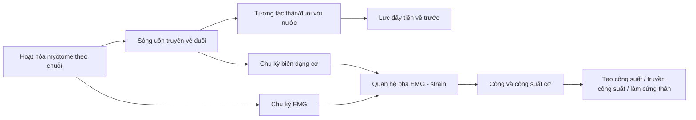

# Khóa học: Cơ sinh học bơi ở cá — từ myotome đến lực đẩy

Khóa học này được biên soạn lại từ bài báo **“Fish swimming: patterns in muscle function”** của **John D. Altringham và David J. Ellerby**, *The Journal of Experimental Biology* 202, 3397–3403 (1999).

Mục tiêu của bộ tài liệu là biến bài báo nghiên cứu ngắn thành một chuỗi bài học có thể học độc lập, có lộ trình, hình minh họa, thuật ngữ, câu hỏi tự kiểm tra và bài đánh giá cuối khóa. Phần kiến thức chuyên môn bám sát nội dung của bài báo; các mục tiêu học tập, câu hỏi và hoạt động ôn tập là phần tổ chức sư phạm được xây dựng từ nội dung đó.

## 1. Kết quả học tập

Sau khi hoàn thành khóa học, người học có thể:

1. Giải thích cơ chế bơi dạng uốn sóng của cá và cách sóng uốn truyền từ đầu về đuôi tạo lực đẩy.
2. Mô tả cấu trúc myotome, hướng sợi cơ và sự phân bố của cơ nhanh, cơ chậm và lớp cơ trung gian.
3. Giải thích cách hoạt hóa cơ thay đổi theo vị trí dọc thân và theo tốc độ bơi.
4. Phân tích các đại lượng động học chính: biên độ sóng, bước sóng đẩy, tần số đập đuôi, stride length và slip.
5. Liên hệ chu kỳ EMG, chu kỳ biến dạng cơ, lực, công và công suất.
6. Phân biệt vai trò tạo công suất, truyền công suất và làm cứng thân của các vùng cơ trước–sau.
7. Trình bày vì sao cá ngừ là một trường hợp chuyên hóa đáng chú ý trong cơ chế truyền công suất tới đuôi.
8. Nhận diện các giới hạn phương pháp luận và các câu hỏi nghiên cứu còn bỏ ngỏ mà bài báo nêu ra.

## 2. Lộ trình học

| Bài | Chủ đề | Hình chính |
|---|---|---|
| 01 | Bơi uốn sóng và cơ chế tạo lực đẩy | — |
| 02 | Giải phẫu myotome và các loại cơ | Hình 1, 2, 3 |
| 03 | Hoạt hóa cơ khi bơi | Hình 4, 5 |
| 04 | Động học thân cá và sóng uốn | — |
| 05 | Biến dạng, EMG, công và công suất | Hình 4, 5, 6 |
| 06 | Phân công chức năng dọc thân và truyền công suất | Hình 6 |
| 07 | Cá ngừ, giới hạn nghiên cứu và kết luận | Hình 2 |

Tài liệu bổ trợ:

- `08-on-tap-va-danh-gia.md`: bài tập tổng hợp cuối khóa.
- `09-dap-an-va-goi-y.md`: đáp án và gợi ý giải.
- `10-thuat-ngu.md`: bảng thuật ngữ Anh–Việt.
- `11-tai-lieu-tham-khao.md`: thư mục tài liệu của bài báo.
- `assets/`: sáu hình đã được tách khỏi PDF.
- `source/`: bản PDF gốc.

## 3. Cách học đề xuất

Mỗi bài nên học theo thứ tự: **Tóm tắt → Mục tiêu → Khái niệm → Cơ chế → Hình minh họa → Câu hỏi tự kiểm tra → Checklist**. Với các bài có đồ thị, hãy đọc trục, đơn vị và quan hệ pha trước khi đọc phần diễn giải.

## 4. Quy ước

- **BL**: body length — chiều dài cơ thể, đo từ mõm.
- **EMG**: electromyography — điện cơ đồ.
- **Anterior**: phía trước, gần đầu.
- **Posterior / caudal**: phía sau / vùng gần đuôi.
- **Positive work**: công dương — cơ tạo công khi đang hoạt hóa và rút ngắn.
- **Negative work**: công âm — cơ đang hoạt hóa nhưng bị kéo dài.

## 5. Sơ đồ toàn khóa

