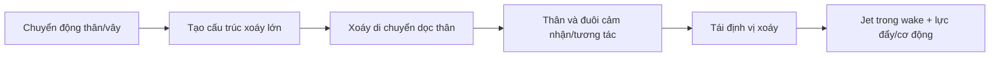

# Bài 01 - Chuyển động không ổn định và điều khiển độ xoáy

## 1. Tóm tắt

Cá nhanh và cá voi nhỏ không chỉ tạo lực bằng cách “đẩy nước ra sau”. Điểm quan trọng trong bài báo là chúng khai thác **dòng chảy không ổn định** do thân, vây và đuôi chuyển động nhịp nhàng. Các chuyển động này tạo, vận chuyển, hợp nhất, triệt tiêu và tái định vị những cấu trúc xoáy lớn. Cách nhìn đó được gọi là **vorticity control - điều khiển độ xoáy**.

## 2. Mục tiêu bài học

Sau bài này, người học có thể:

- giải thích vì sao dòng không ổn định là trung tâm của bơi kiểu cá;
- mô tả ba kiểu tương tác giữa xoáy tới và xoáy do foil sinh ra;
- phân biệt tương tác tăng cường, triệt tiêu và ghép cặp xoáy;
- giải thích vì sao tái định vị xoáy có thể tăng hiệu suất;
- đọc Figure 1 như một ví dụ về thu hồi năng lượng từ trường xoáy tới.

## 3. Từ lực đẩy truyền thống đến bơi kiểu cá

Phương tiện biển truyền thống thường được phân tích quanh trạng thái gần ổn định. Trong khi đó, cá sử dụng chuyển động nhịp nhàng và có biên độ đáng kể của thân, vây và đuôi. Bài báo nhấn mạnh ba lợi thế của cách vận động này:

- tạo lực lớn trong khoảng thời gian ngắn một cách hiệu quả;
- phối hợp thân và đuôi để giảm năng lượng cần cho bơi ổn định;
- phối hợp chuyển động quá độ để giảm năng lượng bị thất thoát vào wake khi cơ động.

Vì vậy, không nên xem dao động thân chỉ là một “hậu quả” của việc bơi. Nó là một thành phần chủ động của cơ chế tạo và điều khiển dòng.

## 4. Vorticity control là gì?

Trong ngữ cảnh của bài báo, chuỗi ý tưởng cốt lõi là:

Điều đáng chú ý là vây đuôi không luôn tạo lực từ “nước sạch”. Nó thường làm việc trong một trường vận tốc đã bị thân và các phần khác của cá làm biến đổi.

## 5. Ba chế độ tương tác xoáy - foil

Bài báo tổng hợp ba dạng tương tác khi một foil dao động gặp các xoáy quy mô lớn có kích thước lõi cùng bậc với chord của foil.

### 5.1. Tương tác tăng cường

Xoáy tới kết hợp **cùng chiều có lợi** với xoáy do foil shed ra, tạo các xoáy mạnh hơn trong wake. Các xoáy có thể sắp xếp thành reverse Kármán street.

Ý nghĩa: động lượng trong jet wake được tăng cường, nhưng điều này không mặc nhiên có nghĩa là hiệu suất tối đa vì năng lượng cần để tạo xoáy cũng phải được tính đến.

### 5.2. Tương tác triệt tiêu

Xoáy tới và xoáy do foil tạo ra tương tác theo cách làm yếu nhau. Wake phía sau có xoáy yếu hơn nhưng vẫn có thể giữ cấu trúc reverse Kármán.

Điểm quan trọng là foil có thể **lấy lại một phần năng lượng chứa trong các eddy tới**. Trong thí nghiệm được bài báo dẫn lại, chế độ triệt tiêu gắn với tăng đáng kể hiệu suất của foil.

### 5.3. Ghép cặp xoáy trái dấu

Xoáy tới có thể ghép với xoáy trái dấu do foil sinh ra thành các cặp xoáy. Các cặp này dịch ra khỏi đường tâm và tạo một wake rộng.

Đây là một topology wake khác với hai trường hợp reverse Kármán street hẹp hơn.

## 6. Xoáy có thể xuất hiện ở đâu trên foil?

Bài báo chỉ ra vorticity của foil có thể được sinh ra ở:

- trailing edge - mép sau;
- leading edge - mép trước;
- hoặc đồng thời ở cả hai.

Do đó, khi mô phỏng hoặc rig một vây cá, chỉ quan tâm đến vị trí mép sau là chưa đủ nếu chuyển động có góc tấn lớn hoặc không ổn định mạnh.

## 7. Phân tích Figure 1

Hình mô tả một foil dao động thao tác các xoáy được tạo từ một vật thể tiết diện D đặt ở thượng lưu. Dòng chảy đi từ phải sang trái. Trước foil, các xoáy tới còn mạnh; sau khi tương tác, các xoáy wake yếu đi và vị trí thay đổi mạnh.

Điểm cần đọc từ hình không phải là “xoáy biến mất”, mà là **foil đã thay đổi cách các xoáy sắp xếp và phân phối năng lượng**. Chính khả năng điều khiển pha, vị trí và cường độ của các cấu trúc này là nền tảng cho các bài tiếp theo.

## 8. Tác động của forcing tuần hoàn

Bài báo cũng tổng hợp các kết quả cho thấy forcing tuần hoàn có thể thay đổi đáng kể cấu trúc wake. Khi tần số forcing gần tần số Strouhal tự nhiên của wake, ảnh hưởng lên wake có thể mạnh. Trong một số thí nghiệm với cylinder quay dao động, bề rộng wake và do đó drag giảm đáng kể.

Một kết quả khác: traveling wave trên một tấm mềm có thể làm giảm turbulence trong lớp biên khi tốc độ truyền sóng lớn hơn tốc độ dòng tự do. Ý tưởng này sẽ quay lại ở Bài 08.

## 9. Các hiểu lầm cần tránh

- **Không phải mọi xoáy đều là tổn thất.** Xoáy có thể là phương tiện mang động lượng và có thể được tái sử dụng.
- **Không phải xoáy càng mạnh càng tốt.** Hiệu suất phụ thuộc tổ chức wake và năng lượng trao đổi.
- **Không thể phân tích riêng đuôi khỏi dòng tới.** Dòng tới đã mang “lịch sử” chuyển động của thân.
- **Vorticity control không chỉ là tạo xoáy.** Phần quan trọng là timing, vị trí và tương tác giữa các xoáy.

## 10. Câu hỏi tự kiểm tra

1. Vì sao bơi kiểu cá được xem là một bài toán dòng không ổn định?
2. Ba kiểu tương tác giữa xoáy tới và xoáy do foil sinh ra khác nhau thế nào?
3. Vì sao tương tác triệt tiêu vẫn có thể làm tăng hiệu suất?
4. Tại sao vị trí tương đối của xoáy và foil quan trọng không kém cường độ xoáy?
5. Từ Figure 1, hãy mô tả sự thay đổi của wake trước và sau foil.

## 11. Checklist kiến thức

- [ ] Tôi giải thích được vorticity control bằng lời của mình.
- [ ] Tôi phân biệt được tăng cường, triệt tiêu và ghép cặp xoáy.
- [ ] Tôi hiểu tail có thể tái sử dụng trường xoáy do body tạo ra.
- [ ] Tôi hiểu forcing tuần hoàn có thể thay đổi wake và drag.

## 12. Tổng kết

Luận điểm nền tảng của toàn khóa là: **cá không chỉ tạo lực bằng hình dạng vây; chúng tạo và điều khiển một trường xoáy không ổn định theo thời gian**. Bài tiếp theo chuyển sang hệ tối giản hơn - một foil vừa heave vừa pitch - để xem các tham số nào điều khiển việc hình thành jet và reverse Kármán street.
