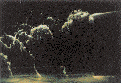

# Bài 02 - Foil dao động và cơ chế tạo lực đẩy

## 1. Tóm tắt

Một foil chuyển động tiến với tốc độ trung bình ổn định, đồng thời dao động **heave** và **pitch**, có thể tạo lực đẩy nếu các tham số chuyển động phù hợp. Bài học này xây dựng trực giác về jet wake, reverse Kármán street và bộ tham số kinematic của foil.

## 2. Mục tiêu bài học

- phân biệt heave và pitch;
- giải thích tiêu chí wake dạng jet đối với lực đẩy trung bình;
- nhận biết reverse Kármán street;
- liệt kê các tham số chính của một flapping foil;
- hiểu vai trò của leading-edge vortex và tip vortex.

## 3. Heave và pitch

**Heave** là chuyển động tịnh tiến ngang/lateral của foil. **Pitch** là chuyển động quay của foil quanh một trục. Hai chuyển động phối hợp tạo ra góc tấn tức thời và phân bố áp suất thay đổi liên tục.

Một cách biểu diễn khái niệm:

```text
Dòng tới U  --->

           /  foil tại một thời điểm
          /
   heave ↑↓      pitch ↺↻
```

Bài báo không đưa ra một luật điều khiển duy nhất cho mọi trường hợp. Thay vào đó, nó nhấn mạnh hiệu suất phụ thuộc tổ hợp biên độ, pha, tần số và góc.

## 4. Khi nào foil tạo thrust?

Nếu vận tốc trung bình phía sau foil tạo thành **jet**, wake mang động lượng theo hướng phù hợp để sinh thrust. Nếu hệ chủ yếu chịu drag, wake mang dấu hiệu của một **drag wake**.

Trong cả hai trường hợp, wake không tĩnh: các cấu trúc xoáy quy mô lớn hình thành theo chu kỳ.

## 5. Reverse Kármán street

Một Kármán vortex street cổ điển phía sau vật cản liên hệ với drag. Trong một foil tạo thrust, hai xoáy trái dấu mỗi chu kỳ có thể sắp xếp ngược chiều quay so với trường hợp drag, tạo **reverse Kármán street**.

Bài báo liên hệ hiệu suất cao với wake có **hai xoáy lớn mỗi chu kỳ**, thay vì các topology phức tạp hơn như bốn xoáy lớn mỗi chu kỳ.

## 6. Các tham số chính của flapping foil

Bài báo liệt kê năm tham số quan trọng:

1. tỷ số biên độ heave so với chord;
2. feathering parameter;
3. độ lệch pha giữa heave và pitch;
4. reduced frequency;
5. vị trí tương đối của trục pitch.

Có thể dùng số Strouhal và góc tấn danh nghĩa thay cho một số cách tham số hóa trên.

### 6.1. Góc tấn danh nghĩa

Góc tấn danh nghĩa được mô tả là chênh lệch cực đại giữa góc do heave gây ra và góc pitch. Nó là một cách gói gọn cường độ “tấn” của foil trong chuyển động kết hợp.

### 6.2. Pha giữa heave và pitch

Hai chuyển động có thể có cùng tần số nhưng khác pha. Pha quyết định foil xoay như thế nào tại thời điểm nó đạt biên heave, từ đó thay đổi góc tấn, lực tức thời và cách xoáy shed ra.

## 7. Leading-edge vortex

Khi dòng tách gần leading edge, một **leading-edge vortex - LEV** có thể hình thành. Bài báo tổng hợp các công trình từ khí động học côn trùng để làm rõ rằng các cơ chế không ổn định có thể trì hoãn stall và tạo lực lớn.

Trong thí nghiệm foil dao động được dẫn lại, sự hình thành LEV ở mức vừa phải có liên hệ với hiệu suất đẩy cao, lên tới khoảng 87% trong các cấu hình tải vừa phải được nghiên cứu.

Điều kiện được bài báo nêu cho vùng hiệu suất cao gồm:

- biên độ heave cùng bậc với chord;
- góc tấn danh nghĩa khoảng 20°;
- Strouhal phù hợp với việc hình thành reverse Kármán street.

Đây là kết quả theo cấu hình thí nghiệm, không phải bộ tham số phổ quát.

## 8. Xoáy đầu mút và hiệu ứng ba chiều

Foil có aspect ratio hữu hạn tạo tip vortices. Bài báo ghi nhận rằng với foil dao động, khi tần số tăng, hiệu ứng ba chiều có thể nhỏ hơn so với foil chuyển động ổn định, do hình thành các tip vortices luân phiên dấu và vận tốc cảm ứng yếu hơn.



Figure 4 cho thấy một cấu trúc tip vortex phức tạp được truy vết bằng khí bơm vào vùng áp suất thấp của lõi xoáy. Nó minh họa rằng wake thực tế là ba chiều và các vortex ring/tip vortex có thể nối với nhau theo cấu trúc phức tạp.

## 9. Liên hệ với vây cá

Foil là mô hình tối giản. Vây cá thật có:

- độ mềm;
- biến dạng theo span;
- chuyển động do thân đưa tới;
- tương tác với wake của thân;
- hình học thay đổi theo loài.

Vì vậy, các kết quả foil là nền tảng để hiểu cơ chế, không phải bản sao đầy đủ của vây cá sống.

## 10. Bài tập ngắn

### 10.1. Nhận diện tham số

Cho một foil có chord `c`, heave biên độ `h0`, pitch góc `θ0`, tần số `f`, tốc độ tiến `U`. Hãy phân loại đại lượng nào là hình học, kinematic và động lực wake.

### 10.2. Giải thích wake

Nếu quan sát thấy hai xoáy trái dấu mỗi chu kỳ, sắp xếp thành jet phía sau foil, hãy giải thích vì sao đó là dấu hiệu của chế độ tạo thrust.

### 10.3. Phân tích LEV

Vì sao LEV không nên mặc định được xem là “xấu”? Trả lời dựa trên quan hệ giữa LEV, lift và hiệu suất trong dòng không ổn định.

## 11. Tổng kết

Foil heave + pitch là mô hình cơ bản để thấy rằng thrust phụ thuộc tổ chức wake chứ không chỉ phụ thuộc biên độ quẫy. Bài tiếp theo đưa số Strouhal vào trung tâm để liên hệ kinematic với dynamics của wake và hiệu suất.
