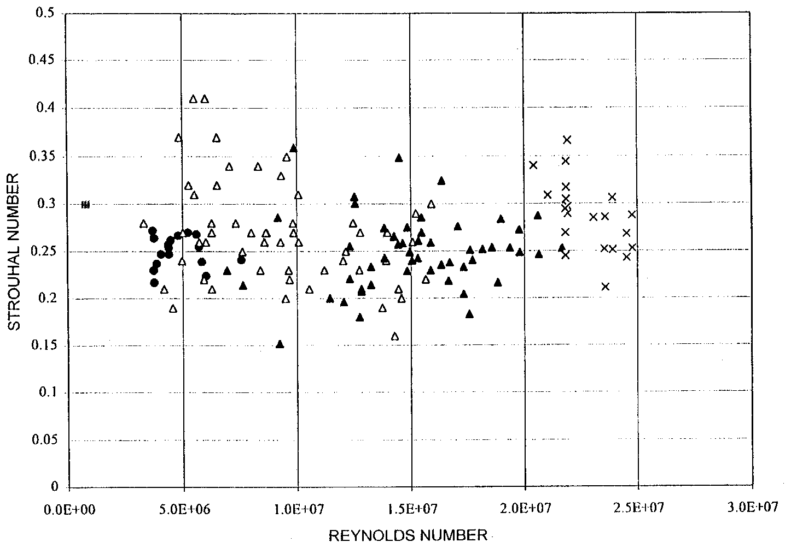
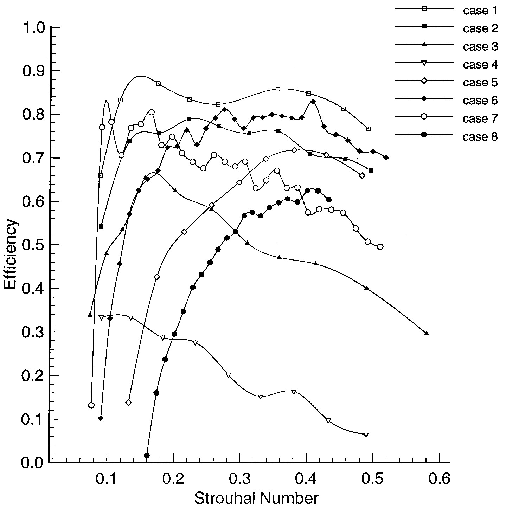

# Bài 03 - Số Strouhal, động lực wake và hiệu suất

## 1. Tóm tắt

Số Strouhal là tham số vô thứ nguyên kết nối tần số dao động, bề rộng/biên độ wake và tốc độ tiến. Bài báo dùng nó như một thước đo đặc biệt hữu ích để mô tả **dynamics của wake**, đồng thời nhấn mạnh rằng reduced frequency vẫn cần thiết để mô tả mức độ không ổn định của foil.

## 2. Mục tiêu bài học

- tính và diễn giải số Strouhal;
- phân biệt vai trò của Strouhal và reduced frequency;
- giải thích vì sao “khớp” tần số dao động với instability của wake có thể tăng hiệu suất;
- đọc Figure 2, Figure 3 và Figure 12;
- tránh diễn giải sai khoảng Strouhal tối ưu.

## 3. Định nghĩa Strouhal

Bài báo định nghĩa:

$$
St = \frac{fA}{U}
$$

trong đó:

- `f`: tần số dao động;
- `A`: bề rộng wake, thường được xấp xỉ bằng tổng biên độ lateral của foil;
- `U`: tốc độ tiến.

Số Strouhal không có đơn vị.

## 4. Ý nghĩa vật lý

Nếu giữ `U` cố định:

- tăng `f` làm tăng `St`;
- tăng `A` làm tăng `St`.

Nếu giữ `f` và `A` cố định:

- tăng `U` làm giảm `St`.

Nhưng giá trị của `St` không tự nói hết về foil. Hai hệ có cùng `St` vẫn có thể khác chord, pha pitch-heave, góc tấn và Reynolds number.

## 5. Strouhal và reduced frequency không thay thế hoàn toàn nhau

Bài báo phân biệt:

- **reduced frequency**: đo mức độ không ổn định bằng cách so sánh thang bước sóng không gian của nhiễu với chord;
- **Strouhal**: hữu ích hơn cho việc đặc trưng dynamics của wake.

Do cả chuyển động foil lẫn wake đều quan trọng, hai tham số thường cần được dùng đồng thời.

## 6. Wake instability và vùng hiệu suất cao

Luận điểm của Triantafyllou và cộng sự là hiệu suất tối ưu xuất hiện khi tần số foil tương thích với dynamics tự nhiên của wake, cụ thể gần tần số mà nhiễu trong wake được khuếch đại mạnh nhất theo phân tích ổn định tuyến tính.

Nói cách khác, hệ không chỉ “quẫy nhanh” mà cần **quẫy ở nhịp phù hợp với khả năng tổ chức xoáy của wake**.

## 7. Khoảng Strouhal 0,25-0,35

Trong các profile cụ thể được nghiên cứu, bài báo báo cáo vùng tối ưu khoảng:

$$
0.25 \lesssim St \lesssim 0.35
$$

Tuy nhiên chính bài báo lưu ý rằng các trường hợp khác có thể cho giá trị khác. Vì vậy, nên xem đây là một **vùng tham chiếu thực nghiệm/theoretical cho các cấu hình được khảo sát**, không phải luật sinh học phổ quát.

## 8. Figure 2 - dữ liệu cá heo

Dữ liệu kinematic của cá heo được huấn luyện cho thấy các tần số vô thứ nguyên nằm gần vùng dự đoán từ phân tích instability. Điểm quan trọng của hình là sự liên hệ giữa quan sát sinh học và lý thuyết wake, chứ không phải một đường phụ thuộc đơn giản của `St` theo Reynolds number.

## 9. Figure 3 - hiệu suất foil

Figure 3 so sánh nhiều “case” có biên độ heave, góc tấn danh nghĩa và pha heave-pitch khác nhau. Các đường cong khác nhau đáng kể. Điều này chứng minh rằng:

- `St` rất quan trọng;
- nhưng cùng một `St`, hiệu suất vẫn phụ thuộc mạnh vào các tham số khác.

Do đó, tối ưu một rig/robot chỉ bằng cách đặt `St` vào một khoảng mục tiêu là chưa đủ.

## 10. Figure 12 - robot cá và hai đỉnh giảm công suất

Robot thân mềm trong nghiên cứu Barrett et al. cho hai đỉnh giảm công suất: một gần `St ≈ 0,13` và một gần `St ≈ 0,25`. Hình dạng đường cong được nhận xét là tương tự quan hệ hiệu suất - Strouhal của flapping foil.

Điểm này một lần nữa nhắc rằng hệ thân mềm hoàn chỉnh có thể có nhiều cơ chế/tối ưu cục bộ, không nhất thiết chỉ một đỉnh.

## 11. Ví dụ tính toán

Một foil có:

- `f = 2 Hz`;
- `A = 0,15 m`;
- `U = 1,0 m/s`.

Khi đó:

$$
St = \frac{2 \times 0.15}{1.0} = 0.30
$$

Giá trị 0,30 nằm trong khoảng 0,25-0,35 được báo cáo cho một số profile trong bài báo. Tuy nhiên, chưa thể kết luận foil này có hiệu suất tối ưu nếu chưa biết pha, góc tấn, chord và topology wake.

## 12. Bài tập

1. Với `f = 3 Hz`, `A = 0,08 m`, `U = 1,2 m/s`, tính `St`.
2. Nếu muốn giữ `St` không đổi khi tốc độ tăng 20%, cần thay `fA` như thế nào?
3. Từ Figure 3, giải thích vì sao không thể tối ưu bằng Strouhal một biến.
4. Từ Figure 12, nêu hai vùng Strouhal có giảm công suất nổi bật trong robot.
5. Viết một câu giải thích sự khác nhau giữa “foil unsteadiness” và “wake dynamics”.

## 13. Tổng kết

Strouhal là cầu nối giữa kinematics và wake, nhưng nó không phải tham số duy nhất. Hiệu suất cao xuất hiện khi chuyển động foil phối hợp với dynamics của wake để tạo cấu trúc xoáy có tổ chức, đặc biệt reverse Kármán street.
