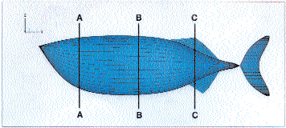
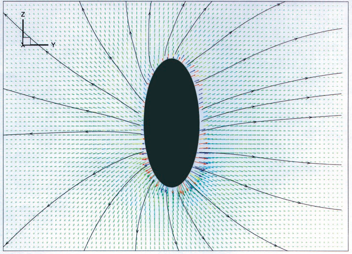
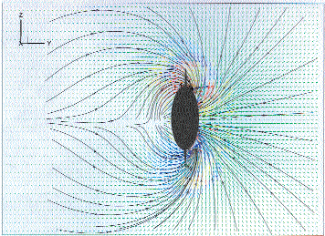
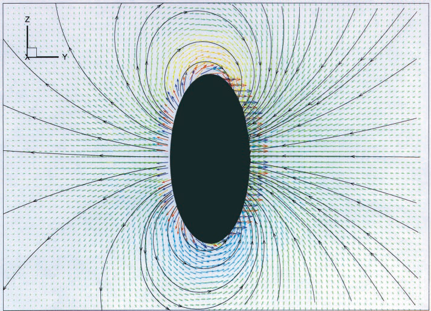
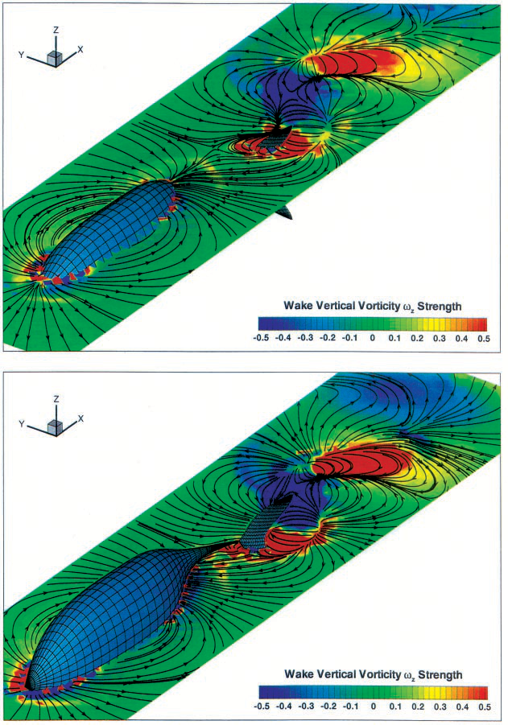

# Bài 04 - Slender-body theory và lực ngang của thân cá

## 1. Tóm tắt

Bài này chuyển từ foil độc lập sang thân cá kéo dài. Slender-body theory xem sự biến đổi hình học theo trục dọc chậm hơn nhiều so với tiết diện ngang, từ đó xấp xỉ crossflow ở các mặt cắt vuông góc với trục cá như bài toán gần hai chiều. Đây là nền tảng lịch sử quan trọng, nhưng các hình DPIV và mô phỏng ba chiều cho thấy dòng thật có thể lệch đáng kể khỏi giả thiết này.

## 2. Mục tiêu bài học

- hiểu giả thiết hình học của slender-body theory;
- diễn giải hai biểu thức lực ngang trong bài báo;
- hiểu khái niệm added mass cục bộ;
- nhận biết giới hạn của mô hình hai chiều mặt cắt;
- giải thích vì sao mô phỏng số ba chiều trở nên cần thiết.

## 3. Hệ tọa độ và mô hình hóa thân cá

Bài báo dùng:

- `x`: trục dọc thân;
- `y`: hướng chuyển động ngang/transverse;
- `z`: hướng không uốn chính;
- `h(x,t)`: độ lệch của backbone;
- `U`: tốc độ tiến.

Vì nhiều loài cá có thân kéo dài, thay đổi hình học theo `x` tương đối chậm. Slender-body theory giả sử crossflow do chuyển động ngang của thân có thể được xấp xỉ gần hai chiều trên các mặt phẳng `yz`.

## 4. Lực ngang theo Lighthill

Với giả thiết dòng chưa tách, bài báo đưa biểu thức lực ngang trên một đơn vị chiều dài:

$$
L = -\left(\frac{\partial}{\partial t}+U\frac{\partial}{\partial x}\right)
\left[
  a\left(\frac{\partial h}{\partial t}+U\frac{\partial h}{\partial x}\right)
\right]
$$

trong đó `a` là added mass cục bộ trên một đơn vị chiều dài.

### 4.1. Đạo hàm vật chất dọc thân

Toán tử:

$$
\left(\frac{\partial}{\partial t}+U\frac{\partial}{\partial x}\right)
$$

kết hợp biến thiên theo thời gian và sự “đi qua” không gian với tốc độ tiến `U`.

### 4.2. Added mass

Khi thân tăng tốc ngang, nó phải gia tốc một lượng chất lỏng lân cận. Hiệu ứng quán tính chất lỏng này được gói trong `a`. Vì tiết diện thay đổi dọc thân, added mass cục bộ cũng thay đổi.

## 5. Biểu thức sửa đổi khi có shedding

Nếu cho phép vorticity shed ra dọc phần thân thu hẹp, Wu và Newman & Wu dẫn tới biểu thức được bài báo viết:

$$
L = -a\left(\frac{\partial}{\partial t}+U\frac{\partial}{\partial x}\right)^2 h
$$

Bài báo nhận xét các quan sát dòng gần đây hỗ trợ việc dùng biểu thức thứ hai cho phần sau của thân.

## 6. Vì sao slender-body theory chưa đủ?

Hình dung đơn giản của slender-body theory là crossflow gần hai chiều trên mặt cắt `yz`. Nhưng visualisation trong bài báo cho thấy tùy pha dao động, dòng có thể mang đặc điểm gần hai chiều hơn trong các mặt phẳng `xy` dọc thân.

Điều này nghĩa là:

- dòng thật có cấu trúc ba chiều;
- hướng dòng ưu thế thay đổi theo pha;
- vùng mép trên và mép dưới của thân có thành phần 3D mạnh;
- lực định lượng cần mô phỏng số chính xác hơn.

## 7. Figure 6 - các lát cắt transverse

Figure 6 đặt ba mặt cắt A, B, C dọc thân Giant Danio. Các streamline và vector vận tốc cho thấy flow không chỉ là crossflow hai chiều đơn giản. Ở các vùng khác nhau, pattern dọc và ngang thay đổi theo vị trí và pha.

## 8. Figure 7 - các lát cắt dọc

Figure 7 cho thấy pattern gần hai chiều theo mặt phẳng `xy` còn tồn tại từ mặt phẳng giữa thân lên tới mặt phẳng cách phía trên khoảng 20% chiều sâu. Hình cũng làm rõ tách dòng từ thân và tương tác của tail với vorticity tới.

## 9. Gray's paradox trong bối cảnh bài báo

Bài báo nhắc lại lịch sử “Gray's paradox”: ước lượng ban đầu cho rằng công suất cơ của cá heo dường như nhỏ hơn nhiều công suất cần để kéo một mô hình thân cứng thẳng ở tốc độ cao. Nhiều công trình sau đó tranh luận hoặc sửa lại kết luận này.

Trong khóa học, giá trị của câu chuyện này là gợi ra câu hỏi đúng: **thân mềm đang thay đổi dòng như thế nào so với một thân cứng được kéo thẳng?** Các bài 05, 07 và 08 cung cấp cơ chế cụ thể hơn cho câu hỏi đó.

## 10. Câu hỏi tự kiểm tra

1. Slender-body theory giả định điều gì về biến đổi hình học theo `x`?
2. `h(x,t)` mô tả đại lượng nào?
3. Added mass xuất hiện vì cơ chế vật lý gì?
4. Hai biểu thức lực ngang khác nhau ở giả thiết shedding như thế nào?
5. Figure 6 và Figure 7 cho thấy giới hạn nào của giả thiết crossflow hai chiều?

## 11. Tổng kết

Slender-body theory cung cấp khung toán học mạnh để liên hệ chuyển động backbone với lực ngang. Tuy nhiên, bài báo nhấn mạnh rằng wake và dòng gần thân thực tế là ba chiều, biến thiên theo pha và chịu ảnh hưởng của separation. Vì vậy, bước tiếp theo phải theo dõi **vorticity thực sự được tạo, shed và đưa tới tail như thế nào**.
