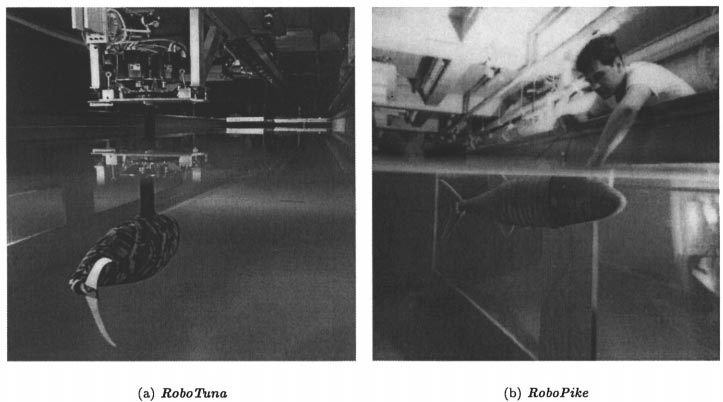
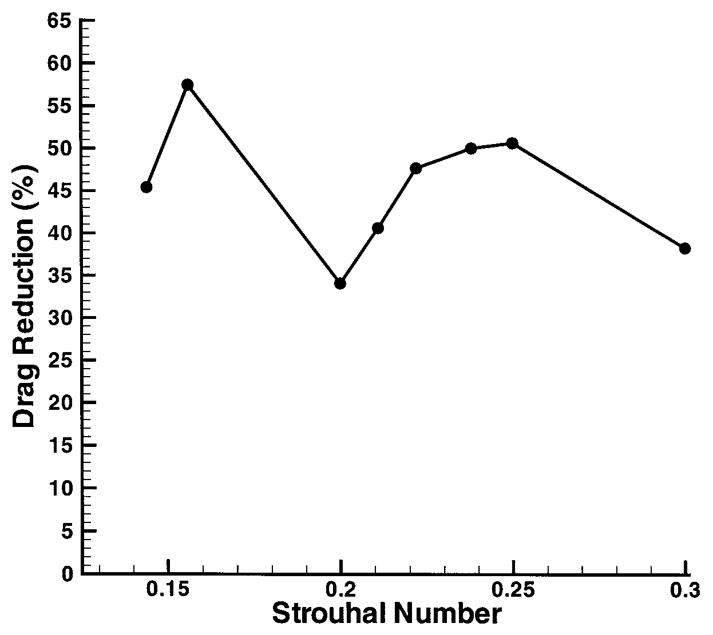

# Bài 07 - Robot cá, đo công suất và giảm năng lượng cần thiết

## 1. Tóm tắt

Robot mô phỏng cá không chỉ là ứng dụng kỹ thuật; trong bài báo, chúng còn là thiết bị thí nghiệm cho phép đo lực và công suất chính xác hơn cá sống. Các robot thân mềm cho thấy trong một vùng tham số, chuyển động bơi chủ động có thể cần ít công suất hơn đáng kể so với kéo cùng thân ở cấu hình cứng-thẳng.

## 2. Mục tiêu bài học

- hiểu vai trò khoa học của robot biomimetic;
- phân tích RoboTuna và RoboPike;
- diễn giải kết quả giảm công suất trên robot thân mềm;
- hiểu phân bố công suất dọc thân;
- phân biệt “giảm công suất cần thiết” với tuyên bố tuyệt đối về drag.

## 3. Biomimetics trong bài báo

Biomimetics sử dụng nguyên lý từ sinh vật để phát triển cơ cấu nhân tạo. Điểm hai chiều rất quan trọng:

- hiểu cá → thiết kế robot;
- robot đo được chính xác → kiểm nghiệm lại hiểu biết về cá.

Robot cho phép lặp lại cùng một kinematic, kiểm soát phase, amplitude và đo lực/công suất trực tiếp - điều khó thực hiện trên cá sống.

## 4. Figure 11 - RoboTuna và RoboPike

Bài báo mô tả:

- robot dạng bluefin tuna dài khoảng 1,2-1,25 m, gồm tám link, dùng trong đo công suất;
- robot tự hành dạng pike dài 0,81 m, gồm ba link điều khiển độc lập, dùng cho maneuver nhanh.

Sự khác nhau về số link phản ánh mục tiêu thí nghiệm khác nhau: tái hiện traveling-wave tinh hơn so với cơ động chủ động gọn hơn.

## 5. Kết quả giảm công suất cần thiết

Trong một vùng tham số ở Reynolds number cỡ `10^6`, các phép đo lặp lại trên robot mềm cho thấy công suất cần để tự bơi có thể giảm **hơn 50%** so với công suất cần để kéo cùng phương tiện ở cấu hình cứng-thẳng.

Cần đọc kết quả đúng phạm vi:

- so sánh là giữa hai trạng thái của cùng hệ;
- kết quả phụ thuộc vùng tham số;
- không đồng nghĩa với “cá luôn giảm drag 50% trong mọi điều kiện”.

## 6. Figure 12 - hai đỉnh theo Strouhal

Robot cho hai đỉnh đáng chú ý gần:

- `St ≈ 0,13`;
- `St ≈ 0,25`.

Bài báo nhận xét shape của đường cong giống đường hiệu suất flapping foil trong Figure 3. Điều này gợi ý cơ chế wake có vai trò trực tiếp trong việc chọn vùng kinematic tiết kiệm công suất.

## 7. Phân bố công suất dọc thân

Khi chia thân robot thành ba đoạn gần bằng nhau, bài báo dẫn kết quả:

| Đoạn | Tỷ lệ công suất đầu vào |
|---|---:|
| Phía trước | 15% |
| Giữa | 46% |
| Phía sau | 39% |

Phần giữa và sau chiếm phần lớn công suất, phù hợp với đo công suất cơ ở cơ cá sống được trích dẫn.

Điểm này củng cố luận điểm của Bài 05: **thân không chỉ tạo hình dòng; nó đóng góp đáng kể vào propulsive force**.

## 8. Ứng dụng foil và vây trong phương tiện biển

Bài báo tổng hợp nhiều hướng:

- oscillating foil cho ship propulsion;
- pectoral-fin-like mechanism cho hovering;
- fins cho maneuvering tốc độ thấp;
- robot thân mềm cho fast-start và turning.

Tài liệu không cung cấp một kiến trúc cơ điện tối ưu duy nhất; nó tập trung vào cơ chế thủy động lực học chung.

## 9. Nguyên tắc thiết kế rút ra

Từ các kết quả robot có thể rút ra các tiêu chí đánh giá một hệ bơi nhân tạo:

1. không chỉ đo thrust mà phải đo cả power;
2. so sánh active swimming với rigid-tow baseline;
3. sweep Strouhal thay vì chỉ thử một tần số;
4. đo phase giữa các đoạn thân;
5. kiểm tra wake topology bằng PIV/DPIV nếu có thể;
6. phân tích power distribution dọc thân, không chỉ ở actuator tail.

Các mục trên là cách tổ chức thí nghiệm rút từ phương pháp và kết quả bài báo.

## 10. Câu hỏi tự kiểm tra

1. Vì sao robot có giá trị như công cụ khoa học?
2. Hai robot trong Figure 11 khác mục tiêu nào?
3. “Giảm hơn 50% công suất” được so với baseline nào?
4. Phần nào của thân hấp thụ/đóng góp phần lớn input power trong đo robot?
5. Figure 12 cho thấy điều gì về quan hệ Strouhal - power?

## 11. Tổng kết

Robot biomimetic cho phép chuyển các nguyên lý vorticity control thành phép đo định lượng. Kết quả quan trọng nhất không phải “sao chép hình dạng cá”, mà là chứng minh một thân chủ động uốn theo traveling wave có thể tổ chức dòng và công suất khác căn bản một thân cứng được kéo thẳng.
